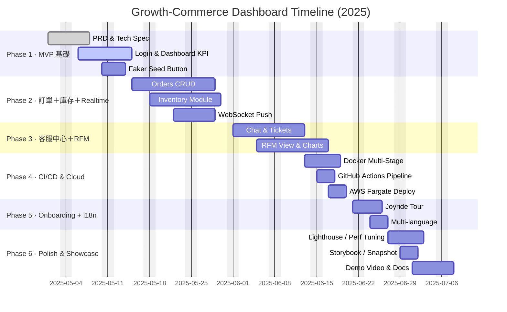

# 專案時程 Gantt 圖

| Phase | 功能模組                     | 期間 (起迄)      |
|-------|-----------------------------|------------------|
| P1    | PRD & Tech Spec             | 5/1 – 5/5        |
|       | Login + KPI Dashboard       | 5/6 – 5/12       |
|       | Faker Seed Button           | 5/10 – 5/12      |
| P2    | Orders CRUD                 | 5/15 – 5/24      |
|       | Inventory Module            | 5/18 – 5/28      |
|       | Realtime WebSocket          | 5/22 – 5/27      |
| P3    | Chat & Ticketing            | 6/1 – 6/10       |
|       | RFM View & Charts           | 6/5 – 6/13       |
| P4    | Docker & CI/CD Pipeline     | 6/13 – 6/18      |
|       | AWS Fargate Deployment      | 6/17 – 6/19      |
| P5    | Onboarding Tour             | 6/21 – 6/24      |
|       | i18n (en / zh‑TW)           | 6/24 – 6/26      |
| P6    | Performance & Storybook     | 6/27 – 7/02      |
|       | Demo Video & Documentation  | 7/01 – 7/05      |
