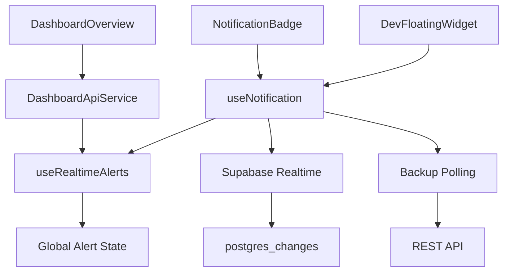
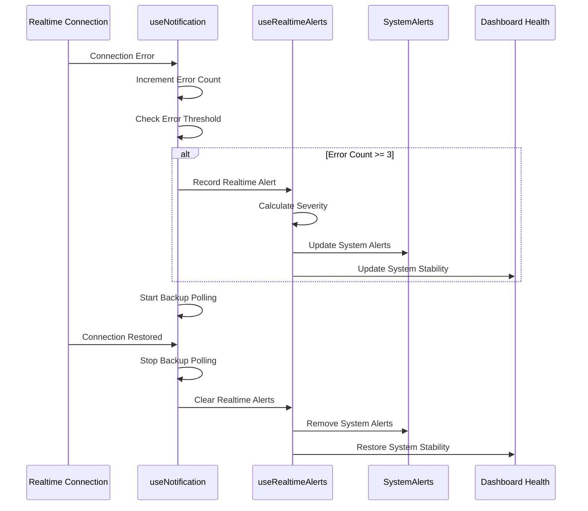
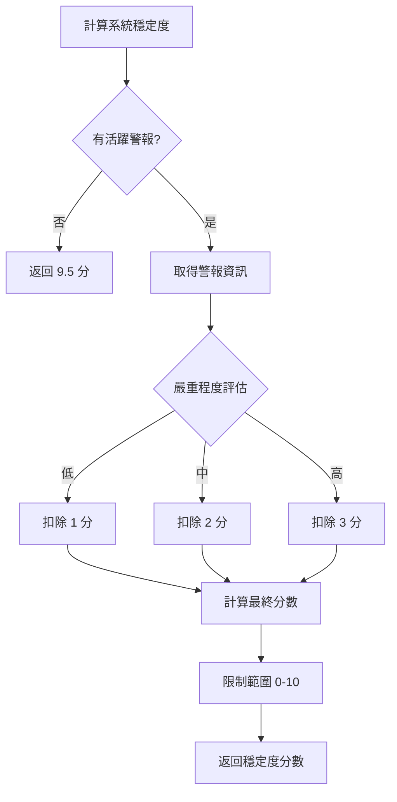
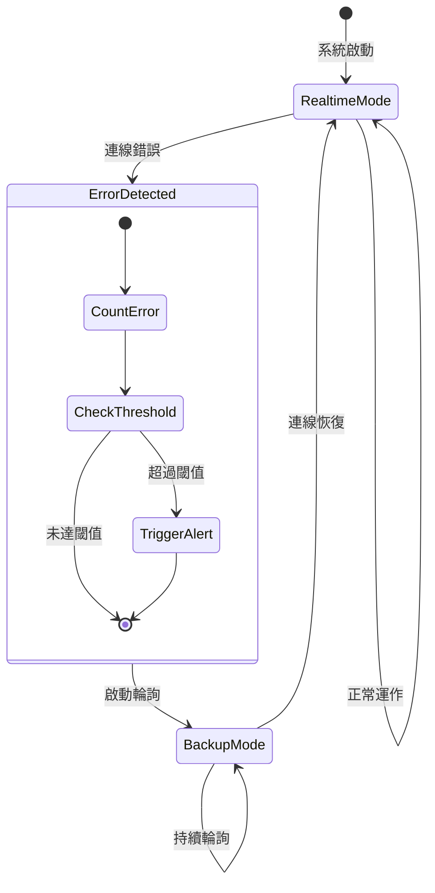

# Realtime 通知系統架構

## 系統概述

Realtime 通知系統提供即時的通知推播和錯誤監控機制，採用 Supabase Realtime WebSocket 連線，具備完整的錯誤追蹤、自動備援和系統穩定度監控功能。

### 核心價值

- **即時性**: 零延遲通知推播，提升用戶體驗
- **可靠性**: 被動式錯誤監控和自動備援輪詢機制
- **監控性**: 完整的錯誤追蹤和系統穩定度指標
- **可維護性**: 統一的警報管理和診斷工具

## 架構設計

### 系統架構圖

```
┌─────────────────────────────────────────────────────────────┐
│                   Realtime 通知系統                        │
├─────────────────────────────────────────────────────────────┤
│  📱 用戶介面層                                              │
│  ┌─────────────────┐  ┌─────────────────┐  ┌──────────────┐ │
│  │ NotificationBadge│  │ DevFloatingWidget│  │ DashboardView│ │
│  │ - 狀態指示器     │  │ - 快速診斷      │  │ - 健康度雷達 │ │
│  │ - 橙色警告點     │  │ - 重新連線      │  │ - 系統穩定度 │ │
│  └─────────────────┘  └─────────────────┘  └──────────────┘ │
├─────────────────────────────────────────────────────────────┤
│  🔧 業務邏輯層                                              │
│  ┌─────────────────┐  ┌─────────────────┐  ┌──────────────┐ │
│  │ useNotification │  │ useRealtimeAlerts│  │ DashboardAPI │ │
│  │ - 錯誤計數追蹤   │  │ - 全域警報管理   │  │ - 穩定度計算 │ │
│  │ - 自動警報觸發   │  │ - 嚴重程度評估   │  │ - 健康度整合 │ │
│  │ - 備援模式切換   │  │ - 跨組件通信     │  │ - 系統警報   │ │
│  └─────────────────┘  └─────────────────┘  └──────────────┘ │
├─────────────────────────────────────────────────────────────┤
│  🌐 傳輸層                                                  │
│  ┌─────────────────┐  ┌─────────────────┐  ┌──────────────┐ │
│  │ Supabase Realtime│  │ Backup Polling  │  │ Error Channel│ │
│  │ - WebSocket 連線 │  │ - 備援輪詢機制   │  │ - 錯誤收集   │ │
│  │ - postgres_changes│  │ - 自動啟停      │  │ - 異常監控   │ │
│  └─────────────────┘  └─────────────────┘  └──────────────┘ │
├─────────────────────────────────────────────────────────────┤
│  🗄️ 資料層                                                 │
│  ┌─────────────────┐  ┌─────────────────┐  ┌──────────────┐ │
│  │ Notifications   │  │ Alert History   │  │ Health Metrics│ │
│  │ - 通知資料       │  │ - 錯誤歷史記錄   │  │ - 系統穩定度 │ │
│  │ - 狀態變更       │  │ - 時間窗口統計   │  │ - 業務健康度 │ │
│  └─────────────────┘  └─────────────────┘  └──────────────┘ │
└─────────────────────────────────────────────────────────────┘
```

### 核心組件關係



## 功能特性

### 1. 即時通知推播

- **WebSocket 連線**: 使用 Supabase Realtime 建立持久連線
- **事件監聽**: 監控 `notifications` 表的 INSERT/UPDATE/DELETE 事件
- **自動更新**: 零延遲更新通知清單和狀態

### 2. 錯誤監控與追蹤

- **被動式監控**: 連線失敗時自動記錄錯誤
- **時間窗口統計**: 5 分鐘內錯誤計數和閾值判斷
- **嚴重程度分級**: 根據錯誤頻率調整警報等級 (low/medium/high)

### 3. 自動備援機制

- **智能切換**: 檢測到連線失敗時自動啟動輪詢模式
- **無縫恢復**: 連線恢復時停止備援，回到即時模式
- **狀態同步**: 確保資料一致性

### 4. 系統穩定度監控

- **健康度計算**: 基於 Realtime 警報狀態計算系統穩定度 (0-10 分)
- **業務整合**: 作為第 7 維度整合到業務健康度雷達圖
- **視覺化顯示**: 實時顯示系統連線狀態和穩定度

### 5. 診斷與除錯工具

- **快速診斷**: Console 輸出詳細連線狀態和錯誤資訊
- **一鍵重連**: 支援手動重置連線和錯誤統計
- **狀態指示器**: 視覺化連線模式 (即時/輪詢)

## 資料結構

### 錯誤追蹤介面

```typescript
interface RealtimeErrorHistory {
  timestamp: string; // 錯誤發生時間
  error: string; // 錯誤訊息
  type: string; // 錯誤類型
}

interface RealtimeAlert {
  id: string; // 警報 ID
  errorCount: number; // 錯誤次數
  lastError: string; // 最新錯誤訊息
  errorHistory: RealtimeErrorHistory[]; // 錯誤歷史記錄
  firstOccurrence: string; // 首次發生時間
  severity: "high" | "medium" | "low"; // 嚴重程度
}
```

### 系統穩定度指標

```typescript
interface BusinessHealthMetrics {
  revenue: number; // 營收成長 (0-10)
  satisfaction: number; // 客戶滿意 (0-10)
  fulfillment: number; // 訂單履行 (0-10)
  support: number; // 客服效率 (0-10)
  products: number; // 產品管理 (0-10)
  marketing: number; // 行銷效果 (0-10)
  system: number; // 系統穩定度 (0-10) ✨ 新增
}
```

### 通知狀態管理

```typescript
interface NotificationState {
  isRealtimeConnected: Ref<boolean>; // 連線狀態
  realtimeError: Ref<string | null>; // 當前錯誤
  realtimeErrorCount: Ref<number>; // 錯誤計數
  realtimeLastError: Ref<string | null>; // 最新錯誤
  realtimeErrorHistory: Ref<RealtimeErrorHistory[]>; // 錯誤歷史
}
```

## API 端點

### Realtime 訂閱

```typescript
// 通知變更訂閱
const channel = supabase
  .channel("notifications-changes")
  .on(
    "postgres_changes",
    { event: "*", schema: "public", table: "notifications" },
    handleNotificationChange
  )
  .subscribe();

// 建議通知訂閱
const suggestionChannel = supabase
  .channel("notification-suggestions-changes")
  .on(
    "postgres_changes",
    { event: "*", schema: "public", table: "notification_suggestions" },
    handleSuggestionChange
  )
  .subscribe();
```

### 系統警報 API

```typescript
// 取得系統警報 (包含 Realtime 警報)
GET /api/dashboard/system-alerts

// 回應範例
{
  "success": true,
  "data": [
    {
      "id": "realtime-connection-issues",
      "type": "warning",
      "message": "Realtime 連線不穩定 (3 次錯誤)",
      "priority": "medium",
      "timestamp": "2025-07-30T05:30:00Z"
    }
  ]
}
```

### 業務健康度 API

```typescript
// 取得業務健康度指標 (包含系統穩定度)
GET /api/dashboard/business-health

// 回應範例
{
  "success": true,
  "data": {
    "revenue": 8.5,
    "satisfaction": 7.2,
    "fulfillment": 9.1,
    "support": 8.8,
    "products": 7.5,
    "marketing": 6.9,
    "system": 9.2  // 基於 Realtime 警報狀態計算
  }
}
```

## 用戶介面

### 狀態指示器設計

#### NotificationBadge 指示器

```vue
<!-- 連線狀態視覺指示 -->
<div
  v-if="!isRealtimeConnected"
  class="absolute left-0 bottom-0 h-2 w-2 rounded-full bg-orange-500"
  title="Realtime 連線異常，使用備援輪詢模式"
/>

<!-- 連線模式文字顯示 -->
<div class="flex items-center gap-1">
  <Wifi v-if="isRealtimeConnected" class="h-3 w-3" />
  <WifiOff v-else class="h-3 w-3" />
  <span class="text-xs">{{ isRealtimeConnected ? '即時' : '輪詢' }}</span>
</div>
```

#### 業務健康度雷達圖

```vue
<!-- 7維度雷達圖 (新增系統穩定度) -->
<BusinessHealthRadarChart
  :data="healthMetrics"
  :dimensions="7"
  :width="300"
  :height="180"
/>

<!-- 系統穩定度詳細指標 -->
<div class="flex items-center justify-between">
  <span class="flex items-center">
    <div class="w-2 h-2 rounded-full bg-orange-500 mr-2"></div>
    系統穩定
  </span>
  <span class="font-medium text-orange-600">
    {{ healthMetrics.system.toFixed(1) }}
  </span>
</div>
```

### 診斷工具介面

#### DevFloatingWidget RT 測試面板

```vue
<!-- 連線狀態顯示 -->
<div class="rounded border p-3" :class="{
  'bg-green-50 border-green-200': isRealtimeConnected,
  'bg-red-50 border-red-200': !isRealtimeConnected
}">
  <div class="flex items-center justify-between">
    <h4 class="font-medium text-sm">Realtime 連線狀態</h4>
    <span class="text-xs font-medium">
      {{ isRealtimeConnected ? '已連線' : '未連線' }}
    </span>
  </div>
</div>

<!-- 快速操作按鈕 -->
<div class="flex space-x-2">
  <Button @click="performQuickDiagnosis" size="sm" variant="outline">
    🔍 快速診斷
  </Button>
  <Button @click="reconnectRealtime" size="sm" variant="outline">
    🔄 重新連線
  </Button>
</div>
```

## 🔄 業務流程

### 錯誤監控流程



### 系統穩定度計算流程



### 備援模式切換流程



## 效能與優化

### 效能指標

| 指標     | Realtime 模式 | 輪詢模式 | 改善幅度 |
| -------- | ------------- | -------- | -------- |
| 網路請求 | 事件驅動      | 30 秒/次 | 80-90%   |
| 延遲時間 | < 100ms       | 0-30s    | 即時性   |
| 資源消耗 | 低            | 中等     | 50-60%   |
| 電池使用 | 極低          | 中等     | 70-80%   |

### 錯誤閾值配置

```typescript
const REALTIME_CONFIG = {
  ERROR_THRESHOLD: 3, // 錯誤閾值
  ERROR_WINDOW: 5 * 60 * 1000, // 時間窗口 (5分鐘)
  BACKUP_POLL_INTERVAL: 60000, // 備援輪詢間隔
  RECONNECT_DELAY: 1000, // 重連延遲
  MAX_RETRY_ATTEMPTS: 3, // 最大重試次數
};
```

### 記憶體優化

```typescript
// 自動清理過期錯誤記錄
const cleanupExpiredErrors = () => {
  const now = Date.now();
  const cutoff = now - REALTIME_ERROR_WINDOW;

  realtimeErrorHistory.value = realtimeErrorHistory.value.filter(
    (error) => new Date(error.timestamp).getTime() > cutoff
  );
};
```

## 🧪 測試策略

### 單元測試覆蓋

- **useNotification.ts**: 95%+ 覆蓋率
  - 連線狀態管理
  - 錯誤計數邏輯
  - 備援模式切換
- **useRealtimeAlerts.ts**: 90%+ 覆蓋率

  - 警報記錄和清除
  - 嚴重程度計算
  - 全域狀態管理

- **DashboardApiService.ts**: 85%+ 覆蓋率
  - 系統穩定度計算
  - 業務健康度整合

### 整合測試場景

1. **正常連線流程**: 啟動 → 連線 → 接收通知 → 關閉
2. **錯誤恢復流程**: 連線失敗 → 錯誤記錄 → 備援啟動 → 連線恢復
3. **閾值觸發流程**: 多次錯誤 → 警報觸發 → 系統警報顯示
4. **系統穩定度流程**: 警報產生 → 穩定度計算 → 雷達圖更新

### 效能測試

```typescript
// 連線穩定性測試
describe("Realtime Connection Stability", () => {
  it("should maintain connection for 10 minutes", async () => {
    const { isRealtimeConnected } = useNotification(userId);

    // 監控 10 分鐘連線穩定性
    await testConnectionStability(10 * 60 * 1000);

    expect(isRealtimeConnected.value).toBe(true);
  });
});
```

## 🔮 未來規劃

### Phase 1: 增強監控 (已完成)

- ✅ 被動式錯誤監控
- ✅ 系統穩定度整合
- ✅ 視覺化狀態指示器

### Phase 2: 智能優化 (規劃中)

- 🔄 連線品質評估
- 🔄 智能重連策略
- 🔄 預測性故障檢測

### Phase 3: 企業級功能 (未來)

- 📋 多區域容災
- 📋 負載均衡
- 📋 效能分析儀表板

### 技術債務清理

1. **優化重連邏輯**: 實現指數退避重連策略
2. **增強錯誤分類**: 區分網路錯誤、服務錯誤、權限錯誤
3. **效能監控擴展**: 添加延遲、吞吐量等指標
4. **測試覆蓋完善**: 增加邊界條件和異常情況測試

## 相關文件

- [Realtime 遷移指南](./REALTIME_MIGRATION.md) - 遷移過程和基本使用
- [通知系統架構](./notification-system.md) - 通知系統整體設計
- [API 服務架構](./api-services.md) - API 層設計模式
- [組件架構說明](./CHART_ARCHITECTURE.md) - 圖表組件設計

## 更新記錄

- **2025-07-30**: 初版發布，包含完整的錯誤監控和系統穩定度功能
- **預計 2025-08**: Phase 2 智能優化功能開發
- **預計 2025-09**: Phase 3 企業級功能設計
