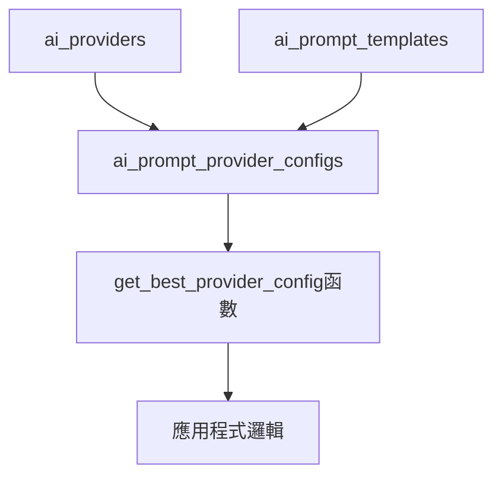

# AI 模板系統

## 系統概述

AI 模板系統是一個企業級的人工智能提示詞管理系統，採用三表分離架構，提供智能的多提供商選擇和效能優化機制。系統支援動態模板選擇、變數替換、效能追蹤和自動化配置管理。

### 核心特色
- **多提供商支援**: Ollama、Claude、OpenAI 三大主流 AI 服務
- **智能選擇機制**: 基於效能、成本、品質的自動最佳化選擇
- **模板版本控制**: 支援模板複製、版本管理和 A/B 測試
- **完整的監控**: 效能統計、成本追蹤、品質評分
- **TypeScript 完整支援**: 型別安全的 API 和開發體驗

## 架構設計

### 三表分離架構



#### 1. AI 提供商表 (ai_providers)
儲存 AI 服務提供商的基本資訊和配置：

| 欄位 | 說明 | 範例 |
|------|------|------|
| `name` | 提供商識別碼 | `"ollama"`, `"claude"`, `"openai"` |
| `display_name` | 顯示名稱 | `"Ollama 本機服務"` |
| `provider_type` | 服務類型 | `"local"`, `"cloud"` |
| `base_url` | API 基礎 URL | `"http://localhost:11434"` |
| `default_model` | 預設模型 | `"phi4-mini:latest"` |
| `is_active` | 啟用狀態 | `true` / `false` |
| `is_default` | 預設提供商 | `true` / `false` |

#### 2. AI 提示詞模板表 (ai_prompt_templates)
儲存結構化的提示詞模板和配置：

| 欄位 | 說明 | 範例 |
|------|------|------|
| `template_key` | 模板唯一識別碼 | `"alert_enhancement"` |
| `template_name` | 模板顯示名稱 | `"警示增強分析"` |
| `category` | 模板分類 | `"alert_analysis"` |
| `prompt_template` | 提示詞模板內容 | 包含 `{{variable}}` 變數的文字 |
| `required_variables` | 必要變數清單 | `["alert_details", "business_context"]` |
| `optional_variables` | 可選變數清單 | `["historical_data"]` |
| `max_tokens` | 最大回應 token 數 | `300` |
| `temperature` | 隨機性控制參數 | `0.3` |

#### 3. AI 提供商配置表 (ai_prompt_provider_configs)
連接模板與提供商，包含效能優化配置：

| 欄位 | 說明 | 範例 |
|------|------|------|
| `template_id` | 關聯的模板 ID | UUID |
| `provider_id` | 關聯的提供商 ID | UUID |
| `provider_specific_params` | 提供商專屬參數 | JSON 格式配置 |
| `priority` | 優先級 (數字越小優先級越高) | `100` |
| `performance_score` | 效能評分 (0-1) | `0.85` |
| `cost_efficiency_score` | 成本效率評分 (0-1) | `0.92` |
| `quality_score` | 品質評分 (0-1) | `0.78` |

## 可用模板清單

目前系統提供 13 個活躍的 AI 模板，涵蓋多個業務領域：

### 警示分析類
| 模板 Key | 模板名稱 | 用途說明 |
|---------|---------|---------|
| `alert_enhancement` | 警示增強分析 | 一般性業務警示的 AI 分析和建議 |
| `alert_enhancement_critical` | 緊急警示分析 | 高優先級緊急警示的深度分析 |

### 分析與洞察類
| 模板 Key | 模板名稱 | 用途說明 |
|---------|---------|---------|
| `trend_analysis` | 趨勢分析 | 業務趨勢分析和預測 |
| `business_health_analysis` | 業務健康分析 | 分析業務健康指標並提供建議 |
| `insight_deepening` | 深度洞察分析 | 具備豐富商業背景時的深度分析 |
| `business_intelligence` | 商業智能分析 | 提供深度商業洞察和戰略建議 |

### 客戶關係管理類
| 模板 Key | 模板名稱 | 用途說明 |
|---------|---------|---------|
| `customer_behavior_analysis` | 客戶行為分析 | 分析客戶行為並提供個人化建議 |
| `customer_churn_analysis` | 客戶流失風險分析 | 專門分析客戶流失風險 |

### 電商運營類
| 模板 Key | 模板名稱 | 用途說明 |
|---------|---------|---------|
| `product_recommendation` | 產品推薦 | 基於客戶偏好和庫存狀況推薦產品 |
| `inventory_alert_analysis` | 庫存預警分析 | 分析庫存狀況並提供補貨建議 |
| `order_anomaly_detection` | 訂單異常分析 | 檢測和分析訂單異常情況 |

### 管理決策類
| 模板 Key | 模板名稱 | 用途說明 |
|---------|---------|---------|
| `executive_summary_enhanced` | 高階主管摘要 (增強版) | 為高階主管提供戰略級業務摘要 |
| `risk_forecasting` | 風險預測分析 | 專業風險預測和評估分析 |

## AI 提供商配置

### 當前可用提供商

#### 1. Ollama (本機服務) ✅ 預設啟用
- **類型**: 本機部署
- **基礎 URL**: `http://localhost:11434`
- **預設模型**: `phi4-mini:latest`
- **優勢**: 無外部依賴、資料隱私保護、無使用費用
- **適用場景**: 一般性業務分析、內部系統警示

#### 2. Claude by Anthropic ⚠️ 需要配置
- **類型**: 雲端服務
- **狀態**: 已架構但未啟用
- **優勢**: 高品質文字分析、專業商業洞察
- **適用場景**: 複雜商業分析、高品質內容生成

#### 3. OpenAI ChatGPT ⚠️ 需要配置
- **類型**: 雲端服務
- **狀態**: 已架構但未啟用
- **優勢**: 廣泛的語言能力、強大的推理能力
- **適用場景**: 創意內容、複雜問題解決

## 🎛️ 智能選擇機制

### 優化策略選項

系統透過 `get_best_provider_config()` 函數提供四種優化策略：

#### 1. `'performance'` - 效能優先
- 基於 `performance_score` 選擇回應速度最快的配置
- 適用場景: 即時警示、快速分析需求

#### 2. `'cost'` - 成本優先
- 基於 `cost_efficiency_score` 選擇最經濟的配置
- 適用場景: 大量批次處理、成本敏感業務

#### 3. `'quality'` - 品質優先
- 基於 `quality_score` 選擇分析品質最高的配置
- 適用場景: 重要決策支援、高階主管報告

#### 4. `'balanced'` - 平衡模式 (預設)
- 綜合評分: `效能(40%) + 成本效率(30%) + 品質(30%)`
- 適用場景: 一般業務需求、日常運營分析

### 動態選擇邏輯

```sql
-- 系統自動選擇流程
1. 檢查是否指定偏好提供商 → 如果可用則優先使用
2. 根據優化策略計算各配置的評分
3. 選擇評分最高的配置
4. 按優先級排序作為備援選項
```

## 效能監控與統計

### 系統健康指標

系統提供完整的監控和統計功能：

#### 1. 模板統計
- 總模板數量和分類分布
- 活躍模板數量
- 提供商配置統計

#### 2. 效能統計
- 各模板的綜合評分排名
- 提供商效能比較
- 回應時間和成功率追蹤

#### 3. 使用分析
- 模板使用頻率統計
- 熱門模板排行
- 成本效益分析

### 監控視圖

系統提供以下預建視圖：

- `ai_prompt_templates_active`: 活躍模板概覽
- `ai_prompt_provider_configs_active`: 活躍配置概覽
- `ai_prompt_provider_performance_stats`: 效能統計詳情

## 🔮 未來規劃

### Phase 4: 增強功能規劃
- **自適應學習**: 基於使用回饋自動調整配置評分
- **A/B 測試**: 支援模板變體的效果比較
- **成本追蹤**: 詳細的 API 使用成本分析
- **多語言支援**: 支援多語言提示詞模板
- **自定義評分**: 允許自定義效能評分權重

### 技術改進方向
- **快取機制**: 提升頻繁使用模板的回應速度
- **批次處理**: 支援大量提示詞的批次處理
- **錯誤重試**: 智能的錯誤處理和自動重試機制
- **配置熱更新**: 支援運行時動態更新配置

---

## 相關文檔

- [AI 模板使用指南](../../../04-guides/ai/ai-template-usage-guide.md)
- [AI Template API 參考](../../../05-reference/ai/ai-template-api-reference.md)
- [AIEnhancedAlertService 文檔](./ai-enhanced-alert-service.md)