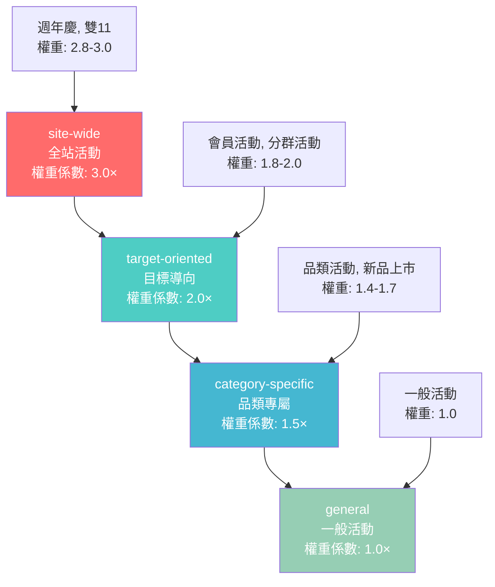
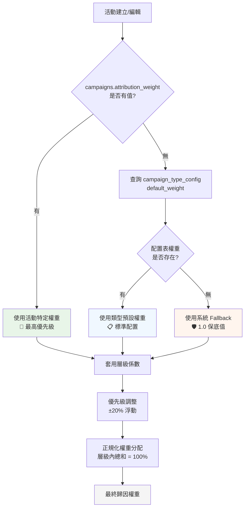
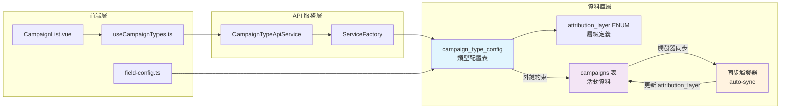
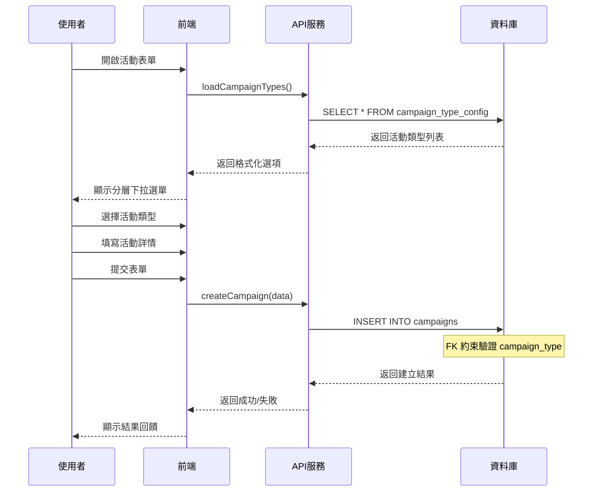
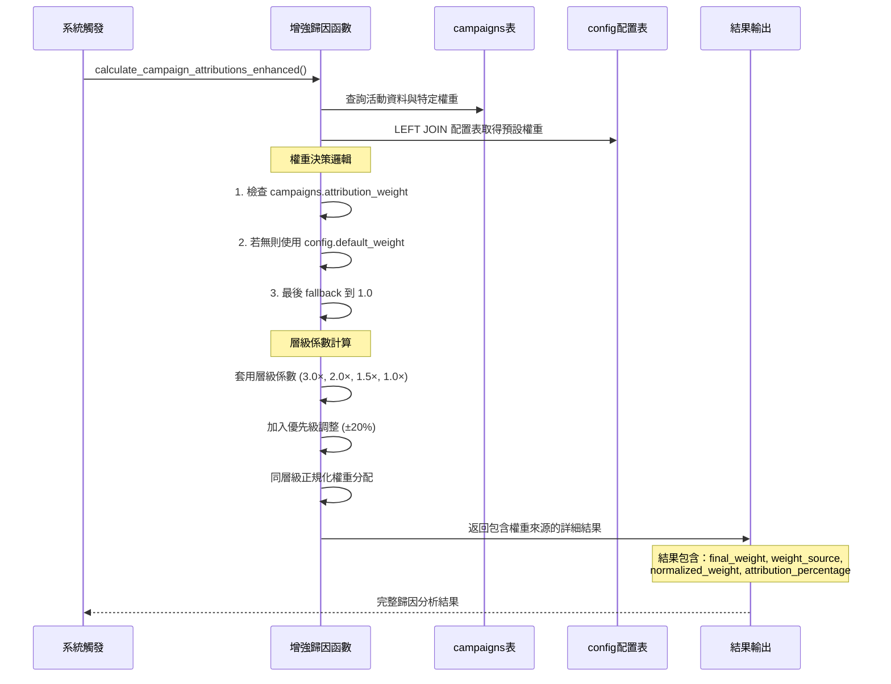

# 活動類型管理系統

## 系統概述

活動類型管理系統是一個企業級的可配置活動分類與歸因系統，專為電商平台設計。系統基於四層歸因架構（site-wide > target-oriented > category-specific > general），提供靈活的活動類型配置、權重管理和效果歸因分析。

### 核心價值
- **靈活配置**: 支援動態活動類型管理，無需重新部署
- **精準歸因**: 基於業務層級的多維度歸因權重計算
- **企業級穩定性**: 完整的錯誤處理和容錯機制
- **向後相容**: 保持與現有硬編碼類型的完全相容性

### 業務背景
解決原有系統的核心問題：
- 活動類型硬編碼在前端程式碼中，缺乏統一管理
- 前端類型定義與後端歸因邏輯不一致
- 缺乏資料庫層面的約束和驗證機制
- 無法動態調整活動權重和優先級

## 架構設計

### 四層歸因架構



#### 層級權重與優先級配置
| 層級 | 中文名稱 | 權重範圍 | 優先級範圍 | 層級係數 | 業務描述 |
|------|----------|----------|------------|----------|----------|
| `site-wide` | 全站活動 | 2.0-5.0 | 80-100 | 3.0× | 雙11、週年慶等重大促銷 |
| `target-oriented` | 目標導向 | 1.5-3.0 | 60-80 | 2.0× | 會員專屬、VIP 活動 |
| `category-specific` | 品類專屬 | 1.0-2.5 | 40-60 | 1.5× | 服飾、3C 產品專區促銷 |
| `general` | 一般活動 | 0.5-2.0 | 0-40 | 1.0× | 日常折扣、新品上市 |

### 權重覆蓋與計算機制

#### 權重優先級規則


#### 權重計算公式

**第一步：基礎權重決定**
```
基礎權重 = COALESCE(
    campaigns.attribution_weight,        -- 活動特定權重（優先）
    campaign_type_config.default_weight, -- 類型預設權重
    1.0                                  -- 系統保底權重
)
```

**第二步：層級係數計算**
```
層級權重 = 基礎權重 × 層級係數

其中層級係數：
- site-wide: 3.0×
- target-oriented: 2.0×  
- category-specific: 1.5×
- general: 1.0×
```

**第三步：優先級調整**
```
優先級加成 = 層級權重 × (優先級分數 / 500.0)

最終權重 = 層級權重 + 優先級加成
```

**第四步：正規化分配**
```
正規化權重 = 活動權重 / MAX(同層級總權重, 0.1)
歸因百分比 = 正規化權重 × 100%
```

### 系統組件架構



### 資料表關聯設計

#### campaigns 表整合
```sql
-- 新增關聯欄位
ALTER TABLE campaigns 
ADD COLUMN attribution_layer attribution_layer;

-- 外鍵約束
ALTER TABLE campaigns 
ADD CONSTRAINT fk_campaigns_campaign_type 
FOREIGN KEY (campaign_type) REFERENCES campaign_type_config(type_code)
ON UPDATE CASCADE ON DELETE SET NULL;

-- 自動同步觸發器
CREATE TRIGGER trigger_sync_campaign_attribution_layer
    BEFORE INSERT OR UPDATE OF campaign_type ON campaigns
    FOR EACH ROW 
    EXECUTE FUNCTION sync_campaign_attribution_layer();
```

#### 欄位用途說明
| 表名 | 欄位 | 用途 | 優先級 |
|------|------|------|--------|
| campaigns | `attribution_weight` | 活動特定權重覆蓋 | 🎯 最高 |
| campaign_type_config | `default_weight` | 類型預設權重 | 📋 標準 |
| 系統 Fallback | `1.0` | 保底權重值 | 🛡️ 最低 |
| campaigns | `attribution_layer` | 自動同步的歸因層級 | 🔄 自動 |

## 功能特性

### 1. 動態類型配置
- **資料庫驅動**: 所有活動類型定義來自 `campaign_type_config` 表
- **即時生效**: 配置變更立即反映到前端下拉選單
- **分層管理**: 按歸因層級組織活動類型
- **多語言支援**: 支援中英文顯示名稱

### 2. 權重與優先級系統
- **權重計算**: 支援 0.00-9.99 範圍的權重設定
- **優先級排序**: 0-100 優先級系統，影響顯示順序
- **層級權重**: 不同歸因層級具有不同的基礎權重

### 3. 視覺化與品牌
- **顏色系統**: 每種類型可配置專屬色彩類別
- **圖示支援**: 預留圖示欄位支援未來擴展
- **品牌一致性**: 統一的視覺設計語言

### 4. 驗證與約束
- **唯一性約束**: 確保類型代碼的唯一性
- **外鍵約束**: campaigns 表與配置表的參照完整性
- **ENUM 約束**: 歸因層級的嚴格類型安全

## 資料結構

### attribution_layer ENUM
```sql
CREATE TYPE attribution_layer AS ENUM (
    'site-wide',        -- 全站活動：影響全體使用者的重大推廣
    'target-oriented',  -- 目標導向：針對特定群體的精準行銷
    'category-specific',-- 品類專屬：限定商品類別的促銷
    'general'          -- 一般活動：日常基礎推廣活動
);
```

### campaign_type_config 表結構
```sql
CREATE TABLE public.campaign_type_config (
    type_code TEXT PRIMARY KEY,                    -- 類型代碼 (e.g., 'flash_sale')
    display_name_zh TEXT NOT NULL,               -- 中文顯示名稱
    display_name_en TEXT,                         -- 英文顯示名稱
    attribution_layer attribution_layer NOT NULL, -- 歸因層級
    default_weight NUMERIC(3,2) DEFAULT 1.0,     -- 預設權重 (0.00-9.99)
    default_priority INTEGER DEFAULT 50,         -- 預設優先級 (0-100)
    color_class TEXT,                            -- CSS 顏色類別
    icon_name TEXT,                              -- 圖示名稱
    description TEXT,                            -- 描述
    is_active BOOLEAN DEFAULT TRUE,              -- 是否啟用
    created_at TIMESTAMPTZ DEFAULT NOW(),        -- 建立時間
    updated_at TIMESTAMPTZ DEFAULT NOW()         -- 更新時間
);
```

### TypeScript 類型定義
```typescript
// 歸因層級類型
export type AttributionLayer = 
    | 'site-wide' 
    | 'target-oriented' 
    | 'category-specific' 
    | 'general'

// 活動類型配置介面
export interface CampaignTypeConfig {
    type_code: string
    display_name_zh: string
    display_name_en?: string
    attribution_layer: AttributionLayer
    default_weight: number
    default_priority: number
    color_class?: string
    icon_name?: string
    description?: string
    is_active: boolean
    created_at: string
    updated_at: string
}

// 活動類型群組
export interface CampaignTypeGroup {
    layer: AttributionLayer
    display_name: string
    description: string
    types: CampaignTypeConfig[]
    total_count: number
}
```

## API 端點

### RPC 函數

#### get_campaign_type_groups()
```sql
-- 取得按歸因層級分組的活動類型
SELECT layer, display_name, description, types, total_count
FROM campaign_type_groups
ORDER BY 
  CASE layer 
    WHEN 'site-wide' THEN 1
    WHEN 'target-oriented' THEN 2  
    WHEN 'category-specific' THEN 3
    WHEN 'general' THEN 4
  END
```

#### validate_campaign_type(type_code)
```sql
-- 驗證活動類型是否有效
SELECT EXISTS(
  SELECT 1 FROM campaign_type_config 
  WHERE type_code = $1 AND is_active = TRUE
)
```

#### validate_campaign_system()
```sql
-- 系統健康度檢查
SELECT 
  total_types,
  active_types, 
  layers_coverage,
  system_health_score
```

### RESTful API 端點

| 方法 | 端點 | 描述 |
|------|------|------|
| GET | `/campaign-types` | 取得所有活躍的活動類型 |
| GET | `/campaign-types/groups` | 取得分組的活動類型 |
| POST | `/campaign-types` | 建立新活動類型 |
| PUT | `/campaign-types/:code` | 更新活動類型 |
| DELETE | `/campaign-types/:code` | 刪除活動類型 (軟刪除) |
| POST | `/campaign-types/:code/validate` | 驗證活動類型 |
| GET | `/campaign-types/health` | 系統健康度檢查 |

## 使用者介面

### 活動表單整合
```vue
<template>
  <!-- 動態下拉選單，按歸因層級分組 -->
  <Select 
    v-model="formData.campaignType"
    :options="campaignTypeOptions"
    :groupBy="layer"
    :groupLabelMap="layerDisplayNames"
    placeholder="選擇活動類型"
  />
</template>
```

### 篩選器整合
```vue
<template>
  <!-- 篩選器使用動態選項 -->
  <DataTableFacetedFilter
    :title="'活動類型'"
    :options="campaignTypeOptions"
    v-model:selected="campaignTypeFilter"
  />
</template>
```

### 狀態標籤顯示
```vue
<template>
  <!-- 動態顏色和顯示名稱 -->
  <Badge 
    :variant="getCampaignTypeColor(campaign.campaignType)"
    :class="getCampaignTypeColor(campaign.campaignType, campaignTypeConfig)"
  >
    {{ getCampaignTypeDisplayName(campaign.campaignType, campaignTypeConfig) }}
  </Badge>
</template>
```

## 🔄 業務流程

### 活動類型建立流程


### 歸因計算流程（增強版）


### 權重計算實例

#### 範例情境：同時進行的多個活動
```
活動 A: 雙11購物節
- campaign_type: 'holiday' (site-wide層級)
- campaigns.attribution_weight: NULL (使用配置預設)
- config.default_weight: 3.00
- 層級係數: 3.0×
- 最終權重: 3.00 × 3.0 = 9.0

活動 B: VIP會員專屬
- campaign_type: 'membership' (target-oriented層級)  
- campaigns.attribution_weight: 2.5 (活動特定覆蓋)
- 層級係數: 2.0×
- 最終權重: 2.5 × 2.0 = 5.0

活動 C: 3C品類促銷
- campaign_type: 'category' (category-specific層級)
- campaigns.attribution_weight: NULL
- config.default_weight: 1.50
- 層級係數: 1.5×
- 最終權重: 1.50 × 1.5 = 2.25
```

#### 正規化分配結果
```
同層級權重總和:
- site-wide: 9.0 (僅活動A)
- target-oriented: 5.0 (僅活動B)  
- category-specific: 2.25 (僅活動C)

正規化權重 (同層級內分配100%):
- 活動A: 9.0/9.0 = 100% (該層級唯一活動)
- 活動B: 5.0/5.0 = 100% (該層級唯一活動)
- 活動C: 2.25/2.25 = 100% (該層級唯一活動)
```

## 效能與優化

### 查詢優化
- **索引策略**: type_code (主鍵)、attribution_layer、is_active 複合索引
- **視圖優化**: 預計算的分組視圖減少即時查詢負擔
- **快取機制**: 前端 composable 快取配置資料

### 資料庫效能
```sql
-- 複合索引優化查詢效能
CREATE INDEX idx_campaign_type_config_layer_active 
ON campaign_type_config(attribution_layer, is_active);

-- 快取友好的分組視圖
CREATE VIEW campaign_type_groups_cache AS
SELECT 
  attribution_layer as layer,
  json_agg(
    json_build_object(
      'type_code', type_code,
      'display_name_zh', display_name_zh,
      'default_weight', default_weight,
      'default_priority', default_priority,
      'color_class', color_class
    ) ORDER BY default_priority DESC, display_name_zh
  ) as types,
  count(*) as total_count
FROM campaign_type_config 
WHERE is_active = TRUE
GROUP BY attribution_layer;
```

### 前端效能
- **懶載入**: useCampaignTypes composable 按需載入
- **記憶化**: computed 屬性快取計算結果
- **類型安全**: TypeScript 編譯時優化

## 🧪 測試策略

### 單元測試
```typescript
describe('CampaignTypeApiService', () => {
  it('should load campaign types grouped by layer', async () => {
    const service = new CampaignTypeApiService(mockSupabase)
    const result = await service.getCampaignTypeGroups()
    expect(result.success).toBe(true)
    expect(result.data).toHaveProperty('site-wide')
  })
})
```

### 整合測試
```typescript
describe('Campaign Type Integration', () => {
  it('should create campaign with valid type', async () => {
    const campaignData = {
      campaignName: '測試活動',
      campaignType: 'flash_sale',
      // ...other fields
    }
    const result = await createCampaign(campaignData)
    expect(result.success).toBe(true)
  })
})
```

### 資料庫測試
```sql
-- 測試歸因層級約束
INSERT INTO campaign_type_config (type_code, display_name_zh, attribution_layer)
VALUES ('test_invalid', '測試', 'invalid_layer'); 
-- 預期：約束錯誤

-- 測試權重範圍約束
INSERT INTO campaign_type_config (type_code, display_name_zh, attribution_layer, default_weight)
VALUES ('test_weight', '測試權重', 'general', 15.00);
-- 預期：約束錯誤 (超出 0.00-9.99 範圍)
```

## 🔮 未來擴展規劃

> **📋 完整規劃文檔**: 詳細的 Phase 2&3 功能規劃請參閱 [未來階段規劃文檔](../../04-guides/dev-notes/enhancement-plans/campaign-type-system-future-phases.md)

### Phase 2: 智能化管理與預測分析 (4-6 個月)

#### 2.1 活動模板系統 🎯
**目標**: 建立可重複使用的活動模板，提升創建效率
- **活動模板庫**: 基於歷史成功案例的標準化模板
- **模板自定義工具**: 支援模板參數調整和個性化配置
- **效果追蹤**: 模板使用效果分析和成功率統計
- **商業價值**: 活動創建效率提升 60%，成功率提升 25%

#### 2.2 智能建議引擎 🤖
**目標**: 提供數據驅動的活動配置建議
- **權重優化建議**: 基於歷史數據的最佳權重推薦
- **時機預測**: 最佳活動發布時間點分析
- **預算分配**: 多活動預算智能分配建議
- **機器學習模型**: 回歸、分類、時間序列分析
- **商業價值**: ROI 提升 15-20%，降低決策風險

#### 2.3 效果預測模型 📈
**目標**: 活動執行前的效果預測和風險評估
- **營收預測**: 基於歷史轉換率的收入預估
- **互動預測**: 點擊率、參與度等 KPI 預測
- **競爭影響分析**: 與現有活動的相互影響評估
- **置信區間**: 預測結果的可信度量化
- **商業價值**: 減少 30% 的活動失敗率

#### 2.4 進階分析儀表板 📊
**目標**: 提供深度分析工具支援複雜決策
- **多點觸控歸因**: 跨通道歸因路徑分析
- **協同效應分析**: 活動組合效果最佳化
- **競爭分析**: 市場動態監控和差異化策略
- **視覺化升級**: 互動式分析界面和報表

### Phase 3: 自適應優化與跨平台整合 (6-8 個月)

#### 3.1 歸因模型自動優化 🔧
**目標**: 基於實際效果的系統自我優化
- **自適應權重**: 根據效果數據自動調整權重
- **層級係數優化**: 動態優化四層歸因係數
- **A/B 測試自動化**: 自動化權重配置實驗
- **安全機制**: 漸進式調整、回滾機制、人工審核
- **ML 技術**: 強化學習、多臂老虎機、貝氏優化

#### 3.2 即時權重調整 ⚡
**目標**: 基於即時數據流的動態權重優化
- **實時監控**: 活動效果即時追蹤和分析
- **動態調整**: 自動化權重調整觸發機制
- **效果驗證**: 調整效果的即時驗證和回饋
- **觸發條件**: 效能閾值、時間點、競爭行為、市場變化
- **商業價值**: 響應速度提升，最佳化效果持續

#### 3.3 跨平台數據整合 🔗
**目標**: 統一多平台活動管理和歸因分析
- **平台整合**: Google Ads, Facebook Ads, LINE Ads 等
- **數據同步**: 即時、批次、增量同步策略
- **統一歸因**: 跨平台統一的歸因分析框架
- **權重同步**: 多平台權重配置自動同步
- **電商整合**: Shopify, WooCommerce 等平台支援

#### 3.4 機器學習深度整合 🧠
**目標**: 全面整合 AI/ML 技術提升系統智能化程度
- **MLOps 架構**: 完整的模型訓練、部署、監控體系
- **預測模型套件**: 營收、LTV、流失率等多維預測
- **優化算法**: 多目標遺傳演算法、貝氏優化等
- **異常檢測**: Isolation Forest 異常活動識別
- **因果推斷**: Double ML 因果效應分析

### 實施策略與資源需求

#### 開發資源估算
- **Phase 2**: 6-8 人團隊，4-6 個月
  - 後端工程師 3 名，前端工程師 2 名，數據科學家 2 名，DevOps 1 名
- **Phase 3**: 8-10 人團隊，6-8 個月
  - 在 Phase 2 基礎上增加 ML 工程師和平台整合專家

#### 技術基礎設施需求
- **GPU 集群**: 支援 ML 模型訓練和推理
- **實時數據流**: Apache Kafka + Apache Storm
- **時序數據庫**: InfluxDB 或 TimescaleDB
- **監控系統**: Prometheus + Grafana

#### 風險評估與緩解
- **技術風險**: ML 模型準確性、實時處理延遲、跨平台相容性
- **業務風險**: 投資回報、用戶接受度、競爭壓力
- **緩解措施**: 分階段實施、A/B 測試驗證、持續用戶回饋

#### 成功指標 (KPI)
- **Phase 2**: 活動效率提升 60%，ROI 提升 15-20%，預測準確率 85%+
- **Phase 3**: 自動化率 90%，即時調整延遲 < 5 分鐘，整合平台數 10+

### 長期願景與戰略意義

此系統的最終目標是建立**企業級的智能化行銷活動管理平台**，具備：

1. **全自動化運營**: 從活動規劃到效果優化的端到端自動化
2. **預測性分析**: 精準的市場趨勢預測和活動效果預估
3. **適應性優化**: 基於實時數據的自我學習和優化能力
4. **跨平台統一**: 多通道、多平台的統一管理和分析
5. **商業智能**: 深度的商業洞察和戰略決策支援

透過這些能力，企業將能夠：
- **提升競爭優勢**: 更精準的行銷策略和更高的 ROI
- **降低運營成本**: 自動化減少人工介入，提高營運效率
- **增強決策品質**: 數據驅動的決策，降低主觀判斷風險
- **實現規模效益**: 系統化的活動管理支援業務快速擴展

這是一個具有戰略意義的長期投資項目，將為企業數位轉型和智能化運營奠定重要基礎。

## 相關文檔

- [活動類型 API 文檔](./campaign-type-api.md)
- [資料庫系統文檔](../database/CAMPAIGN_TYPE_CONFIG_SYSTEM.md)
- [開發指南](../../04-guides/dev-notes/CAMPAIGN_TYPE_CONFIG_DEVELOPMENT_GUIDE.md)
- [活動系統整體架構](./campaign-system.md)

## 🏷️ 標籤

`#架構設計` `#活動管理` `#歸因分析` `#可配置系統` `#企業級`

---

*最後更新：2025-08-27*
*文檔版本：v1.0.0*