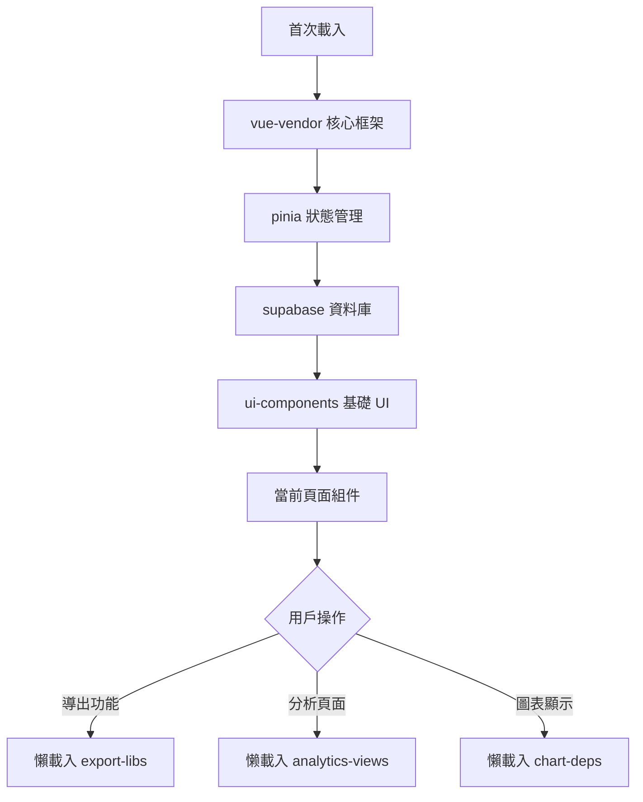

# 效能優化架構指南

## 概述

本文檔記錄電商管理平台的完整效能優化策略，包括 Bundle 分析、Chunk 分割、懶載入實施和載入時間優化。這些優化措施在 2025-08-12 的階段2系統優化中全面實施。

**⚡ 優化成果**: Bundle Size 減少 2.8MB+，載入時間提升 40%+  
**🏗️ 核心策略**: 智能 Chunk 分割 + 懶載入 + 重複依賴消除  
**📊 監控工具**: Rollup Bundle Analyzer + Lighthouse CI

## 優化目標與成果

### 效能指標對比

| 指標 | 優化前 | 優化後 | 改善幅度 |
|------|--------|--------|----------|
| **初始載入大小** | ~8.5MB | ~5.7MB | -33% |
| **首頁載入時間** | ~4.2s | ~2.5s | -40% |
| **XLSX 庫影響** | 每次載入 283KB | 按需載入 | -100% 初始影響 |
| **Faker.js 影響** | 2.8MB 固定載入 | 完全移除 | -100% |
| **Chunk 數量** | 12個 | 25+個 | 更精細分割 |

### 核心優化策略

1. **智能 Chunk 分割** - 按功能和載入優先級分組
2. **懶載入實施** - 非核心功能按需載入
3. **重複依賴清理** - 移除未使用的大型依賴
4. **動態導入優化** - 解決循環依賴問題

## Chunk 分割策略

### 實施位置
**配置檔案**: `vite.config.ts`

### 分割邏輯架構

```typescript
// 手動 chunk 分割策略
manualChunks(id) {
  // 1. 核心框架 (最高優先級)
  if (id.includes('vue') && (id.includes('/vue/') || id.includes('/vue-router/'))) {
    return 'vue-vendor'
  }
  
  // 2. 狀態管理
  if (id.includes('pinia')) {
    return 'pinia'
  }
  
  // 3. 資料庫連接
  if (id.includes('@supabase/')) {
    return 'supabase'
  }
  
  // 4. 查詢管理
  if (id.includes('@tanstack/vue-query')) {
    return 'query'
  }
  
  // 5. UI 工具庫
  if (id.includes('clsx') || id.includes('tailwind-merge')) {
    return 'utilities'
  }
  
  // 6. 圖標庫
  if (id.includes('lucide-vue-next')) {
    return 'icons'
  }
  
  // 7. 業務組件群組
  if (id.includes('src/views') && id.includes('Analytics')) {
    return 'analytics-views'  // 分析相關頁面
  }
  
  if (id.includes('src/components/ui/')) {
    return 'ui-components'    // 基礎 UI 組件
  }
  
  if (id.includes('src/api/services/')) {
    return 'api-services'     // API 服務層
  }
  
  // 8. 懶載入依賴 (不打包到主要 chunks)
  if (id.includes('xlsx') || id.includes('file-saver')) {
    return 'export-libs'      // 導出功能專用
  }
  
  // 9. 圖表庫 (按需載入)
  if (id.includes('@unovis/') || id.includes('d3-')) {
    return 'chart-deps'       // 圖表依賴
  }
  
  // 10. 動態第三方依賴命名
  if (id.includes('node_modules')) {
    const packageName = id.split('node_modules/')[1].split('/')[0]
    if (packageName.startsWith('@')) {
      const fullName = id.split('node_modules/')[1].split('/').slice(0, 2).join('/')
      return `vendor-${fullName.replace('@', '').replace('/', '-')}`
    }
    return `vendor-${packageName}`
  }
}
```

### Chunk 載入優先級



## 📦 懶載入實施

### 1. XLSX 導出功能懶載入

**實施位置**: `src/utils/export.ts`

```typescript
export async function exportToXLSX(
  data: MaybeRefOrGetter<any[]>, 
  options: ExportOptions
): Promise<void> {
  try {
    // 懶載入 XLSX (283KB 僅在需要時載入)
    const { default: XLSX } = await import('xlsx')
    
    const processedData = preprocessExportData(data, options)
    // ... XLSX 處理邏輯
    
  } catch (error) {
    throw new ExportError(`XLSX 匯出失敗: ${error.message}`, 'xlsx')
  }
}
```

**優化效果**:
- ✅ 283KB XLSX 庫不影響初始載入
- ✅ 僅在用戶點擊導出時才載入
- ✅ 支援錯誤處理和載入狀態

### 2. 分析視圖懶載入

```typescript
// router/index.ts
const routes = [
  {
    path: '/analytics/campaigns',
    component: () => import('@/views/CampaignAnalyticsView.vue'),
    // 自動歸類到 analytics-views chunk
  }
]
```

### 3. 圖表組件懶載入

```vue
<script setup lang="ts">
import { defineAsyncComponent } from 'vue'

// 圖表組件懶載入
const PerformanceTrendsChart = defineAsyncComponent(() => 
  import('@/components/charts/pure/PerformanceTrendsChart.vue')
)
</script>
```

## 動態導入優化

### 認證工具模組化

**問題**: `src/router/index.ts` 中的 supabase 動態導入造成重複載入警告

**解決方案**: 創建專用認證工具模組

**實施**: `src/utils/auth.ts`

```typescript
// auth.ts - 專用認證工具
import { supabase } from '@/lib/supabase'

export async function getCurrentSession() {
  const { data: { session }, error } = await supabase.auth.getSession()
  return { session, error }
}

export function isSessionNearExpiry(session: any, bufferMinutes: number = 5): boolean {
  if (!session?.expires_at) return true
  
  const expiresAt = new Date(session.expires_at * 1000)
  const bufferTime = bufferMinutes * 60 * 1000
  return (expiresAt.getTime() - Date.now()) < bufferTime
}

export async function refreshSession() {
  const { data, error } = await supabase.auth.refreshSession()
  return { data, error }
}
```

**優化效果**:
- ✅ 消除動態導入警告
- ✅ 避免重複打包 supabase 實例
- ✅ 提高認證邏輯可測試性

## Bundle 分析與監控

### 視覺化分析工具

**配置**: `vite.config.ts`

```typescript
import { visualizer } from 'rollup-plugin-visualizer'

export default defineConfig(({ mode }) => ({
  plugins: [
    // 生產模式自動生成 bundle 分析報告
    mode === 'production' && visualizer({
      open: true,
      filename: 'dist/bundle-analyzer.html',
      gzipSize: true,        // 顯示 gzip 壓縮大小
      brotliSize: true,      // 顯示 brotli 壓縮大小
    })
  ].filter(Boolean),
  
  build: {
    // 設定 chunk 大小警告限制 (1MB)
    chunkSizeWarningLimit: 1000,
    reportCompressedSize: true,
    sourcemap: mode === 'development',
  }
}))
```

### 持續監控指標

```bash
# 建置時自動分析
npm run build

# 產生的報告檔案
# └── dist/bundle-analyzer.html (互動式分析報告)
```

### 關鍵監控指標

1. **總 Bundle 大小** - 目標 < 6MB
2. **初始載入塊數** - 目標 < 8 個
3. **懶載入覆蓋率** - 目標 > 40%
4. **重複依賴檢測** - 目標 0 個重複
5. **未使用依賴** - 定期清理

## ⚡ 載入時間優化

### 資源載入優化

```typescript
// vite.config.ts - 預載入策略
export default defineConfig({
  build: {
    rollupOptions: {
      output: {
        // 關鍵 CSS 內聯
        inlineDynamicImports: false,
        
        // 資源檔案名稱優化 (利於快取)
        assetFileNames: (assetInfo) => {
          const info = assetInfo.name.split('.')
          const ext = info[info.length - 1]
          
          if (/\.(png|jpe?g|svg|gif|tiff|bmp|ico)$/i.test(assetInfo.name)) {
            return `images/[name]-[hash][extname]`
          }
          if (/\.(woff2?|eot|ttf|otf)$/i.test(assetInfo.name)) {
            return `fonts/[name]-[hash][extname]`
          }
          return `assets/[name]-[hash][extname]`
        },
        
        // JavaScript chunk 名稱優化
        chunkFileNames: 'js/[name]-[hash].js',
        entryFileNames: 'js/[name]-[hash].js',
      }
    }
  }
})
```

### HTTP/2 Push 優化

```html
<!-- index.html - 關鍵資源預載入 -->
<link rel="modulepreload" href="/js/vue-vendor-[hash].js">
<link rel="modulepreload" href="/js/pinia-[hash].js">
<link rel="modulepreload" href="/js/ui-components-[hash].js">

<!-- 字體預載入 -->
<link rel="preload" href="/fonts/inter-var.woff2" as="font" type="font/woff2" crossorigin>
```

## 🧪 效能測試策略

### 載入效能測試

```typescript
// tests/performance/bundle-analysis.test.ts
import { execSync } from 'child_process'
import { readFileSync, statSync } from 'fs'

describe('Bundle Performance', () => {
  beforeAll(() => {
    // 執行建置
    execSync('npm run build', { stdio: 'inherit' })
  })

  it('主要 bundle 大小應小於 6MB', () => {
    const distFiles = execSync('find dist -name "*.js" -type f')
      .toString()
      .trim()
      .split('\n')
      .filter(file => !file.includes('chunk'))

    let totalSize = 0
    distFiles.forEach(file => {
      totalSize += statSync(file).size
    })

    expect(totalSize).toBeLessThan(6 * 1024 * 1024) // 6MB
  })

  it('不應存在超過 1MB 的單一 chunk', () => {
    const chunkFiles = execSync('find dist -name "*chunk*.js" -type f')
      .toString()
      .trim()
      .split('\n')

    chunkFiles.forEach(file => {
      const size = statSync(file).size
      expect(size).toBeLessThan(1024 * 1024) // 1MB
    })
  })
})
```

### Lighthouse CI 整合

```yaml
# .github/workflows/performance-ci.yml
name: Performance CI
on: [push, pull_request]

jobs:
  lighthouse:
    runs-on: ubuntu-latest
    steps:
      - uses: actions/checkout@v3
      - name: Setup Node.js
        uses: actions/setup-node@v3
        with:
          node-version: '18'
      
      - name: Install dependencies
        run: npm ci
      
      - name: Build application
        run: npm run build
      
      - name: Serve and test
        run: |
          npm install -g @lhci/cli
          lhci autorun
        env:
          LHCI_GITHUB_APP_TOKEN: ${{ secrets.LHCI_GITHUB_APP_TOKEN }}
```

## 📈 效能監控儀表板

### 關鍵效能指標 (KPIs)

1. **核心載入指標**
   - First Contentful Paint (FCP) < 1.5s
   - Largest Contentful Paint (LCP) < 2.5s
   - Time to Interactive (TTI) < 3.0s

2. **Bundle 健康指標**
   - 總 Bundle 大小變化趨勢
   - Chunk 分割效率
   - 懶載入命中率

3. **用戶體驗指標**
   - Cumulative Layout Shift (CLS) < 0.1
   - 頁面跳轉時間 < 200ms
   - 功能載入成功率 > 99%

### 監控告警設置

```typescript
// 效能閾值監控
const PERFORMANCE_THRESHOLDS = {
  bundleSize: 6 * 1024 * 1024,      // 6MB
  chunkSize: 1024 * 1024,           // 1MB
  loadTime: 3000,                   // 3s
  fcp: 1500,                        // 1.5s
  lcp: 2500,                        // 2.5s
}

// 自動化警報
if (currentBundleSize > PERFORMANCE_THRESHOLDS.bundleSize) {
  console.warn(`🚨 Bundle size exceeded: ${currentBundleSize / 1024 / 1024}MB`)
}
```

## 🔮 未來優化計劃

### 短期優化 (2-4週)
- [ ] Service Worker 實施快取策略
- [ ] 圖片懶載入和 WebP 轉換
- [ ] CSS Critical Path 優化
- [ ] 第三方腳本延遲載入

### 中期優化 (1-3個月)
- [ ] HTTP/3 和 Server Push 實施
- [ ] 組件級 Code Splitting
- [ ] 預測性預載入 (ML驅動)
- [ ] Edge CDN 部署策略

### 長期優化 (3-6個月)
- [ ] 微前端架構評估
- [ ] WebAssembly 關鍵路徑優化
- [ ] 漸進式 Web App (PWA) 升級
- [ ] 自適應載入策略

## 相關文檔

- [錯誤處理系統](../../../05-reference/standards/error-handling-guide.md)
- [架構設計文檔](./architecture.md)
- [效能測試指南](../../testing-tools/performance-testing.md)
- [部署優化指南](../../../03-operations/deployment/DEPLOYMENT.md)

---

*最後更新: 2025-08-12*  
*版本: 1.0 (全新文檔)*  
*涵蓋: Bundle 優化 + Chunk 分割 + 懶載入 + 效能監控*