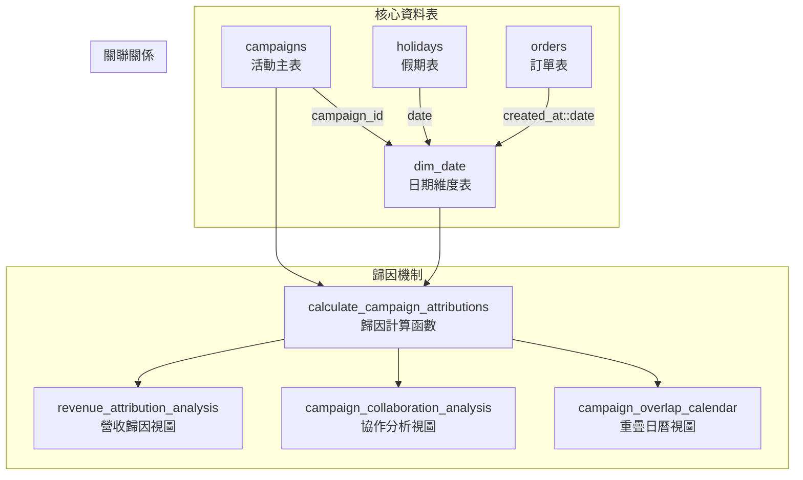

# 活動維度架構技術文件

## 系統架構概述

本文件詳細說明 `campaigns`、`dim_date`、`holidays` 三表關係架構，以及分層歸因機制的技術實作。

## 資料表關係圖



## 核心資料表結構

### **1. campaigns 活動主表**

```sql
CREATE TABLE campaigns (
    id UUID PRIMARY KEY DEFAULT gen_random_uuid(),
    campaign_name TEXT NOT NULL,
    campaign_type TEXT NOT NULL,
    start_date DATE NOT NULL,
    end_date DATE NOT NULL,
    description TEXT,
    
    -- 分層歸因欄位
    attribution_layer TEXT DEFAULT 'general',
    priority_score INTEGER DEFAULT 50,
    attribution_weight NUMERIC(3,2) DEFAULT 1.0,
    
    created_at TIMESTAMPTZ DEFAULT NOW(),
    updated_at TIMESTAMPTZ DEFAULT NOW(),
    
    -- 約束條件
    CONSTRAINT chk_campaign_date_order CHECK (start_date <= end_date),
    CONSTRAINT chk_campaign_name_not_empty CHECK (length(trim(campaign_name)) > 0)
);
```

**分層歸因架構**：
- `attribution_layer`: 歸因層級 ('site-wide', 'target-oriented', 'category-specific')
- `priority_score`: 同層級活動的優先級 (0-100)
- `attribution_weight`: 歸因權重 (0.0-1.0)

### **2. dim_date 日期維度表**

```sql
CREATE TABLE dim_date (
    date DATE PRIMARY KEY,
    campaign_id UUID REFERENCES campaigns(id) ON DELETE SET NULL,
    campaign_name TEXT, -- 保留用於向後相容
    is_weekend BOOLEAN DEFAULT FALSE,
    is_holiday BOOLEAN DEFAULT FALSE,
    
    -- 索引優化
    CONSTRAINT idx_dim_date_campaign_id FOREIGN KEY (campaign_id) REFERENCES campaigns(id)
);
```

**設計原則**：
- 主鍵為 `date`，確保每日唯一性
- `campaign_id` 外鍵關聯活動表
- 自動同步假期狀態

### **3. holidays 假期表**

```sql
CREATE TABLE holidays (
    id UUID PRIMARY KEY DEFAULT gen_random_uuid(),
    date DATE NOT NULL UNIQUE,
    name TEXT NOT NULL,
    description TEXT,
    created_at TIMESTAMPTZ DEFAULT NOW()
);
```

**自動同步機制**：
- 觸發器：`trigger_sync_holidays`
- 同步函數：`sync_holiday_to_dim_date()`

## ⚙️ 分層歸因機制

### **歸因層級架構**

```
📱 全站活動層 (site-wide)
├── seasonal: 季節性活動 (權重: 0.8)
├── holiday: 假期活動 (權重: 0.7)  
├── anniversary: 週年慶活動 (權重: 0.6)
└── flash_sale: 限時閃購 (權重: 0.9)

🎯 目標導向層 (target-oriented)
├── membership: 會員活動 (權重: 0.5)
└── demographic: 人群活動 (權重: 0.3)

🛍️ 品類專屬層 (category-specific)  
├── category: 品類活動 (權重: 0.4)
├── product_launch: 新品發布 (權重: 0.6)
└── lifestyle: 生活方式活動 (權重: 0.4)
```

### **歸因權重計算演算法**

```sql
-- 核心歸因函數
CREATE OR REPLACE FUNCTION calculate_campaign_attributions(
    target_date DATE,
    order_amount NUMERIC DEFAULT NULL
) RETURNS JSONB
```

**計算步驟**：

1. **活動識別**：找出指定日期的所有活躍活動
2. **層級分組**：按 `attribution_layer` 分組計算權重
3. **正規化權重**：每層級內權重總和為 1.0
4. **歸因強度**：根據權重分類 (dominant/significant/moderate/minor)

**權重計算公式**：
```
正規化權重 = 活動原始權重 / 同層級活動權重總和
```

## 🔄 自動化同步機制

### **假期同步觸發器**

```sql
CREATE TRIGGER trigger_sync_holidays
    AFTER INSERT OR UPDATE OR DELETE ON holidays
    FOR EACH ROW
    EXECUTE FUNCTION sync_holiday_to_dim_date();
```

**同步邏輯**：
1. **INSERT/UPDATE**: 在 `dim_date` 中標記 `is_holiday = TRUE`
2. **DELETE**: 移除假期標記 `is_holiday = FALSE`
3. **自動建立**: 不存在的日期自動插入 `dim_date`

### **活動同步觸發器**

```sql
CREATE TRIGGER update_campaign_in_dim_date_v2_trigger
    AFTER INSERT OR UPDATE OR DELETE ON campaigns
    FOR EACH ROW
    EXECUTE FUNCTION update_campaign_in_dim_date_v2();
```

**同步邏輯**：
1. **活動期間**: 自動建立 `start_date` 到 `end_date` 的所有日期記錄
2. **關聯更新**: 設定 `dim_date.campaign_id` 
3. **假期整合**: 自動檢查並標記假期狀態

## 📈 分析視圖架構

### **1. revenue_attribution_analysis**

**用途**: 核心營收歸因分析

```sql
SELECT 
    campaign_id,
    campaign_name,
    attribution_layer,
    influenced_orders,           -- 影響的訂單數
    total_attributed_revenue,    -- 總歸因營收
    avg_attribution_weight,      -- 平均歸因權重
    avg_concurrent_campaigns,    -- 平均並發活動數
    exclusive_orders,            -- 獨占訂單數
    collaborative_orders         -- 協作訂單數
FROM revenue_attribution_analysis;
```

### **2. campaign_collaboration_analysis**

**用途**: 活動協作效果分析

```sql
SELECT 
    concurrent_campaigns,        -- 並發活動數
    campaign_combination,        -- 活動組合描述
    occurrence_count,           -- 發生次數
    combination_revenue,        -- 組合總營收
    collaboration_type          -- 協作類型
FROM campaign_collaboration_analysis;
```

### **3. campaign_overlap_calendar**

**用途**: 活動重疊日曆分析

```sql
SELECT 
    date,
    concurrent_campaigns,       -- 當日活動數
    campaigns_list,            -- 活動清單
    complexity_level,          -- 複雜度等級
    special_flags              -- 特殊標記
FROM campaign_overlap_calendar;
```

### **4. holiday_impact_summary**

**用途**: 假期影響分析

```sql
SELECT 
    holiday_date,
    holiday_name,
    revenue_multiplier,        -- 營收倍數 (相對平日)
    orders_multiplier,         -- 訂單倍數
    holiday_type              -- 假期類型
FROM holiday_impact_summary;
```

## 🛡️ 資料完整性保障

### **約束條件**

1. **日期邏輯約束**：
   ```sql
   ALTER TABLE campaigns 
   ADD CONSTRAINT chk_campaign_date_order 
   CHECK (start_date <= end_date);
   ```

2. **活動名稱約束**：
   ```sql
   ALTER TABLE campaigns 
   ADD CONSTRAINT chk_campaign_name_not_empty 
   CHECK (length(trim(campaign_name)) > 0);
   ```

3. **外鍵約束**：
   - `dim_date.campaign_id` → `campaigns.id`
   - 支援 `ON DELETE SET NULL` 確保資料一致性

### **完整性檢查函數**

```sql
-- 假期資料完整性檢查
SELECT * FROM check_holiday_data_integrity();

-- 歸因品質檢查  
SELECT * FROM check_attribution_quality();

-- 系統健康檢查
SELECT * FROM check_campaign_system_health();
```

## 🔍 索引優化策略

### **效能索引**

```sql
-- 活動表索引
CREATE INDEX idx_campaigns_date_range ON campaigns (start_date, end_date);
CREATE INDEX idx_campaigns_type ON campaigns (campaign_type);
CREATE INDEX idx_campaigns_active_period ON campaigns 
    (start_date, end_date, campaign_type) 
    WHERE start_date IS NOT NULL AND end_date IS NOT NULL;

-- 日期維度表索引
CREATE INDEX idx_dim_date_campaign_id ON dim_date (campaign_id);
CREATE INDEX idx_dim_date_holiday ON dim_date (is_holiday);

-- 假期表索引  
CREATE UNIQUE INDEX idx_holidays_date ON holidays (date);
```

### **查詢優化**

1. **日期範圍查詢**: 使用 `idx_campaigns_date_range`
2. **活動類型過濾**: 使用 `idx_campaigns_type`
3. **假期狀態查詢**: 使用 `idx_dim_date_holiday`

## 效能考量

### **查詢複雜度**

- **O(1)**: 單日期歸因查詢
- **O(n)**: 活動期間歸因計算 (n = 活動數)
- **O(m×n)**: 協作分析查詢 (m = 訂單數, n = 活動數)

### **記憶體使用**

- **JSON歸因資料**: 每次計算約 1-5KB
- **視圖快取**: 依據訂單量動態調整
- **觸發器開銷**: 最小化，僅於資料變更時執行

### **擴展性設計**

1. **水平擴展**: 支援時間分區 (依年月分割)
2. **垂直擴展**: 支援新增歸因維度
3. **快取策略**: 預計算常用歸因結果

## 安全性考量

### **存取控制**

```sql
-- 只讀分析角色
GRANT SELECT ON revenue_attribution_analysis TO analytics_role;
GRANT SELECT ON campaign_collaboration_analysis TO analytics_role;

-- 管理員完整權限
GRANT ALL ON campaigns, dim_date, holidays TO admin_role;
```

### **資料驗證**

1. **輸入驗證**: 所有函數包含參數檢查
2. **型別安全**: 使用 PostgreSQL 強型別系統
3. **SQL注入防護**: 使用參數化查詢

## 遷移策略

### **版本控制**

- `20250723180000`: 基礎結構優化
- `20250723190000`: 假期同步機制
- `20250723200000`: 分層歸因實作

### **向後相容性**

1. **保留舊欄位**: `dim_date.campaign_name` 保留用於相容性
2. **漸進式遷移**: 支援新舊系統並存
3. **回滾機制**: 完整的備份和回滾策略

---

## 相關文件

- **[系統維護指南](./CAMPAIGN_MAINTENANCE_GUIDE.md)**: 日常維護操作
- **[使用者操作手冊](./CAMPAIGN_USER_MANUAL.md)**: 業務人員使用指南
- **[API參考文件](./CAMPAIGN_API_REFERENCE.md)**: 開發介面說明

---

**文件版本**: v1.0  
**最後更新**: 2025-07-24  
**維護團隊**: 資料工程團隊