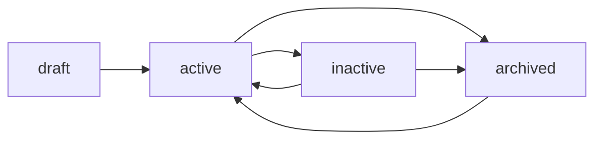

# 產品狀態管理系統

## 概述

產品狀態管理系統採用雙層架構，分別管理產品的**業務狀態**和**資料狀態**，提供靈活且清晰的產品生命週期管理。

## 架構設計

### 雙層狀態架構

```
產品狀態管理
├── status (業務狀態)         # 產品在業務流程中的狀態
│   ├── draft                 # 草稿
│   ├── active                # 上架銷售
│   ├── inactive              # 暫停銷售
│   └── archived              # 已歸檔
└── deleted_at (資料狀態)     # 資料的軟刪除標記
    ├── NULL                  # 資料存在
    └── timestamp             # 軟刪除時間
```

## 狀態定義與用途

### Status 欄位（業務狀態）

| Status | 中文說明 | 前台顯示 | 可購買 | 後台顯示 | 用途說明 |
|--------|---------|----------|--------|----------|----------|
| `draft` | 草稿 | ❌ | ❌ | ✅ | 產品建立中，尚未完成所有必要資訊 |
| `active` | 上架 | ✅ | ✅ | ✅ | 正常銷售狀態，顯示在所有產品列表 |
| `inactive` | 下架 | ✅ | ❌ | ✅ | 暫時停止銷售（如缺貨、季節性商品） |
| `archived` | 歸檔 | ❌ | ❌ | ✅ | 已停產但保留歷史記錄 |

### Deleted_at 欄位（資料狀態）

| 值 | 說明 | 顯示位置 | 用途 |
|----|------|----------|------|
| `NULL` | 資料正常 | 根據 status 決定 | 正常資料記錄 |
| 時間戳記 | 軟刪除 | 不顯示 | 標記為刪除但保留資料 |

## 使用場景

### 典型業務場景

1. **新產品上架流程**
   ```
   draft (建立草稿) → active (正式上架)
   ```

2. **季節性產品管理**
   ```
   active (銷售期) → inactive (非銷售期) → active (下一季銷售)
   ```

3. **產品停產流程**
   ```
   active → inactive (清庫存) → archived (停產歸檔)
   ```

4. **錯誤產品處理**
   ```
   任何狀態 → deleted_at = now() (軟刪除)
   ```

## 查詢邏輯

### SQL 查詢範例

```sql
-- 前台產品列表（只顯示可購買產品）
SELECT * FROM products
WHERE deleted_at IS NULL
  AND status = 'active';

-- 前台產品詳情（顯示但不可購買）
SELECT * FROM products
WHERE deleted_at IS NULL
  AND status IN ('active', 'inactive');

-- 後台產品管理（顯示所有未刪除產品）
SELECT * FROM products
WHERE deleted_at IS NULL;

-- 庫存計算（包含暫停銷售的產品）
SELECT * FROM products
WHERE deleted_at IS NULL
  AND status IN ('active', 'inactive');

-- 資料分析（包含歸檔產品）
SELECT * FROM products
WHERE deleted_at IS NULL
  AND status IN ('active', 'inactive', 'archived');
```

## 前端實作

### Vue 組件實作

```typescript
// 狀態選項定義
const statusOptions = [
  { value: 'draft', label: 'Draft', icon: Package2, color: 'text-muted-foreground' },
  { value: 'active', label: 'Active', icon: Check, color: 'text-success' },
  { value: 'inactive', label: 'Inactive', icon: Pause, color: 'text-warning' },
  { value: 'archived', label: 'Archived', icon: Archive, color: 'text-muted-foreground' },
]

// 更新產品狀態
async function updateProductStatus(
  id: string,
  status: 'draft' | 'active' | 'inactive' | 'archived'
) {
  const result = await productApiService.updateProductStatus(id, status)
  // 處理結果...
}

// 軟刪除產品
async function deleteProduct(id: string) {
  const result = await productApiService.deleteProduct(id)
  // 處理結果...
}
```

### UI 呈現

- **Status 管理**: 下拉選單切換產品業務狀態
- **Delete 按鈕**: 執行軟刪除操作（設置 deleted_at）
- **狀態顏色**:
  - Active: 綠色（success）
  - Inactive: 黃色（warning）
  - Draft/Archived: 灰色（muted）

## 🔄 狀態轉換規則

### 允許的狀態轉換



### 特殊規則

1. **Draft 狀態**: 只能轉換為 active
2. **Archived 狀態**: 可以重新啟用為 active
3. **Deleted 資料**: 不顯示在任何正常介面，需要特殊權限查看

## 🛡️ 最佳實踐

### 何時使用 Status

- 管理產品的業務生命週期
- 控制產品在不同渠道的顯示和銷售
- 季節性或週期性的產品管理
- 產品發布流程控制

### 何時使用 Deleted_at

- 使用者明確要求刪除產品
- 錯誤或重複的產品記錄
- 違反規定的產品
- 需要從系統中完全移除但保留歷史記錄

### 注意事項

1. **不要混淆兩者用途**: Status 是業務狀態，deleted_at 是資料狀態
2. **保持資料完整性**: 軟刪除的產品仍保留所有關聯資料
3. **權限控制**: 刪除操作需要適當權限
4. **審計追蹤**: 所有狀態變更應記錄在歷史日誌

## 🔍 與其他模組的比較

| 模組 | 狀態管理方式 | 刪除方式 |
|------|-------------|----------|
| **產品 (Products)** | status + deleted_at | 軟刪除 |
| **訂單 (Orders)** | status only | 無刪除（只有取消） |
| **活動 (Campaigns)** | 無 status | 硬刪除 |
| **活動類型 (Campaign Types)** | is_active | 軟刪除（設為 inactive） |
| **分類 (Categories)** | 無 status | 硬刪除 |
| **客戶 (Customers)** | 無 status | 無刪除功能 |

## 維護指南

### 資料庫維護

```sql
-- 檢查軟刪除的產品數量
SELECT COUNT(*) FROM products WHERE deleted_at IS NOT NULL;

-- 清理超過一年的軟刪除資料（謹慎使用）
DELETE FROM products
WHERE deleted_at IS NOT NULL
  AND deleted_at < NOW() - INTERVAL '1 year';

-- 恢復誤刪的產品
UPDATE products
SET deleted_at = NULL
WHERE id = 'product_id';
```

### 監控建議

1. 定期檢查長時間處於 draft 狀態的產品
2. 監控 inactive 產品的庫存狀況
3. 審查軟刪除產品的原因和頻率
4. 確保歸檔產品的歷史訂單資料完整性

## 未來改進方向

1. **狀態變更歷史**: 記錄每次狀態變更的時間和原因
2. **批量狀態管理**: 支援批量更新產品狀態
3. **自動狀態轉換**: 基於規則的自動狀態管理（如庫存為 0 自動轉為 inactive）
4. **狀態工作流**: 需要審核的狀態變更流程
5. **回收站功能**: 軟刪除產品的統一管理介面