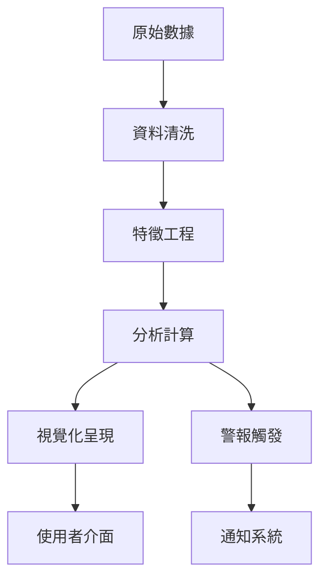

# Analytics 系統架構設計

## 系統概述

Analytics 分析系統是電商管理平台的核心商業智能模組，提供多維度的數據分析與視覺化功能，支援產品分析、訂單分析、客戶分析、支援分析四大專業領域。

## 整體架構

### 分析模組組織
```
Analytics System (分析系統)
├── Product Analytics (產品分析)          # ABC分析、滯銷品、庫存預警
├── Order Analytics (訂單分析)            # 訂單趨勢、漏斗分析、效能統計
├── Customer Analytics (客戶分析)         # RFM模型、LTV分析、行為追蹤
└── Support Analytics (客服分析)          # 客服效能、回應時間、工作量分析
```

### 技術架構分層
```
┌─────────────────┐    ┌─────────────────┐    ┌─────────────────┐
│   View Layer    │    │ Component Layer │    │  Service Layer  │
│                 │    │                 │    │                 │
│ AnalyticsViews  │◄──►│ Chart Components│◄──►│ Analytics APIs  │
│ (5個頁面)        │    │ (7個圖表) ✅      │    │ (6個服務) 🔄     │
└─────────────────┘    └─────────────────┘    └─────────────────┘
          │                        │                        │
          ▼                        ▼                        ▼
┌─────────────────┐    ┌─────────────────┐    ┌─────────────────┐
│ Composable Layer│    │  Types & Utils  │    │  Database Layer │
│                 │    │                 │    │                 │
│ useAnalytics    │    │ Analytics Types │    │ Supabase Views  │
│ (6個組合函數)    │    │ Chart Configs   │    │ SQL Functions   │
└─────────────────┘    └─────────────────┘    └─────────────────┘
```

## 檔案結構詳覽

### 頁面組件 (Views)
```
src/views/
├── CustomerAnalyticsView.vue       # 客戶 RFM 分析 (46KB - 複雜儀表板)
├── OrderAnalyticsView.vue          # 訂單趨勢分析 (13KB - 中等複雜度)
├── ProductAnalyticsView.vue        # 產品 ABC 分析 (11KB - 精簡版)
├── ProductAnalyticsTestView.vue    # 產品分析測試 (16KB - 開發測試用)
└── SupportAnalyticsView.vue        # 客服效能分析 (26KB - 高複雜度)
```

### 分析組件 (Components) - ✅ 已驗證
```
src/components/analytics/
├── ABCAnalysisChart.vue            # ABC 分類圓餅圖 ✅
├── AnalyticsDashboard.vue          # 綜合分析儀表板 ✅
├── CancellationAnalysisChart.vue   # 取消訂單分析 ✅
├── CustomerBehaviorChart.vue       # 客戶行為追蹤 ✅
├── DeliveryPerformanceChart.vue    # 配送效能分析 ✅
├── DemandForecastChart.vue         # 需求預測圖表 ✅
├── OrderFunnelChart.vue            # 訂單轉換漏斗 ✅
└── PaymentPerformanceChart.vue     # 付款效能分析 ✅
```

### API 服務層 (Services)
```
src/api/services/
├── CustomerAnalyticsZeroExpansionService.ts  # 客戶分析服務
├── OrderAnalyticsZeroExpansionService.ts     # 訂單分析服務
├── ProductApiService.ts                      # 產品分析服務 (複用)
├── SupportAnalyticsApiService.ts             # 客服分析服務
├── UserApiService.ts                         # 用戶分析服務 (複用)
└── base/BaseApiService.ts                    # 基礎服務類
```

### 狀態管理層 (Composables)
```
src/composables/analytics/
├── useBasicForecasting.ts          # 基礎預測功能 (備份中)
├── useCustomerAnalyticsBasic.ts    # 客戶分析基礎功能
├── useOrderAnalyticsBasic.ts       # 訂單分析基礎功能
├── useProductAnalytics.ts          # 產品分析功能
├── useProfitabilityAnalysis.ts     # 毛利分析功能 (備份中)
└── useSupportAnalytics.ts          # 客服分析功能
```

### 類型定義 (Types)
```
src/types/
├── analytics.ts                    # 通用分析類型
├── customerAnalytics.ts            # 客戶分析類型
├── orderAnalytics.ts               # 訂單分析類型
├── productAnalytics.ts             # 產品分析類型
└── supportAnalytics.ts             # 客服分析類型
```

## 各模組功能詳述

### 1. Product Analytics (產品分析)

#### 核心功能
- **ABC 分析**: 按銷售額和銷量對產品進行分類
- **滯銷品分析**: 識別長期無銷售的產品
- **庫存預警**: 低庫存和過剩庫存警報
- **需求預測**: 基於歷史數據的銷售預測

#### 技術實現
```typescript
interface ProductAnalytics {
  abcAnalysis: ABCCategory[]      # A/B/C 三類產品分析
  slowMovingProducts: Product[]   # 滯銷品清單
  stockAlerts: StockAlert[]       # 庫存預警
  demandForecast: ForecastData[]  # 需求預測數據
}
```

#### 關鍵指標
- 產品週轉率
- 庫存健康度分數
- 預測準確率
- ABC分類分佈

### 2. Order Analytics (訂單分析)

#### 核心功能
- **訂單趨勢分析**: 時序性訂單數據分析
- **轉換漏斗**: 從瀏覽到完成訂單的轉換分析
- **取消訂單分析**: 訂單取消原因與趨勢
- **配送效能**: 配送時間和成功率分析

#### 技術實現
```typescript
interface OrderAnalytics {
  trendAnalysis: TrendData[]        # 趨勢數據
  conversionFunnel: FunnelStep[]    # 漏斗轉換步驟
  cancellationAnalysis: CancelData[] # 取消分析
  deliveryPerformance: DeliveryMetrics # 配送指標
}
```

#### 關鍵指標
- 訂單轉換率
- 平均訂單價值 (AOV)
- 訂單取消率
- 配送準時率

### 3. Customer Analytics (客戶分析)

#### 核心功能
- **RFM 分析**: 最近購買時間、頻率、金額分析
- **客戶生命週期價值 (LTV)**: 客戶長期價值評估
- **行為追蹤**: 客戶行為模式分析
- **客戶分群**: 基於行為的客戶分群

#### 技術實現
```typescript
interface CustomerAnalytics {
  rfmAnalysis: RFMSegment[]         # RFM分群結果
  lifetimeValue: LTVData[]          # 客戶LTV數據
  behaviorTracking: BehaviorEvent[] # 行為追蹤事件
  customerSegments: Segment[]       # 客戶分群
}
```

#### 關鍵指標
- 客戶獲取成本 (CAC)
- 客戶留存率
- 平均客單價
- 回購率

### 4. Support Analytics (客服分析)

#### 核心功能
- **回應時間分析**: 客服回應速度統計
- **解決率分析**: 問題解決效率評估
- **工作量分析**: 客服工作量分佈
- **滿意度分析**: 客戶滿意度追蹤

#### 技術實現
```typescript
interface SupportAnalytics {
  responseTimeMetrics: ResponseTimeData[] # 回應時間指標
  resolutionRates: ResolutionData[]       # 解決率數據
  workloadAnalysis: WorkloadMetrics[]     # 工作量分析
  satisfactionScores: SatisfactionData[] # 滿意度分數
}
```

#### 關鍵指標
- 平均回應時間
- 首次解決率
- 客服工作負荷
- 客戶滿意分數

## 資料流與處理

### 資料來源分類
- **🗄️ DB**: 直接從資料庫查詢取得（已驗證存在）
- **⚙️ FE**: 前端計算處理（基於已存在資料）
- **🔄 Hybrid**: 混合模式（確認資料庫基礎數據存在）
- **📊 RPC**: 使用資料庫函數（已驗證函數存在）

### 資料處理流程


## 使用者介面架構

### 視覺化組件標準
- 使用 Unovis 圖表庫統一視覺風格
- 響應式設計適配各種螢幕尺寸
- 支援深色/淺色主題切換
- 互動性操作（縮放、篩選、drill-down）

### 儀表板佈局原則
- **資訊密度**: 平衡資訊豐富度與可讀性
- **視覺層次**: 重要指標優先顯示
- **導航便利性**: 清楚的模組間導航
- **即時性**: 資料自動刷新與狀態指示

## 效能優化策略

### 前端優化
- **組件懶載入**: 按需載入分析組件
- **資料快取**: 智能快取分析結果
- **虛擬滾動**: 大量資料的高效渲染
- **防抖處理**: 避免頻繁的資料查詢

### 後端優化
- **資料預計算**: 定期計算複雜指標
- **索引優化**: 針對分析查詢優化索引
- **分頁載入**: 大資料集分頁處理
- **快取策略**: Redis 快取熱門分析結果

## 🧪 測試策略

### 單元測試
- 分析邏輯函數測試
- 圖表組件渲染測試
- 資料轉換邏輯測試

### 整合測試
- API 端點整合測試
- 資料庫查詢效能測試
- 端到端使用者流程測試

### 效能測試
- 大量資料處理效能測試
- 並發使用者負載測試
- 記憶體使用監控

## 🔮 未來規劃

### Phase 2 增強功能
- 機器學習預測模型
- 自訂報表建立器
- 即時資料串流處理

### Phase 3 智能化升級
- AI 驅動的異常檢測
- 自動化見解產生
- 預測性分析建議

### Phase 4 企業級擴展
- 多租戶支援
- 進階權限控制
- 企業級資料治理