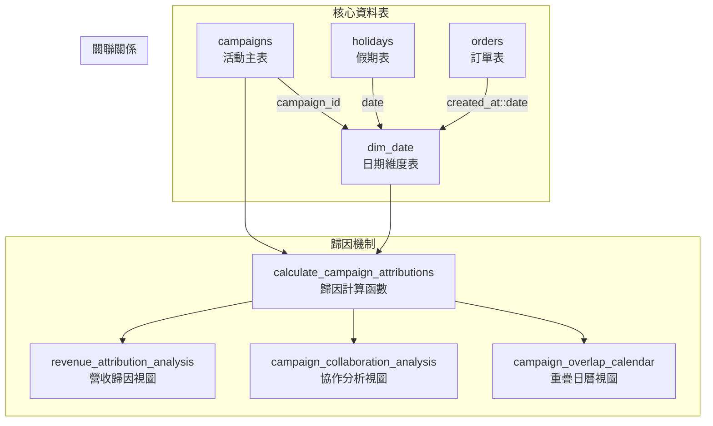

# Campaign 資料庫設計

## 系統架構概述

本文件詳細說明 Campaign 系統的資料庫設計，包含 `campaigns`、`dim_date`、`holidays` 三表關係架構，以及分層歸因機制的技術實作。

## 資料表關係圖



## 核心資料表結構

### **1. campaigns 活動主表**

```sql
CREATE TABLE campaigns (
    id UUID PRIMARY KEY DEFAULT gen_random_uuid(),
    campaign_name TEXT NOT NULL,
    campaign_type TEXT NOT NULL,
    start_date DATE NOT NULL,
    end_date DATE NOT NULL,
    description TEXT,

    -- 分層歸因欄位
    attribution_layer TEXT DEFAULT 'general',
    priority_score INTEGER DEFAULT 50,
    attribution_weight NUMERIC(3,2) DEFAULT 1.0,

    created_at TIMESTAMPTZ DEFAULT NOW(),
    updated_at TIMESTAMPTZ DEFAULT NOW(),

    -- 約束條件
    CONSTRAINT chk_campaign_date_order CHECK (start_date <= end_date),
    CONSTRAINT chk_campaign_name_not_empty CHECK (length(trim(campaign_name)) > 0)
);
```

**分層歸因架構**：
- `attribution_layer`: 歸因層級 ('site-wide', 'target-oriented', 'category-specific')
- `priority_score`: 同層級活動的優先級 (0-100)
- `attribution_weight`: 歸因權重 (0.0-1.0)

### **2. dim_date 日期維度表**

```sql
CREATE TABLE dim_date (
    date DATE PRIMARY KEY,
    campaign_id UUID REFERENCES campaigns(id) ON DELETE SET NULL,
    campaign_name TEXT, -- 保留用於向後相容
    is_weekend BOOLEAN DEFAULT FALSE,
    is_holiday BOOLEAN DEFAULT FALSE,

    -- 索引優化
    created_at TIMESTAMPTZ DEFAULT NOW()
);

-- 複合索引優化查詢效能
CREATE INDEX idx_dim_date_campaign_id ON dim_date(campaign_id);
CREATE INDEX idx_dim_date_weekend_holiday ON dim_date(is_weekend, is_holiday);
```

### **3. holidays 假期表**

```sql
CREATE TABLE holidays (
    id UUID PRIMARY KEY DEFAULT gen_random_uuid(),
    date DATE NOT NULL UNIQUE,
    name TEXT NOT NULL,
    country_code TEXT DEFAULT 'TW',
    holiday_type TEXT DEFAULT 'public',
    is_recurring BOOLEAN DEFAULT FALSE,

    created_at TIMESTAMPTZ DEFAULT NOW()
);

-- 自動同步到 dim_date
CREATE OR REPLACE FUNCTION sync_holiday_to_dim_date()
RETURNS TRIGGER AS $$
BEGIN
    IF TG_OP = 'INSERT' THEN
        INSERT INTO dim_date (date, is_holiday)
        VALUES (NEW.date, TRUE)
        ON CONFLICT (date) DO UPDATE SET is_holiday = TRUE;
    ELSIF TG_OP = 'DELETE' THEN
        UPDATE dim_date SET is_holiday = FALSE WHERE date = OLD.date;
    END IF;
    RETURN NULL;
END;
$$ LANGUAGE plpgsql;
```

## ⚙️ 分層歸因機制

### 歸因層級系統

```sql
-- 歸因層級定義
CREATE TYPE attribution_layer_type AS ENUM (
    'site-wide',        -- 全站級活動
    'target-oriented',  -- 定向活動
    'category-specific' -- 類別特定活動
);

-- 歸因計算函數
CREATE OR REPLACE FUNCTION calculate_campaign_attributions(
    target_date DATE,
    order_amount NUMERIC
) RETURNS TABLE (
    campaign_id UUID,
    attribution_percentage NUMERIC,
    attributed_amount NUMERIC
) AS $$
DECLARE
    active_campaigns RECORD;
    total_weight NUMERIC := 0;
BEGIN
    -- 計算當日活躍活動總權重
    SELECT SUM(c.attribution_weight) INTO total_weight
    FROM campaigns c
    JOIN dim_date d ON d.campaign_id = c.id
    WHERE d.date = target_date;

    -- 返回歸因分配結果
    FOR active_campaigns IN
        SELECT c.id, c.attribution_weight
        FROM campaigns c
        JOIN dim_date d ON d.campaign_id = c.id
        WHERE d.date = target_date
    LOOP
        RETURN QUERY SELECT
            active_campaigns.id,
            (active_campaigns.attribution_weight / total_weight) * 100,
            order_amount * (active_campaigns.attribution_weight / total_weight);
    END LOOP;
END;
$$ LANGUAGE plpgsql;
```

## 📈 分析視圖架構

### **1. 營收歸因分析視圖**

```sql
CREATE VIEW revenue_attribution_analysis AS
SELECT
    c.id as campaign_id,
    c.campaign_name,
    c.attribution_layer,
    DATE_TRUNC('day', d.date) as analysis_date,
    COUNT(DISTINCT d.date) as active_days,
    SUM(COALESCE(daily_attribution.attributed_revenue, 0)) as total_attributed_revenue,
    AVG(c.attribution_weight) as avg_attribution_weight
FROM campaigns c
JOIN dim_date d ON d.campaign_id = c.id
LEFT JOIN (
    -- 計算每日歸因營收
    SELECT
        date,
        campaign_id,
        SUM(attributed_amount) as attributed_revenue
    FROM calculate_daily_attributions()  -- 假設的日歸因函數
    GROUP BY date, campaign_id
) daily_attribution ON daily_attribution.campaign_id = c.id
                   AND daily_attribution.date = d.date
GROUP BY c.id, c.campaign_name, c.attribution_layer, DATE_TRUNC('day', d.date);
```

### **2. 活動協作分析視圖**

```sql
CREATE VIEW campaign_collaboration_analysis AS
WITH overlapping_campaigns AS (
    SELECT
        d1.campaign_id as campaign_1_id,
        d2.campaign_id as campaign_2_id,
        d1.date as overlap_date,
        c1.campaign_name as campaign_1_name,
        c2.campaign_name as campaign_2_name
    FROM dim_date d1
    JOIN dim_date d2 ON d1.date = d2.date AND d1.campaign_id != d2.campaign_id
    JOIN campaigns c1 ON c1.id = d1.campaign_id
    JOIN campaigns c2 ON c2.id = d2.campaign_id
)
SELECT
    campaign_1_id,
    campaign_2_id,
    campaign_1_name,
    campaign_2_name,
    COUNT(*) as overlap_days,
    MIN(overlap_date) as first_overlap_date,
    MAX(overlap_date) as last_overlap_date
FROM overlapping_campaigns
GROUP BY campaign_1_id, campaign_2_id, campaign_1_name, campaign_2_name;
```

### **3. 重疊日曆視圖**

```sql
CREATE VIEW campaign_overlap_calendar AS
SELECT
    d.date,
    d.is_weekend,
    d.is_holiday,
    COUNT(d.campaign_id) as active_campaign_count,
    ARRAY_AGG(c.campaign_name ORDER BY c.priority_score DESC) as active_campaigns,
    SUM(c.attribution_weight) as total_attribution_weight,
    CASE
        WHEN COUNT(d.campaign_id) > 3 THEN 'high'
        WHEN COUNT(d.campaign_id) > 1 THEN 'medium'
        ELSE 'low'
    END as competition_intensity
FROM dim_date d
JOIN campaigns c ON c.id = d.campaign_id
WHERE d.campaign_id IS NOT NULL
GROUP BY d.date, d.is_weekend, d.is_holiday
ORDER BY d.date;
```

## 🔄 自動化同步機制

### 假期數據同步

```sql
-- 假期數據自動同步觸發器
CREATE TRIGGER trigger_sync_holiday_to_dim_date
    AFTER INSERT OR DELETE ON holidays
    FOR EACH ROW EXECUTE FUNCTION sync_holiday_to_dim_date();

-- 週末標記自動更新
CREATE OR REPLACE FUNCTION update_weekend_flags()
RETURNS void AS $$
BEGIN
    UPDATE dim_date
    SET is_weekend = (EXTRACT(DOW FROM date) IN (0, 6));
END;
$$ LANGUAGE plpgsql;
```

## 效能優化策略

### 索引優化

```sql
-- 主要查詢索引
CREATE INDEX idx_campaigns_date_range ON campaigns(start_date, end_date);
CREATE INDEX idx_campaigns_attribution_layer ON campaigns(attribution_layer);
CREATE INDEX idx_dim_date_composite ON dim_date(date, campaign_id, is_holiday);

-- 分析查詢索引
CREATE INDEX idx_campaigns_priority_weight ON campaigns(priority_score, attribution_weight);
CREATE INDEX idx_holidays_date_type ON holidays(date, holiday_type);
```

### 資料分區策略

```sql
-- dim_date 按年分區
CREATE TABLE dim_date_2024 PARTITION OF dim_date
FOR VALUES FROM ('2024-01-01') TO ('2025-01-01');

CREATE TABLE dim_date_2025 PARTITION OF dim_date
FOR VALUES FROM ('2025-01-01') TO ('2026-01-01');
```

## 🛡️ 資料完整性保障

### 約束條件

```sql
-- 活動日期邏輯約束
ALTER TABLE campaigns ADD CONSTRAINT chk_campaign_date_order
CHECK (start_date <= end_date);

-- 歸因權重約束
ALTER TABLE campaigns ADD CONSTRAINT chk_attribution_weight
CHECK (attribution_weight >= 0.0 AND attribution_weight <= 1.0);

-- 優先級約束
ALTER TABLE campaigns ADD CONSTRAINT chk_priority_score
CHECK (priority_score >= 0 AND priority_score <= 100);
```

### 資料驗證函數

```sql
CREATE OR REPLACE FUNCTION validate_campaign_overlap()
RETURNS TRIGGER AS $$
BEGIN
    -- 檢查同層級活動重疊時的權重總和
    IF (SELECT SUM(attribution_weight)
        FROM campaigns
        WHERE attribution_layer = NEW.attribution_layer
        AND start_date <= NEW.end_date
        AND end_date >= NEW.start_date) > 1.0 THEN
        RAISE EXCEPTION '同層級活動歸因權重總和不能超過 1.0';
    END IF;
    RETURN NEW;
END;
$$ LANGUAGE plpgsql;
```

## 維護與監控

### 健康檢查查詢

```sql
-- 檢查歸因權重總和
SELECT
    attribution_layer,
    date,
    SUM(attribution_weight) as total_weight
FROM campaigns c
JOIN dim_date d ON d.campaign_id = c.id
GROUP BY attribution_layer, date
HAVING SUM(attribution_weight) > 1.0;

-- 檢查孤立的 dim_date 記錄
SELECT COUNT(*) as orphaned_records
FROM dim_date d
LEFT JOIN campaigns c ON c.id = d.campaign_id
WHERE d.campaign_id IS NOT NULL AND c.id IS NULL;
```