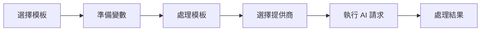

# AI 模板使用指南

## 快速開始

### 基本使用流程

AI 模板系統的使用遵循以下基本流程：



### 最簡單的使用範例

```typescript
import { getAIPromptTemplateService } from '@/api/services'

// 1. 獲取服務實例
const templateService = getAIPromptTemplateService()

// 2. 處理模板並替換變數
const result = await templateService.processPrompt(
  'alert_enhancement',  // 模板 key
  {
    alert_details: '系統 CPU 使用率達到 85%',
    business_context: '電商平台主要伺服器'
  }
)

console.log(result.processed_prompt)  // 處理後的提示詞
```

## 詳細使用說明

### 1. 取得 AI 模板服務

```typescript
// 方式一：使用便捷函數 (推薦)
import { getAIPromptTemplateService } from '@/api/services'
const templateService = getAIPromptTemplateService()

// 方式二：透過 ServiceFactory
import { defaultServiceFactory } from '@/api/services'
const templateService = defaultServiceFactory.getAIPromptTemplateService()

// 方式三：直接創建實例 (測試時使用)
import { AIPromptTemplateService } from '@/api/services/ai/AIPromptTemplateService'
import { supabase } from '@/lib/supabase'
const templateService = new AIPromptTemplateService(supabase)
```

### 2. 查詢可用模板

#### 獲取所有活躍模板

```typescript
// 取得所有模板
const allTemplates = await templateService.getActiveTemplates()

// 按分類篩選
const alertTemplates = await templateService.getActiveTemplates('alert_analysis')

console.log('警示分析類模板:', alertTemplates.map(t => ({
  key: t.template_key,
  name: t.template_name,
  variables: t.required_variables
})))
```

#### 取得特定模板詳情

```typescript
// 根據 template_key 獲取模板
const template = await templateService.getTemplateByKey('alert_enhancement')

console.log('模板資訊:', {
  名稱: template.template_name,
  分類: template.category,
  必要變數: template.required_variables,
  可選變數: template.optional_variables,
  最大Token: template.max_tokens,
  溫度參數: template.temperature
})
```

### 3. 模板變數處理

#### 變數驗證

```typescript
// 在處理模板前先驗證變數
const validation = await templateService.validatePromptVariables(
  'customer_behavior_analysis',
  {
    customer_id: 'CUST_12345',
    analysis_period: '30天',
    // missing: purchase_history (required)
  }
)

if (!validation.isValid) {
  console.error('缺少必要變數:', validation.missingRequired)
  console.warn('額外變數:', validation.extraVariables)
}
```

#### 模板處理與變數替換

```typescript
// 完整的變數準備和模板處理
const variables = {
  // 必要變數
  customer_id: 'CUST_12345',
  purchase_history: [
    { date: '2024-01-15', amount: 1200, product: 'Laptop' },
    { date: '2024-01-20', amount: 350, product: 'Mouse' }
  ],
  analysis_period: '30天',

  // 可選變數
  demographic_info: {
    age_group: '25-34',
    location: '台北市',
    membership_tier: 'Gold'
  }
}

const processingResult = await templateService.processPrompt(
  'customer_behavior_analysis',
  variables
)

console.log('處理結果:', {
  提示詞: processingResult.processed_prompt,
  使用的變數: processingResult.used_variables,
  缺少的必要變數: processingResult.missing_required_variables,
  模板資訊: processingResult.template_info
})
```

### 4. 智能提供商選擇

#### 自動選擇最佳提供商

```typescript
// 使用預設的平衡模式選擇
const bestConfig = await templateService.getBestProviderConfig(
  'business_intelligence'
)

if (bestConfig) {
  console.log('選中的配置:', {
    提供商: bestConfig.provider_name,
    配置ID: bestConfig.config_id,
    綜合評分: bestConfig.overall_score,
    特殊參數: bestConfig.provider_specific_params
  })
}
```

#### 指定優化策略

```typescript
// 效能優先選擇
const performanceConfig = await templateService.getBestProviderConfig(
  'alert_enhancement_critical',
  null,  // 不指定偏好提供商
  'performance'  // 效能優先策略
)

// 成本優先選擇
const costConfig = await templateService.getBestProviderConfig(
  'trend_analysis',
  null,
  'cost'
)

// 品質優先選擇
const qualityConfig = await templateService.getBestProviderConfig(
  'executive_summary_enhanced',
  null,
  'quality'
)
```

#### 指定偏好提供商

```typescript
// 假設我們偏好使用 Claude
const claudeProviderId = 'provider-claude-uuid'

const config = await templateService.getBestProviderConfig(
  'insight_deepening',
  claudeProviderId,  // 偏好的提供商 ID
  'balanced'
)

// 如果 Claude 不可用，系統會自動回退到其他可用提供商
```

### 5. 完整的 AI 增強警示使用範例

基於實際的 `AIEnhancedAlertService` 使用模式：

```typescript
import { getAIEnhancedAlertService } from '@/api/services'

// 1. 初始化服務並設定 AI 提供商
const aiAlertService = getAIEnhancedAlertService()

// 使用預設 Ollama 服務
const setupSuccess = await aiAlertService.useOllamaService()
if (!setupSuccess) {
  console.error('AI 服務設定失敗')
  return
}

// 2. 準備警示內容和上下文
const alertContext: AIAlertContext = {
  alertType: 'performance_degradation',
  metric: 'cpu_usage',
  currentValue: 85,
  threshold: 80,
  historicalData: [
    { timestamp: '2024-01-01T10:00:00Z', value: 65 },
    { timestamp: '2024-01-01T11:00:00Z', value: 72 },
    { timestamp: '2024-01-01T12:00:00Z', value: 85 }
  ],
  businessContext: '電商網站主要應用伺服器'
}

// 3. 執行 AI 增強分析
const analysis = await aiAlertService.enhanceAlert({
  id: 'alert_001',
  type: 'performance',
  message: 'CPU 使用率超過閾值',
  severity: 'high',
  timestamp: new Date(),
  source: 'monitoring_system'
}, alertContext)

// 4. 處理分析結果
if (analysis.aiSuggestion) {
  console.log('AI 分析結果:', {
    摘要: analysis.aiSuggestion.summary,
    嚴重程度: analysis.aiSuggestion.severity,
    建議措施: analysis.aiSuggestion.recommendations,
    後續步驟: analysis.aiSuggestion.nextSteps,
    可信度: analysis.aiSuggestion.confidence,
    使用的AI提供商: analysis.aiProviderUsed,
    處理時間: analysis.processingTime
  })
}
```

### 6. 批量處理模板

```typescript
// 批量處理多個模板
const templateKeys = [
  'alert_enhancement',
  'trend_analysis',
  'customer_behavior_analysis'
]

const batchResults = await Promise.all(
  templateKeys.map(async (key) => {
    try {
      // 為每個模板準備適當的變數
      const variables = generateVariablesForTemplate(key)

      const result = await templateService.processPrompt(key, variables)
      const config = await templateService.getBestProviderConfig(key)

      return {
        templateKey: key,
        success: true,
        result,
        config
      }
    } catch (error) {
      return {
        templateKey: key,
        success: false,
        error: error.message
      }
    }
  })
)

// 處理批量結果
const successful = batchResults.filter(r => r.success)
const failed = batchResults.filter(r => !r.success)

console.log(`成功處理 ${successful.length} 個模板，失敗 ${failed.length} 個`)
```

## 🛡️ 錯誤處理最佳實踐

### 1. 模板不存在處理

```typescript
try {
  const template = await templateService.getTemplateByKey('non_existent_template')
} catch (error) {
  if (error.message.includes('獲取 Prompt 模板失敗')) {
    console.error('指定的模板不存在或已停用')
    // 提供備用模板或使用預設邏輯
    const fallbackTemplate = await templateService.getTemplateByKey('alert_enhancement')
  }
}
```

### 2. 缺少必要變數處理

```typescript
const processingResult = await templateService.processPrompt(templateKey, variables)

if (processingResult.missing_required_variables.length > 0) {
  console.warn('警告：缺少必要變數', processingResult.missing_required_variables)

  // 選項 1：要求使用者提供缺少的變數
  // 選項 2：使用預設值或備用邏輯
  const enrichedVariables = {
    ...variables,
    // 為缺少的變數提供預設值
    business_context: '系統自動分析'
  }

  // 重新處理模板
  const retryResult = await templateService.processPrompt(templateKey, enrichedVariables)
}
```

### 3. 提供商選擇失敗處理

```typescript
const config = await templateService.getBestProviderConfig(templateKey)

if (!config) {
  console.error('無可用的 AI 提供商配置')

  // 檢查是否有活躍的提供商
  const activeProviders = await templateService.supabase
    .from('ai_providers')
    .select('*')
    .eq('is_active', true)

  if (activeProviders.data?.length === 0) {
    throw new Error('系統中沒有活躍的 AI 提供商')
  }

  // 建議檢查模板配置
  console.warn('建議檢查模板的提供商配置')
}
```

## 效能監控與優化

### 1. 取得系統統計

```typescript
// 獲取模板統計
const stats = await templateService.getTemplateStatistics()

console.log('系統統計:', {
  總模板數: stats.total,
  活躍模板數: stats.active_templates,
  分類分布: stats.by_category,
  提供商配置數: stats.total_provider_configs
})
```

### 2. 效能統計分析

```typescript
// 取得提供商效能統計
const performanceStats = await templateService.getProviderPerformanceStats()

// 找出各模板的最佳提供商
const bestPerformers = performanceStats.reduce((acc, stat) => {
  if (!acc[stat.template_key] || stat.overall_score > acc[stat.template_key].overall_score) {
    acc[stat.template_key] = stat
  }
  return acc
}, {})

console.log('各模板最佳提供商:', bestPerformers)
```

### 3. 更新效能評分

```typescript
// 基於實際使用回饋更新配置評分
const configId = 'config-uuid-123'

const updateSuccess = await templateService.updateConfigPerformanceScore(
  configId,
  {
    performance_score: 0.92,  // 基於實際回應時間計算
    cost_efficiency_score: 0.85,  // 基於實際成本計算
    quality_score: 0.88  // 基於回饋品質評估
  }
)

if (updateSuccess) {
  console.log('配置評分更新成功')
}
```

## 進階功能

### 1. 模板版本控制

```typescript
// 複製現有模板並創建新版本
const newTemplateId = await templateService.cloneTemplate(
  'alert_enhancement',  // 源模板 key
  '2.0',               // 新版本號
  {
    template_name: '警示增強分析 v2.0',
    description: '增加了歷史趨勢分析功能',
    prompt_template: '更新的提示詞模板...',
    max_tokens: 400,     // 增加 token 限制
    temperature: 0.2     // 降低隨機性
  }
)

console.log('新模板創建成功，ID:', newTemplateId)
```

### 2. 自定義模板創建

```typescript
// 創建全新的模板
const customTemplate: Omit<AIPromptTemplate, 'id' | 'created_at' | 'updated_at'> = {
  template_key: 'custom_sales_analysis',
  template_name: '銷售數據分析',
  category: 'sales_analytics',
  description: '專門用於銷售數據的深度分析',
  prompt_template: `
    請分析以下銷售數據：

    銷售期間：{{analysis_period}}
    總銷售額：{{total_sales}}
    銷售筆數：{{total_orders}}

    {{#if top_products}}
    熱銷產品：
    {{#each top_products}}
    - {{name}}: {{sales_amount}}
    {{/each}}
    {{/if}}

    請提供：
    1. 銷售趨勢分析
    2. 關鍵成功因素
    3. 改進建議
  `,
  required_variables: ['analysis_period', 'total_sales', 'total_orders'],
  optional_variables: ['top_products', 'comparison_period'],
  max_tokens: 500,
  temperature: 0.3,
  version: '1.0',
  is_active: true
}

const createdTemplate = await templateService.createTemplate(customTemplate)
console.log('自定義模板創建成功:', createdTemplate)
```

### 3. 系統健康檢查

```typescript
// 執行完整的系統健康檢查
try {
  const healthCheck = await templateService.performSystemHealthCheck()
  console.log('系統健康狀況:', healthCheck)

  // 執行就緒檢查
  const readinessCheck = await templateService.performReadinessCheck()
  console.log('系統就緒狀況:', readinessCheck)

  // 測試模板處理功能
  const testResults = await templateService.testPromptProcessing()
  console.log('模板處理測試結果:', testResults)

} catch (error) {
  console.error('系統檢查失敗:', error)
}
```

## 使用技巧和最佳實踐

### 1. 模板選擇策略

- **緊急情況**: 使用 `alert_enhancement_critical`，選擇 `performance` 策略
- **日常分析**: 使用 `trend_analysis` 或 `business_health_analysis`，選擇 `balanced` 策略
- **成本敏感**: 批量處理時使用 `cost` 策略
- **高品質需求**: 重要決策支援使用 `quality` 策略

### 2. 變數準備技巧

```typescript
// 建立變數準備輔助函數
function prepareAlertVariables(alert: DashboardAlert, context?: any): Record<string, any> {
  return {
    alert_details: `${alert.message} (嚴重程度: ${alert.severity})`,
    business_context: context?.businessContext || '系統警示',
    timestamp: alert.timestamp.toISOString(),
    alert_type: alert.type,
    // 可選變數
    ...(context?.historicalData && { historical_data: context.historicalData }),
    ...(context?.additionalInfo && { additional_info: context.additionalInfo })
  }
}

// 使用輔助函數
const variables = prepareAlertVariables(alert, alertContext)
const result = await templateService.processPrompt('alert_enhancement', variables)
```

### 3. 快取和效能優化

```typescript
// 實作簡單的模板快取
class TemplateCache {
  private cache = new Map<string, any>()
  private ttl = 5 * 60 * 1000 // 5 分鐘

  async getTemplate(key: string): Promise<AIPromptTemplate> {
    const cached = this.cache.get(key)
    if (cached && Date.now() - cached.timestamp < this.ttl) {
      return cached.template
    }

    const template = await templateService.getTemplateByKey(key)
    this.cache.set(key, { template, timestamp: Date.now() })
    return template
  }
}

const templateCache = new TemplateCache()
```

---

## 相關資源

- [AI 模板系統架構](../../02-development/ai/ai-template-system.md)
- [AI Template API 參考](../../05-reference/ai/ai-template-api-reference.md)
- [故障排除指南](./ai-troubleshooting.md)