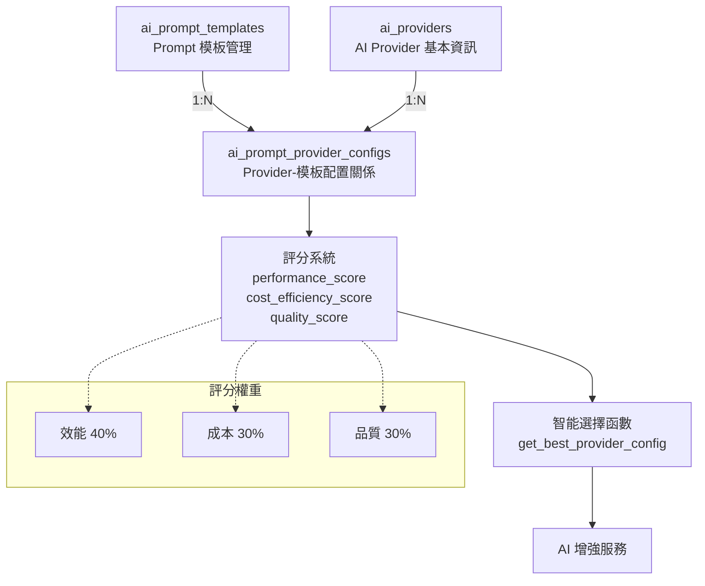
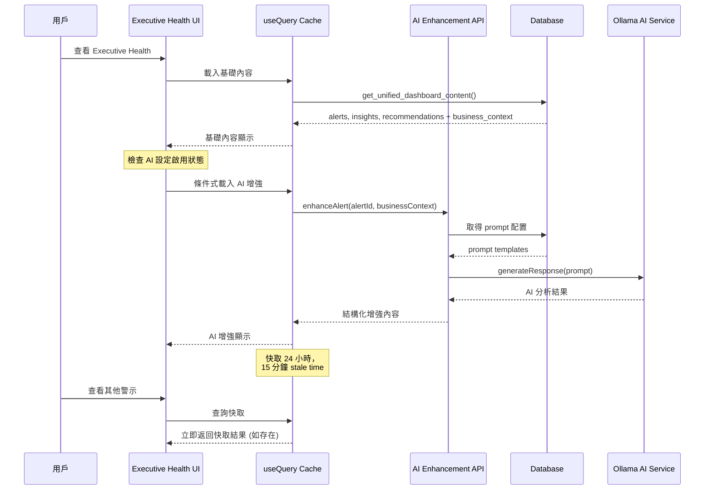
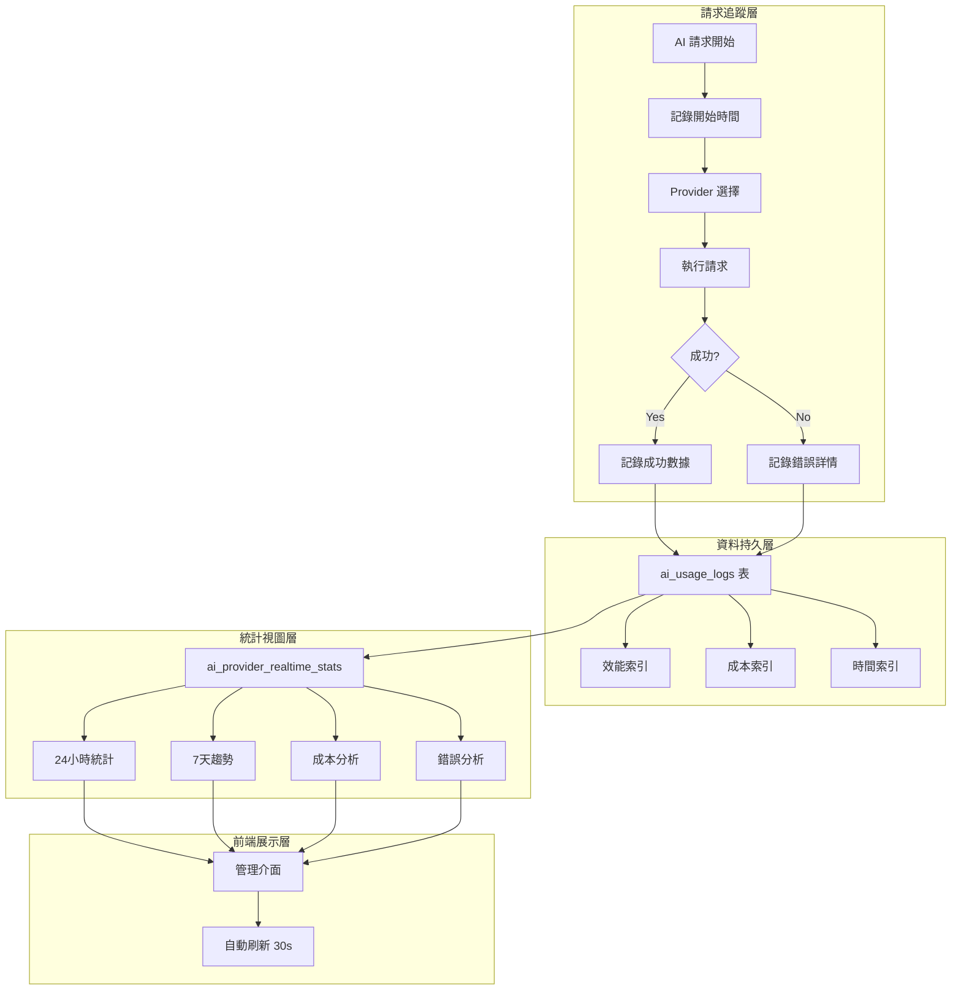

# AI 分析系統重新架構：可分離、低耦合的 AI 增強方案

> **文件版本**: v2.0  
> **建立日期**: 2025-08-07  
> **最後更新**: 2025-08-07 (重構版)  
> **開發階段**: Phase 4 - AI 增強整合 (三表分離架構)  

## 📖 第一章：系統架構概述

### 1.1 核心設計原則

#### 可分離架構原則
- ✅ **可選擴充功能**：系統核心功能不依賴 AI
- ✅ **低耦合設計**：AI 失效時不影響基礎業務邏輯  
- ✅ **增強而非取代**：AI 提供額外洞察，不改變原有流程
- ✅ **即時顯示策略**：採用「即時顯示 + 前端快取 + useQuery」模式
- ✅ **智能選擇機制**：基於效能、成本、品質評分自動選擇最佳 AI Provider

#### 技術決策理念
```
基礎業務邏輯 (穩定核心) → 永遠可用，獨立運作
    ↓ (條件式擴充)
AI 增強服務 (可選功能) → 提供額外價值，可開關
    ↓ (智能選擇層)
AI Provider 評分系統 → 效能40% + 成本30% + 品質30%
    ↓ (前端整合)
用戶介面 (統一體驗) → 基礎 + AI 增強內容 (無縫切換)
```

### 1.2 三表分離架構 (Phase 3)

#### 架構概覽


#### 智能評分系統
AI Provider 選擇基於三維評分機制：

| 評分維度 | 權重 | 評估標準 | 範例 |
|----------|------|----------|------|
| **performance_score** | 40% | API 回應速度、穩定性、併發能力 | GPT-4o: 0.95, Ollama: 0.70 |
| **cost_efficiency_score** | 30% | Token 成本、API 費用、基礎設施成本 | Ollama: 1.0, GPT-4o: 0.50 |
| **quality_score** | 30% | 輸出準確性、專業程度、中文處理 | Claude-Opus: 1.0, Ollama: 0.75 |

**綜合評分計算**：
```sql
overall_score = ROUND(
    performance_score * 0.4 + 
    cost_efficiency_score * 0.3 + 
    quality_score * 0.3, 
    3
)
```

**優化策略選擇**：
- `performance`: 優先效能評分
- `cost`: 優先成本效率評分  
- `quality`: 優先品質評分
- `balanced`: 使用綜合評分 (預設)

### 1.2 AI 增強的四個整合點

#### 整合點 1：警示增強層 (Alert Enhancement)
**目標**：為 Executive Health 的「風險預警中心」提供 AI 深化分析

**原有機制**：
- `dashboard_alerts` 表儲存基礎警示資訊
- `get_unified_dashboard_content()` 函數輸出標準化警示

**AI 增強機制**：
- 讀取 `business_context` 數據快照
- 基於警示類型動態選擇 AI Prompt
- 即時產生個人化改善建議

```typescript
interface AlertEnhancement {
  alertId: string
  aiAnalysis?: {
    summary: string          // AI 生成摘要
    rootCause: string[]     // 根因分析
    recommendations: string[] // 具體建議
    confidence: number      // 信心度 (0-1)
  }
  enhancementStatus: 'loading' | 'success' | 'error' | 'disabled'
}
```

#### 整合點 2：洞察增強層 (Business Insight Enhancement)
**目標**：為「關鍵業務洞察」區塊提供更深度的 AI 分析

**原有機制**：
- `generate_business_insights()` 使用規則引擎產生洞察
- 基於趨勢數據和閾值突破生成標準洞察

**AI 增強機制**：
- 對現有洞察進行語意深化分析
- 發掘隱含的商業機會和風險點
- 提供跨領域關聯性分析

#### 整合點 3：建議增強層 (Recommendation Enhancement)  
**目標**：為「戰略行動建議」區塊提供智慧優先級排序

**原有機制**：
- `generate_strategic_recommendations()` 基於警示產生標準建議
- 使用固定優先級評分機制

**AI 增強機制**：
- 基於當前業務狀況動態評估建議價值
- 提供情境感知的執行順序建議
- 個人化調整建議內容和時程

#### 整合點 4：整合輸出增強層 (Executive Summary Enhancement)
**目標**：為整體 Executive Health 提供高階主管摘要

**原有機制**：
- 三區塊獨立顯示，缺乏統一性視角

**AI 增強機制**：
- 跨區塊分析，提供整體業務健康度評估
- 生成高階主管每日/週摘要
- 識別關鍵優先行動項目

### 1.3 資料流程架構

```mermaid
graph TD
    A[業務資料表] --> B[業務指標計算函數]
    B --> C[get_unified_dashboard_content]
    C --> D[Executive Health 基礎顯示]
    
    C --> E{AI 增強啟用?}
    E -->|是| F[AI Enhancement Service]
    E -->|否| D
    
    F --> G[動態 Prompt 選擇]
    G --> H[Ollama 本機 AI 服務]
    H --> I[AI 分析結果]
    I --> J[前端快取 (24h)]
    J --> K[AI 增強顯示]
    
    D --> L[統一用戶介面]
    K --> L
```

## 第二章：資料庫架構分析

### 2.1 核心資料表結構

#### 主資料表：dashboard_alerts
```sql
CREATE TABLE dashboard_alerts (
    id UUID PRIMARY KEY DEFAULT gen_random_uuid(),
    
    -- 警示基本資訊
    alert_type VARCHAR(50) NOT NULL, -- 'threshold_breach', 'trend_analysis', 'anomaly_detection'
    severity VARCHAR(20) NOT NULL CHECK (severity IN ('info', 'warning', 'critical')),
    metric_name VARCHAR(100) REFERENCES metric_thresholds(metric_name),
    
    -- 警示內容
    title VARCHAR(200) NOT NULL,
    message TEXT NOT NULL,
    current_value DECIMAL(10,4),
    threshold_value DECIMAL(10,4),
    
    -- 🎯 AI 分析關鍵欄位：數據快照
    business_context JSONB DEFAULT '{}'::jsonb, -- 提供給 AI 的完整業務背景
    
    -- 時間管理
    detected_at TIMESTAMPTZ DEFAULT NOW(),
    expires_at TIMESTAMPTZ DEFAULT (NOW() + INTERVAL '24 hours'),
    
    -- 狀態管理
    is_active BOOLEAN DEFAULT TRUE,
    is_resolved BOOLEAN DEFAULT FALSE,
    
    -- AI 相關欄位 (不存取結果，僅標記處理狀態)
    ai_confidence DECIMAL(3,2) CHECK (ai_confidence >= 0 AND ai_confidence <= 1),
    ai_generated_at TIMESTAMPTZ,
    ai_provider VARCHAR(50)
);

-- 關鍵索引：business_context 快速查詢
CREATE INDEX idx_dashboard_alerts_context ON dashboard_alerts USING GIN(business_context);
```

#### 三表分離架構設計

##### 核心理念：職責明確分離
- **`ai_prompt_templates`**: 專業的 Prompt 模板管理
- **`ai_system_config`**: 純粹的系統級配置  
- **`ai_prompt_provider_configs`**: Prompt 與 Provider 的靈活關聯

#### 表1：AI Prompt 模板管理表
```sql
-- 專業的 Prompt 模板管理，支援版本控制和變數定義
CREATE TABLE ai_prompt_templates (
    id UUID PRIMARY KEY DEFAULT gen_random_uuid(),
    
    -- 模板基本資訊
    template_key VARCHAR(50) NOT NULL UNIQUE, -- 'alert_enhancement', 'insight_deepening'
    template_name VARCHAR(100) NOT NULL,      -- '警示深化分析', '洞察深化分析'
    category VARCHAR(50) NOT NULL,            -- 'analysis', 'enhancement', 'summary'
    description TEXT,                         -- 模板用途說明
    
    -- Prompt 內容和參數
    prompt_template TEXT NOT NULL,           -- 完整的 prompt 模板
    max_tokens INTEGER DEFAULT 300,
    temperature DECIMAL(3,2) DEFAULT 0.3,
    
    -- 變數管理 (JSON Array)
    required_variables JSONB DEFAULT '[]'::jsonb, -- ["alert_details", "business_context"]
    optional_variables JSONB DEFAULT '[]'::jsonb, -- ["historical_data", "comparison_metrics"]
    
    -- 版本和狀態管理
    version VARCHAR(20) DEFAULT '1.0',
    is_active BOOLEAN DEFAULT TRUE,
    created_at TIMESTAMPTZ DEFAULT NOW(),
    updated_at TIMESTAMPTZ DEFAULT NOW(),
    
    -- 建立索引和約束
    CONSTRAINT valid_temperature CHECK (temperature >= 0 AND temperature <= 2.0),
    CONSTRAINT valid_max_tokens CHECK (max_tokens > 0 AND max_tokens <= 4096)
);

-- 索引優化
CREATE INDEX idx_prompt_templates_category_active ON ai_prompt_templates(category, is_active);
CREATE INDEX idx_prompt_templates_key ON ai_prompt_templates(template_key) WHERE is_active = true;
```

#### 表2：AI 系統配置表 (重構版)
```sql
-- 專注於系統級配置，移除 Prompt 管理職責
CREATE TABLE ai_system_config (
    id UUID PRIMARY KEY DEFAULT gen_random_uuid(),
    
    -- 環境配置
    config_name VARCHAR(50) NOT NULL UNIQUE, -- 'production', 'development', 'staging'
    config_description TEXT,
    
    -- 基本開關和預設設定
    ai_enabled BOOLEAN DEFAULT FALSE,
    default_provider_id UUID REFERENCES ai_providers(id), -- 預設的 AI 提供商
    
    -- 系統級參數配置
    system_settings JSONB DEFAULT '{
      "auto_enhancement_enabled": true,
      "enhancement_timeout_ms": 30000,
      "fallback_behavior": "graceful",
      "rate_limiting": {
        "requests_per_minute": 60,
        "burst_limit": 10
      },
      "security": {
        "content_filtering": true,
        "response_validation": true
      },
      "monitoring": {
        "log_requests": true,
        "track_performance": true
      }
    }'::JSONB,
    
    -- 管理資訊
    is_active BOOLEAN DEFAULT TRUE,
    created_at TIMESTAMPTZ DEFAULT NOW(),
    updated_at TIMESTAMPTZ DEFAULT NOW(),
    created_by UUID REFERENCES auth.users(id)
);
```

#### 表3：Prompt-Provider 關聯配置表
```sql
-- Prompt 模板與 AI 提供商的靈活關聯和參數優化
CREATE TABLE ai_prompt_provider_configs (
    id UUID PRIMARY KEY DEFAULT gen_random_uuid(),
    
    -- 關聯資訊
    template_id UUID NOT NULL REFERENCES ai_prompt_templates(id) ON DELETE CASCADE,
    provider_id UUID NOT NULL REFERENCES ai_providers(id) ON DELETE CASCADE,
    
    -- 提供商特定的參數覆蓋和優化
    provider_specific_params JSONB DEFAULT '{}'::jsonb,
    /* 範例結構：
    {
      "model": "gpt-4o-mini",           // 覆蓋預設模型
      "temperature": 0.2,              // 覆蓋模板預設溫度
      "max_tokens": 350,               // 覆蓋模板預設 token 限制
      "openai_specific": {              // OpenAI 特有參數
        "top_p": 0.9,
        "presence_penalty": 0.1,
        "response_format": {"type": "text"}
      },
      "claude_specific": {              // Claude 特有參數
        "stop_sequences": ["---"],
        "system_prompt_prefix": "你是專業分析師。"
      },
      "ollama_specific": {              // Ollama 特有參數
        "num_ctx": 4096,
        "mirostat": 2,
        "repeat_penalty": 1.1
      }
    }
    */
    
    -- 狀態管理
    is_active BOOLEAN DEFAULT TRUE,
    created_at TIMESTAMPTZ DEFAULT NOW(),
    
    -- 確保每個模板-提供商組合唯一
    CONSTRAINT unique_template_provider UNIQUE (template_id, provider_id)
);

-- 優化索引
CREATE INDEX idx_prompt_provider_configs_template ON ai_prompt_provider_configs(template_id, is_active);
CREATE INDEX idx_prompt_provider_configs_provider ON ai_prompt_provider_configs(provider_id, is_active);
```

#### AI 提供商表：ai_providers
```sql
CREATE TABLE ai_providers (
    id UUID PRIMARY KEY DEFAULT gen_random_uuid(),
    
    -- 基本資訊
    name VARCHAR(50) NOT NULL UNIQUE, -- 'openai', 'claude', 'ollama'
    display_name VARCHAR(100) NOT NULL,
    provider_type VARCHAR(20) NOT NULL CHECK (provider_type IN ('cloud', 'local', 'hybrid')),
    
    -- API 配置
    base_url VARCHAR(500), -- 'http://localhost:11434' for Ollama
    default_model VARCHAR(100), -- 'llama3.1'
    
    -- 狀態管理
    is_active BOOLEAN DEFAULT TRUE,
    is_default BOOLEAN DEFAULT FALSE,
    health_status VARCHAR(20) DEFAULT 'unknown',
    last_health_check TIMESTAMPTZ
);
```

### 2.2 business_context 數據快照規格

#### 標準快照內容
```json
{
  "snapshot_timestamp": "2025-08-07T10:30:00Z",
  "triggering_metrics": {
    "primary_metric": "avg_response_time", 
    "current_value": 125.5,
    "threshold_value": 120.0,
    "breach_severity": "warning"
  },
  "business_indicators": {
    "active_customers": 1250,
    "high_value_customers": 180,
    "daily_revenue": 145000,
    "order_completion_rate": 0.87,
    "pending_orders": 23
  },
  "trend_analysis": {
    "customer_trend_pct": 15.2,
    "revenue_trend_pct": 8.3, 
    "efficiency_trend_pct": -3.1,
    "trend_period": "7_days"
  },
  "contextual_factors": {
    "time_of_day": "peak_hours",
    "day_of_week": "tuesday",
    "seasonal_factor": "normal",
    "recent_events": ["marketing_campaign_launch", "system_maintenance"]
  },
  "related_alerts": [
    {"metric": "order_completion_rate", "severity": "info", "detected_hours_ago": 2},
    {"metric": "customer_satisfaction_rate", "severity": "warning", "detected_hours_ago": 6}
  ]
}
```

### 2.3 關鍵資料庫函數分層架構

#### 警示生成層 (Alert Generation Layer)
```sql
-- 1. 即時業務指標計算
CREATE OR REPLACE FUNCTION calculate_business_metrics()
RETURNS TABLE (
    metric_name VARCHAR(100),
    current_value DECIMAL(10,4), 
    business_context JSONB  -- 🎯 關鍵：生成 AI 分析用的數據快照
)

-- 2. 閾值警示觸發檢查
CREATE OR REPLACE FUNCTION check_and_generate_alerts()
RETURNS TABLE (...)

-- 3. 趨勢異常偵測
CREATE OR REPLACE FUNCTION check_trend_and_anomaly_alerts()
RETURNS TABLE (...)

-- 4. 趨勢指標計算
CREATE OR REPLACE FUNCTION calculate_trend_metrics()
RETURNS TABLE (...)
```

#### 洞察生成層 (Insight Generation Layer)
```sql
-- 5. 業務洞察分析 (規則引擎)
CREATE OR REPLACE FUNCTION generate_business_insights()
RETURNS TABLE (
    insight_type VARCHAR(50),
    category VARCHAR(50),
    title VARCHAR(200),
    description TEXT,
    business_context JSONB  -- 🎯 提供給 AI 增強的背景資料
)

-- 6. 戰略建議生成
CREATE OR REPLACE FUNCTION generate_strategic_recommendations()
RETURNS TABLE (...)
```

#### 統合輸出層 (Unified Output Layer)
```sql  
-- 7. 三區塊統合函數 (Executive Health 的核心)
CREATE OR REPLACE FUNCTION get_unified_dashboard_content()
RETURNS JSONB  -- 包含 alerts, insights, recommendations 完整數據

-- 8. 全面資料刷新
CREATE OR REPLACE FUNCTION refresh_all_alerts_and_insights()
RETURNS JSONB
```

#### 支援函數層
```sql
-- 9. 風險預測分析
CREATE OR REPLACE FUNCTION calculate_risk_forecast()

-- 10. 客戶生命週期分析  
CREATE OR REPLACE FUNCTION get_ltv_trend_analysis()

-- 11. 庫存狀況總覽
CREATE OR REPLACE FUNCTION get_inventory_overview()

-- 12. 訂單業務處理
CREATE OR REPLACE FUNCTION create_order_with_items()
```

## 第三章：技術實施規格

### 3.1 前端架構設計

#### useQuery 快取策略
```typescript
// AI 增強查詢的 useQuery 配置
export function useAIEnhancedAlert(alertId: string, businessContext: any) {
  return useQuery({
    queryKey: ['ai-enhancement', 'alert', alertId, hashBusinessContext(businessContext)],
    queryFn: async () => {
      // 呼叫 AI Enhancement API
      const enhancement = await aiEnhancementService.enhanceAlert({
        alertId,
        businessContext,
        enhancementType: 'alert_enhancement'
      })
      return enhancement
    },
    staleTime: 15 * 60 * 1000,  // 15分鐘快取
    cacheTime: 24 * 60 * 60 * 1000, // 24小時保存
    enabled: isAIEnabled && !!businessContext, // 條件式啟用
    retry: 1, // AI 失敗時只重試一次
    // 錯誤時不拋出異常，返回 null (優雅降級)
    onError: (error) => {
      console.warn('AI Enhancement failed:', error)
    }
  })
}

// 業務上下文 hash 計算 (用於快取鍵)
function hashBusinessContext(context: any): string {
  return btoa(JSON.stringify(context)).slice(0, 12)
}
```

#### 條件式 AI 增強組件結構
```vue
<!-- Executive Health 主要組件 -->
<template>
  <div class="executive-health">
    <!-- 基礎三區塊 (永遠顯示) -->
    <div class="base-content grid grid-cols-1 lg:grid-cols-3 gap-6">
      <!-- 風險預警中心 -->
      <AlertsSection :alerts="unifiedContent.alerts">
        <template #alert-item="{ alert }">
          <AlertCard :alert="alert">
            <!-- AI 增強內容 (條件式) -->
            <AIAlertEnhancement 
              v-if="aiSettings.enabled && alert.business_context"
              :alert-id="alert.id"
              :business-context="alert.business_context"
              class="mt-4 border-t pt-4"
            />
          </AlertCard>
        </template>
      </AlertsSection>
      
      <!-- 關鍵業務洞察 -->
      <InsightsSection :insights="unifiedContent.insights">
        <template #insight-item="{ insight }">
          <InsightCard :insight="insight">
            <AIInsightDeepening 
              v-if="aiSettings.enabled"
              :insight="insight"
              class="mt-3"
            />
          </InsightCard>
        </template>
      </InsightsSection>
      
      <!-- 戰略行動建議 -->
      <RecommendationsSection :recommendations="unifiedContent.recommendations">
        <template #recommendations-header>
          <AIRecommendationPrioritizer
            v-if="aiSettings.enabled"
            :recommendations="unifiedContent.recommendations"
            :business-context="aggregatedBusinessContext"
          />
        </template>
      </RecommendationsSection>
    </div>
    
    <!-- AI 增強總覽 (新增區塊) -->
    <div v-if="aiSettings.enabled" class="ai-overview mt-8">
      <AIExecutiveSummary 
        :unified-content="unifiedContent"
        :enhancement-insights="allAIEnhancements"
      />
    </div>
    
    <!-- AI 功能控制面板 -->
    <AIControlPanel 
      v-model:settings="aiSettings"
      :health-status="aiHealthStatus"
      class="fixed bottom-4 right-4"
    />
  </div>
</template>

<script setup lang="ts">
import { computed } from 'vue'
import { useUnifiedDashboardContent } from '@/composables/queries/useBusinessHealthQueries'
import { useAISettings } from '@/composables/useAISettings'

// 基礎資料 (永遠載入)
const { data: unifiedContent, isLoading } = useUnifiedDashboardContent()

// AI 設定管理  
const { aiSettings, aiHealthStatus } = useAISettings()

// 聚合業務上下文 (供 AI 分析使用)
const aggregatedBusinessContext = computed(() => {
  if (!unifiedContent.value) return null
  
  return {
    alerts_summary: {
      critical_count: unifiedContent.value.alerts.filter(a => a.severity === 'critical').length,
      warning_count: unifiedContent.value.alerts.filter(a => a.severity === 'warning').length,
      most_frequent_metrics: extractFrequentMetrics(unifiedContent.value.alerts)
    },
    insights_overview: {
      high_impact_count: unifiedContent.value.insights.filter(i => i.impact === 'high').length,
      categories: [...new Set(unifiedContent.value.insights.map(i => i.category))]
    },
    recommendations_status: {
      total_count: unifiedContent.value.recommendations.length,
      priority_distribution: calculatePriorityDistribution(unifiedContent.value.recommendations)
    },
    snapshot_timestamp: new Date().toISOString()
  }
})

// 聚合所有 AI 增強結果
const allAIEnhancements = computed(() => {
  // 收集所有區塊的 AI 增強結果
  // 供 Executive Summary 使用
})
</script>
```

### 3.2 AI Enhancement Service 設計

#### 核心服務介面
```typescript
export interface AIEnhancementService {
  /**
   * 警示增強：為單一警示提供 AI 深化分析
   */
  enhanceAlert(request: AlertEnhancementRequest): Promise<AlertEnhancement>
  
  /**
   * 洞察深化：為業務洞察提供更深層分析
   */
  deepenInsight(request: InsightDeepingRequest): Promise<InsightEnhancement>
  
  /**
   * 建議優化：為戰略建議提供優先級調整
   */
  optimizeRecommendations(request: RecommendationOptimizationRequest): Promise<RecommendationEnhancement>
  
  /**
   * 執行摘要：為整體內容提供高階總結
   */
  generateExecutiveSummary(request: ExecutiveSummaryRequest): Promise<ExecutiveSummary>
  
  /**
   * 健康狀態檢查
   */
  checkHealth(): Promise<AIServiceHealth>
}

// 新增：Prompt 配置介面 (對應新的三表架構)
interface PromptConfig {
  max_tokens: number
  temperature: number
  model?: string
  // 提供商特定參數
  [key: string]: any
}

// 請求介面定義 (更新支援新架構)
interface AlertEnhancementRequest {
  alertId: string
  alertType: string
  severity: 'info' | 'warning' | 'critical'
  businessContext: Record<string, any>
  enhancementType: 'alert_enhancement' | 'trend_analysis' | 'anomaly_analysis'
  preferredProviderId?: string  // 新增：偏好的 AI 提供商
}

interface AlertEnhancement {
  alertId: string
  aiAnalysis: {
    summary: string              // 簡潔摘要 (50字內)
    rootCauseAnalysis: string[]  // 根因分析 (3-5點)  
    actionableRecommendations: string[] // 可執行建議 (3-5點)
    businessImpact: {
      severity: 'low' | 'medium' | 'high' | 'critical'
      affectedAreas: string[]    // 受影響業務領域
      estimatedCost: string      // 預估損失 (如適用)
    }
    timelineEstimate: string     // 解決時程預估
    confidence: number           // AI 信心度 (0-1)
  }
  generatedAt: string
  processingTimeMs: number
}
```

#### AI Service 實作 (基於現有架構)
```typescript
export class AIEnhancementService implements AIEnhancementService {
  private aiAlertService: AIEnhancedAlertService
  
  constructor() {
    this.aiAlertService = new AIEnhancedAlertService()
  }
  
  async enhanceAlert(request: AlertEnhancementRequest): Promise<AlertEnhancement> {
    // 1. 檢查 AI 服務可用性
    if (!(await this.aiAlertService.isAIServiceAvailable())) {
      throw new Error('AI service not available')
    }
    
    // 2. 選擇合適的 Prompt 模板
    const prompt = await this.selectPrompt('alert_enhancement', {
      alert_type: request.alertType,
      severity: request.severity,
      business_context: request.businessContext
    })
    
    // 3. 構建 AI 請求
    const aiRequest = {
      model: 'llama3.1', // 可從配置取得
      messages: [
        {
          role: 'system',
          content: '你是專業的商業分析師，專門分析企業警示並提供可執行的改善建議。'
        },
        {
          role: 'user', 
          content: prompt
        }
      ],
      temperature: 0.3,
      max_tokens: 500
    }
    
    // 4. 呼叫 AI 分析
    const startTime = Date.now()
    const aiResponse = await this.aiAlertService.aiService?.generateResponse(aiRequest)
    const processingTime = Date.now() - startTime
    
    // 5. 解析和結構化回應
    if (!aiResponse?.choices[0]?.message?.content) {
      throw new Error('Invalid AI response')
    }
    
    const aiAnalysis = this.parseAlertEnhancement(aiResponse.choices[0].message.content)
    
    return {
      alertId: request.alertId,
      aiAnalysis,
      generatedAt: new Date().toISOString(),
      processingTimeMs: processingTime
    }
  }
  
  private async selectPrompt(
    enhancementType: string, 
    context: any, 
    preferredProviderId?: string
  ): Promise<{ template: string; config: PromptConfig }> {
    
    // 1. 從新的三表架構獲取 Prompt 模板和配置
    const { data: templates } = await supabase
      .from('ai_prompt_templates')
      .select(`
        *,
        ai_prompt_provider_configs!inner (
          provider_specific_params,
          ai_providers!inner (
            id, name, display_name, default_model
          )
        )
      `)
      .eq('template_key', enhancementType)
      .eq('is_active', true)
      .eq('ai_prompt_provider_configs.is_active', true)
    
    if (!templates || templates.length === 0) {
      throw new Error(`No prompt template found for: ${enhancementType}`)
    }
    
    // 2. 選擇最適合的提供商配置
    let selectedTemplate = templates[0]
    if (preferredProviderId) {
      const preferredConfig = templates.find(t => 
        t.ai_prompt_provider_configs.some(c => 
          c.ai_providers.id === preferredProviderId
        )
      )
      if (preferredConfig) selectedTemplate = preferredConfig
    }
    
    // 3. 構建完整配置
    const baseConfig = {
      max_tokens: selectedTemplate.max_tokens,
      temperature: selectedTemplate.temperature
    }
    
    const providerConfig = selectedTemplate.ai_prompt_provider_configs[0]
    const mergedConfig = {
      ...baseConfig,
      ...providerConfig.provider_specific_params
    }
    
    // 4. 動態替換模板變數
    let processedPrompt = selectedTemplate.prompt_template
    
    // 基於 required_variables 和 optional_variables 動態替換
    const requiredVars = selectedTemplate.required_variables || []
    const optionalVars = selectedTemplate.optional_variables || []
    
    // 處理必要變數
    for (const varName of requiredVars) {
      const placeholder = `{{${varName}}}`
      const value = this.getContextValue(context, varName)
      if (value === undefined) {
        throw new Error(`Required variable '${varName}' not found in context`)
      }
      processedPrompt = processedPrompt.replace(new RegExp(placeholder, 'g'), value)
    }
    
    // 處理可選變數 (如果存在的話)
    for (const varName of optionalVars) {
      const placeholder = `{{${varName}}}`
      const value = this.getContextValue(context, varName)
      if (value !== undefined) {
        processedPrompt = processedPrompt.replace(new RegExp(placeholder, 'g'), value)
      } else {
        // 移除未提供的可選變數佔位符
        processedPrompt = processedPrompt.replace(new RegExp(placeholder, 'g'), '')
      }
    }
    
    return {
      template: processedPrompt,
      config: mergedConfig
    }
  }
  
  private getContextValue(context: any, varName: string): string | undefined {
    // 智能提取 context 中的值
    const pathMap: Record<string, string> = {
      'alert_details': 'alertDetails',
      'business_context': 'business_context', 
      'current_value': 'currentValue',
      'threshold_value': 'thresholdValue',
      'insights': 'insights',
      'unified_content': 'unifiedContent'
    }
    
    const contextPath = pathMap[varName] || varName
    const value = context[contextPath]
    
    if (value === null || value === undefined) {
      return undefined
    }
    
    // 格式化不同類型的值
    if (typeof value === 'object') {
      return JSON.stringify(value, null, 2)
    }
    
    return String(value)
  }
  
  private parseAlertEnhancement(content: string): AlertEnhancement['aiAnalysis'] {
    // 使用現有的 AIEnhancedAlertService.parseAIResponse 邏輯
    // 並擴展為更結構化的解析
    
    const lines = content.split('\n').filter(line => line.trim())
    
    // 智能解析 AI 回應結構
    const parsed = {
      summary: this.extractSection(lines, ['總結', '摘要', 'summary']) || '系統偵測到需關注的指標異常',
      rootCauseAnalysis: this.extractListSection(lines, ['根因', '原因', 'root cause', '分析']),
      actionableRecommendations: this.extractListSection(lines, ['建議', 'recommendations', '改善', '行動']),
      businessImpact: {
        severity: this.extractSeverity(content),
        affectedAreas: this.extractAffectedAreas(content),
        estimatedCost: this.extractCost(content)
      },
      timelineEstimate: this.extractTimeline(content),
      confidence: this.extractConfidence(content)
    }
    
    return parsed
  }
  
  // ... 其他解析方法實作
}
```

### 3.3 錯誤處理與優雅降級

#### 多層容錯機制
```typescript
// 1. Service 層錯誤處理
export function useAIEnhancement<T>(
  queryFn: () => Promise<T>,
  fallbackValue: T | null = null
) {
  return useQuery({
    queryFn,
    onError: (error) => {
      // 錯誤分類處理
      if (error instanceof AIServiceUnavailableError) {
        // AI 服務不可用 - 靜默處理，不顯示錯誤
        console.info('AI service temporarily unavailable')
      } else if (error instanceof AIRequestTimeoutError) {  
        // 請求超時 - 顯示提示但不阻礙使用
        toast.warning('AI 分析回應較慢，請稍後重試')
      } else {
        // 其他錯誤 - 記錄並顯示通用錯誤
        console.error('AI Enhancement Error:', error)
        toast.error('AI 分析暫時無法使用')
      }
    },
    // 返回 fallback 值，不拋出錯誤
    onSettled: (data, error) => {
      return data ?? fallbackValue
    }
  })
}

// 2. Component 層優雅降級
const AIAlertEnhancement = defineComponent({
  setup(props) {
    const { data: enhancement, isLoading, error } = useAIEnhancedAlert(
      props.alertId, 
      props.businessContext
    )
    
    // 狀態判斷邏輯
    const showAIContent = computed(() => {
      return !error.value && enhancement.value?.aiAnalysis
    })
    
    const showLoadingState = computed(() => {
      return isLoading.value && !error.value
    })
    
    return {
      enhancement,
      showAIContent,
      showLoadingState,
      error
    }
  },
  
  template: `
    <div v-if="showAIContent" class="ai-enhancement">
      <div class="ai-badge">
        <Icon name="sparkles" class="w-4 h-4" />
        <span>AI 深化分析</span>
      </div>
      <div class="ai-content">
        <!-- AI 增強內容 -->
        <p class="summary">{{ enhancement.aiAnalysis.summary }}</p>
        <div class="recommendations">
          <h4>改善建議</h4>
          <ul>
            <li v-for="rec in enhancement.aiAnalysis.actionableRecommendations">
              {{ rec }}
            </li>
          </ul>
        </div>
      </div>
    </div>
    
    <!-- 載入狀態 -->
    <div v-else-if="showLoadingState" class="ai-loading">
      <Icon name="loader" class="animate-spin w-4 h-4" />
      <span>AI 正在分析...</span>
    </div>
    
    <!-- 錯誤狀態或服務不可用時：什麼都不顯示 (優雅降級) -->
  `
})
```

## 第四章：開發實施步驟

### Phase 4.1: AI 增強服務層建立 (預估 2-3 天)

#### Step 1.1: 擴展現有 AI 服務架構
```bash
# 檔案結構
admin-platform-vue/src/api/services/ai/
├── AIEnhancedAlertService.ts    # 現有 (已完成)
├── AIEnhancementService.ts     # 新增：統一增強服務
├── BaseAIService.ts            # 現有 (已完成)  
├── OllamaService.ts            # 現有 (已完成)
└── AIServiceFactory.ts         # 現有 (已完成)
```

**新增檔案：AIEnhancementService.ts**
- 實作上述介面規格
- 整合現有 AIEnhancedAlertService
- 提供四種增強功能 (警示/洞察/建議/摘要)

#### Step 1.2: 建立新的三表架構 (取代舊的混合設計)
```sql
-- Phase A: 建立基礎 Prompt 模板
INSERT INTO ai_prompt_templates (template_key, template_name, category, prompt_template, max_tokens, temperature, required_variables) VALUES
('alert_enhancement', '警示深化分析', 'analysis', 
 '基於以下警示資訊，提供具體的業務影響分析和改善建議：

 警示詳情：{{alert_details}}
 當前數值：{{current_value}}
 閾值：{{threshold_value}}
 業務背景：{{business_context}}

 請提供：
 1. 簡要問題摘要 (50字內)
 2. 根本原因分析 (3-5點)
 3. 具體改善行動 (3-5點)
 4. 預估解決時程', 
 400, 0.3, '["alert_details", "current_value", "threshold_value", "business_context"]'),

('insight_deepening', '洞察深化分析', 'enhancement',
 '深化以下業務洞察，提供更詳細的分析和潛在機會：

 洞察內容：{{insights}}
 相關數據：{{business_context}}
 趨勢資訊：{{trend_data}}

 請提供：
 1. 深度分析解說
 2. 潛在商業機會
 3. 風險警示
 4. 具體行動建議',
 400, 0.4, '["insights", "business_context"]'),

('recommendation_optimization', '建議優化', 'optimization',
 '基於當前業務狀況，重新評估以下建議的優先級和可行性：

 現有建議：{{current_recommendations}}
 業務背景：{{business_context}}
 資源限制：{{resource_constraints}}

 請提供：
 1. 調整後的優先級排序
 2. 可行性評估
 3. 資源需求分析
 4. 執行時程建議',
 350, 0.3, '["current_recommendations", "business_context"]');

-- Phase B: 建立 Provider-Prompt 關聯配置
INSERT INTO ai_prompt_provider_configs (template_id, provider_id, provider_specific_params) VALUES
-- 為 OpenAI 配置參數
((SELECT id FROM ai_prompt_templates WHERE template_key = 'alert_enhancement'), 
 (SELECT id FROM ai_providers WHERE name = 'openai'),
 '{"model": "gpt-4o-mini", "temperature": 0.3, "max_tokens": 400}'),

-- 為 Claude 配置參數 (更保守)
((SELECT id FROM ai_prompt_templates WHERE template_key = 'alert_enhancement'),
 (SELECT id FROM ai_providers WHERE name = 'claude'),
 '{"model": "claude-3-haiku-20240307", "temperature": 0.2, "max_tokens": 350}');
```

#### Step 1.3: 建立測試環境
```typescript
// 新增：__tests__/AIEnhancementService.test.ts
describe('AIEnhancementService', () => {
  test('should enhance alert with AI analysis', async () => {
    const service = new AIEnhancementService()
    
    const mockRequest = {
      alertId: 'test-alert-1',
      alertType: 'threshold_breach',
      severity: 'warning' as const,
      businessContext: {
        metric: 'avg_response_time',
        current_value: 125.5,
        threshold_value: 120.0
      },
      enhancementType: 'alert_enhancement' as const
    }
    
    const result = await service.enhanceAlert(mockRequest)
    
    expect(result.aiAnalysis).toBeDefined()
    expect(result.aiAnalysis.summary).toBeTruthy()
    expect(result.processingTimeMs).toBeGreaterThan(0)
  })
  
  test('should gracefully handle AI service unavailable', async () => {
    // Mock AI service unavailable
    jest.spyOn(AIEnhancedAlertService.prototype, 'isAIServiceAvailable')
        .mockResolvedValue(false)
    
    const service = new AIEnhancementService()
    
    await expect(service.enhanceAlert(mockRequest))
      .rejects.toThrow('AI service not available')
  })
})
```

### Phase 4.2: 條件式 AI 增強集成 (預估 2-3 天)

#### Step 2.1: 建立 useQuery 快取策略
```typescript
// 新增：composables/queries/useAIEnhancementQueries.ts
export const AI_ENHANCEMENT_QUERY_KEYS = {
  alert: (alertId: string, contextHash: string) => 
    ['ai-enhancement', 'alert', alertId, contextHash],
  insight: (insightId: string, contextHash: string) => 
    ['ai-enhancement', 'insight', insightId, contextHash],
  recommendations: (contextHash: string) => 
    ['ai-enhancement', 'recommendations', contextHash],
  executiveSummary: (contentHash: string) => 
    ['ai-enhancement', 'executive-summary', contentHash]
} as const

export function useAIEnhancedAlert(alertId: string, businessContext: any) {
  const contextHash = hashBusinessContext(businessContext)
  
  return useQuery({
    queryKey: AI_ENHANCEMENT_QUERY_KEYS.alert(alertId, contextHash),
    queryFn: () => aiEnhancementService.enhanceAlert({
      alertId,
      alertType: businessContext.alert_type,
      severity: businessContext.severity,
      businessContext,
      enhancementType: 'alert_enhancement'
    }),
    enabled: !!businessContext && isAIEnabled(),
    staleTime: 15 * 60 * 1000,  // 15分鐘
    cacheTime: 24 * 60 * 60 * 1000, // 24小時
    retry: 1,
    onError: handleAIError
  })
}
```

#### Step 2.2: 建立 AI 設定管理
```typescript
// 新增：composables/useAISettings.ts
export function useAISettings() {
  const settings = ref({
    enabled: false,
    autoEnhance: true,
    enhancementTypes: {
      alerts: true,
      insights: true,
      recommendations: true,
      executiveSummary: true
    }
  })
  
  const healthStatus = ref<AIServiceHealth | null>(null)
  
  // 從 localStorage 載入設定
  const loadSettings = () => {
    const saved = localStorage.getItem('ai-enhancement-settings')
    if (saved) {
      settings.value = { ...settings.value, ...JSON.parse(saved) }
    }
  }
  
  // 儲存設定
  const saveSettings = () => {
    localStorage.setItem('ai-enhancement-settings', JSON.stringify(settings.value))
  }
  
  // 檢查 AI 服務健康狀態
  const checkHealth = async () => {
    try {
      healthStatus.value = await aiEnhancementService.checkHealth()
      settings.value.enabled = healthStatus.value.isHealthy
    } catch (error) {
      healthStatus.value = { isHealthy: false, error: error.message }
      settings.value.enabled = false
    }
  }
  
  // 初始化
  onMounted(() => {
    loadSettings()
    checkHealth()
  })
  
  // 監聽設定變更
  watch(settings, saveSettings, { deep: true })
  
  return {
    settings: readonly(settings),
    healthStatus: readonly(healthStatus),
    updateSettings: (newSettings: Partial<AISettings>) => {
      Object.assign(settings.value, newSettings)
    },
    refreshHealth: checkHealth
  }
}
```

### Phase 4.3: 前端條件式顯示 (預估 2-3 天)

#### Step 3.1: 建立 AI 增強組件
```vue
<!-- 新增：components/ai/AIAlertEnhancement.vue -->
<template>
  <div class="ai-enhancement">
    <div v-if="showContent" class="ai-content">
      <div class="ai-header">
        <Icon name="sparkles" class="w-4 h-4 text-blue-500" />
        <span class="text-sm font-medium text-blue-700">AI 深化分析</span>
        <div class="confidence-badge" :class="confidenceColor">
          {{ Math.round((enhancement.aiAnalysis.confidence || 0) * 100) }}%
        </div>
      </div>
      
      <div class="ai-body">
        <p class="summary text-sm text-gray-700 mb-3">
          {{ enhancement.aiAnalysis.summary }}
        </p>
        
        <div v-if="enhancement.aiAnalysis.actionableRecommendations.length" 
             class="recommendations">
          <h5 class="text-xs font-medium text-gray-900 mb-2">建議行動</h5>
          <ul class="space-y-1">
            <li v-for="rec in enhancement.aiAnalysis.actionableRecommendations"
                :key="rec"
                class="text-xs text-gray-600 flex items-start">
              <Icon name="arrow-right" class="w-3 h-3 mt-0.5 mr-2 text-blue-500 flex-shrink-0" />
              {{ rec }}
            </li>
          </ul>
        </div>
        
        <div v-if="enhancement.aiAnalysis.timelineEstimate" 
             class="timeline mt-3 text-xs text-gray-500">
          <Icon name="clock" class="w-3 h-3 inline mr-1" />
          預估時程：{{ enhancement.aiAnalysis.timelineEstimate }}
        </div>
      </div>
    </div>
    
    <div v-else-if="isLoading" class="ai-loading">
      <Icon name="loader" class="w-4 h-4 animate-spin text-blue-500" />
      <span class="text-sm text-gray-600 ml-2">AI 正在分析...</span>
    </div>
    
    <!-- 錯誤或服務不可用時：不顯示任何內容 (優雅降級) -->
  </div>
</template>

<script setup lang="ts">
interface Props {
  alertId: string
  businessContext: Record<string, any>
}

const props = defineProps<Props>()

const { data: enhancement, isLoading, error } = useAIEnhancedAlert(
  props.alertId,
  props.businessContext
)

const showContent = computed(() => {
  return !error.value && enhancement.value?.aiAnalysis
})

const confidenceColor = computed(() => {
  const confidence = enhancement.value?.aiAnalysis.confidence || 0
  if (confidence >= 0.8) return 'bg-green-100 text-green-700'
  if (confidence >= 0.6) return 'bg-yellow-100 text-yellow-700'  
  return 'bg-gray-100 text-gray-600'
})
</script>
```

#### Step 3.2: 整合至 Executive Health
```vue
<!-- 更新：views/ExecutiveHealthView.vue -->
<template>
  <div class="executive-health">
    <div class="health-header mb-6">
      <h1>Executive Health Dashboard</h1>
      
      <!-- AI 控制面板 -->
      <AIControlPanel 
        v-model:settings="aiSettings"
        :health-status="aiHealthStatus"
        class="ml-auto"
      />
    </div>
    
    <!-- 三區塊內容 -->
    <div class="grid grid-cols-1 lg:grid-cols-3 gap-6">
      <!-- 風險預警中心 -->
      <div class="alerts-section">
        <SectionHeader title="風險預警中心" :count="alerts.length" />
        <div class="space-y-4">
          <AlertCard v-for="alert in alerts" :key="alert.id" :alert="alert">
            <!-- 條件式 AI 增強 -->
            <AIAlertEnhancement 
              v-if="aiSettings.enabled && aiSettings.enhancementTypes.alerts"
              :alert-id="alert.id"
              :business-context="alert.business_context"
              class="mt-4 pt-4 border-t border-gray-100"
            />
          </AlertCard>
        </div>
      </div>
      
      <!-- 關鍵業務洞察 -->
      <div class="insights-section">
        <SectionHeader title="關鍵業務洞察" :count="insights.length" />
        <div class="space-y-4">
          <InsightCard v-for="insight in insights" :key="insight.title" :insight="insight">
            <AIInsightDeepening 
              v-if="aiSettings.enabled && aiSettings.enhancementTypes.insights"
              :insight="insight"
              class="mt-3"
            />
          </InsightCard>
        </div>
      </div>
      
      <!-- 戰略行動建議 -->
      <div class="recommendations-section">
        <SectionHeader title="戰略行動建議" :count="recommendations.length" />
        
        <!-- AI 優先級調整 (區塊級) -->
        <AIRecommendationPrioritizer 
          v-if="aiSettings.enabled && aiSettings.enhancementTypes.recommendations"
          :recommendations="recommendations"
          :business-context="aggregatedBusinessContext"
          class="mb-4"
        />
        
        <div class="space-y-4">
          <RecommendationCard 
            v-for="rec in recommendations" 
            :key="rec.title" 
            :recommendation="rec" 
          />
        </div>
      </div>
    </div>
    
    <!-- AI 執行摘要 (全域級) -->
    <div v-if="aiSettings.enabled && aiSettings.enhancementTypes.executiveSummary" 
         class="executive-summary mt-8">
      <AIExecutiveSummary 
        :unified-content="{ alerts, insights, recommendations }"
        :business-context="aggregatedBusinessContext"
      />
    </div>
  </div>
</template>

<script setup lang="ts">
// 基礎資料載入 (永遠執行)
const { data: unifiedContent, isLoading } = useUnifiedDashboardContent()

// AI 設定管理
const { settings: aiSettings, healthStatus: aiHealthStatus } = useAISettings()

// 解構基礎內容
const alerts = computed(() => unifiedContent.value?.alerts || [])
const insights = computed(() => unifiedContent.value?.insights || [])
const recommendations = computed(() => unifiedContent.value?.recommendations || [])

// 聚合業務上下文 (供跨區塊 AI 分析使用)
const aggregatedBusinessContext = computed(() => {
  if (!unifiedContent.value) return null
  return {
    // ... 聚合邏輯
  }
})
</script>
```

### Phase 4.4: AI Prompt 選擇策略 (預估 1-2 天)

#### Step 4.1: 動態 Prompt 選擇實作
```typescript
// 增強：AIEnhancementService.ts 的 selectPrompt 方法
class AIEnhancementService {
  private async selectPrompt(
    enhancementType: string, 
    context: AIPromptContext
  ): Promise<{ template: string; config: PromptConfig }> {
    
    // 1. 從資料庫取得所有 prompt 配置
    const { data } = await supabase
      .from('ai_system_config')
      .select('prompt_configs')
      .eq('config_name', 'default')
      .single()
    
    if (!data?.prompt_configs) {
      throw new Error('No AI prompt configuration found')
    }
    
    // 2. 基於情境選擇最適合的 prompt
    const promptKey = this.selectPromptByContext(enhancementType, context)
    const promptConfig = data.prompt_configs[promptKey]
    
    if (!promptConfig) {
      throw new Error(`No prompt template found for: ${promptKey}`)
    }
    
    // 3. 動態變數替換
    const processedTemplate = this.processPromptTemplate(
      promptConfig.template,
      context
    )
    
    return {
      template: processedTemplate,
      config: {
        max_tokens: promptConfig.max_tokens,
        temperature: promptConfig.temperature
      }
    }
  }
  
  private selectPromptByContext(
    enhancementType: string,
    context: AIPromptContext
  ): string {
    // Prompt 選擇邏輯
    switch (enhancementType) {
      case 'alert_enhancement':
        // 根據警示嚴重程度和類型選擇
        if (context.severity === 'critical') {
          return 'alert_enhancement_critical'
        } else if (context.alert_type === 'trend_analysis') {
          return 'alert_enhancement_trend'
        }
        return 'alert_enhancement'
        
      case 'insight_deepening':
        // 根據洞察類別選擇
        if (context.category === 'financial') {
          return 'insight_deepening_financial'
        } else if (context.impact === 'high') {
          return 'insight_deepening_high_impact'
        }
        return 'insight_deepening'
        
      default:
        return enhancementType
    }
  }
  
  private processPromptTemplate(template: string, context: AIPromptContext): string {
    let processed = template
    
    // 基本變數替換
    const variables = {
      '{{alert_details}}': JSON.stringify(context.alertDetails, null, 2),
      '{{business_context}}': JSON.stringify(context.businessContext, null, 2),
      '{{severity}}': context.severity,
      '{{metric_name}}': context.businessContext.metric_name,
      '{{current_value}}': context.businessContext.current_value,
      '{{threshold_value}}': context.businessContext.threshold_value,
      '{{timestamp}}': new Date().toLocaleString('zh-TW')
    }
    
    // 執行替換
    Object.entries(variables).forEach(([key, value]) => {
      processed = processed.replace(new RegExp(key, 'g'), String(value))
    })
    
    return processed
  }
}

interface AIPromptContext {
  alertDetails?: any
  businessContext: any
  severity?: string
  alert_type?: string
  category?: string
  impact?: string
}
```

#### Step 4.2: 完整的三表架構實施

**✅ 新架構優勢總結**：
- **職責分離**：Prompt 模板、系統配置、Provider 關聯各司其職
- **靈活擴展**：新增 prompt 類型只需插入新記錄，不需修改 JSONB 結構
- **多 Provider 優化**：同一分析任務可針對不同 AI 提供商優化參數
- **版本管理**：支援 prompt 模板的版本控制和 A/B 測試

**Phase A: 高級 Prompt 模板實施**
```sql
-- 實施完整的 prompt 模板生態系統
INSERT INTO ai_prompt_templates (template_key, template_name, category, prompt_template, max_tokens, temperature, required_variables, optional_variables, version) VALUES

-- 高階分析模板
('business_intelligence', '商業智能分析', 'intelligence',
 '基於以下業務數據，提供深度商業洞察和戰略建議：

 核心指標：{{key_metrics}}
 趨勢數據：{{trend_analysis}}
 競爭情報：{{competitive_data}}
 市場環境：{{market_context}}

 請提供全面的商業智能報告：
 1. 市場地位評估 (優勢/劣勢/機會/威脅)
 2. 關鍵成功因子識別
 3. 戰略建議和行動方案
 4. 風險評估和緩解策略
 5. ROI 預測和成效評估',
 600, 0.25, '["key_metrics", "trend_analysis"]', '["competitive_data", "market_context"]', '2.0'),

-- 個人化客戶分析
('customer_segmentation', '客戶分群分析', 'customer_analysis',  
 '基於客戶行為數據，提供精準分群和個人化建議：

 客戶數據：{{customer_data}}
 行為模式：{{behavior_patterns}}
 交易歷史：{{transaction_history}}
 偏好分析：{{preference_analysis}}

 請提供：
 1. 客戶分群結果 (高價值/成長潛力/流失風險/新客戶)
 2. 各群組特徵描述
 3. 個人化行銷策略
 4. 留存和提升建議',
 450, 0.3, '["customer_data", "behavior_patterns"]', '["transaction_history", "preference_analysis"]', '1.5'),

-- 風險預測分析
('risk_forecasting', '風險預測分析', 'risk_analysis',
 '基於歷史數據和當前趨勢，進行業務風險預測：

 歷史數據：{{historical_data}}
 當前指標：{{current_metrics}}
 外部因素：{{external_factors}}
 預警信號：{{warning_signals}}

 請提供：
 1. 風險等級評估 (極高/高/中/低)
 2. 主要風險因子分析
 3. 可能影響時間和程度
 4. 預防和應對策略
 5. 監控指標建議',
 500, 0.2, '["historical_data", "current_metrics"]', '["external_factors", "warning_signals"]', '1.0');
```

**Phase B: 多層次 Provider 配置**
```sql  
-- 為不同分析複雜度配置最佳 AI 提供商
INSERT INTO ai_prompt_provider_configs (template_id, provider_id, provider_specific_params) VALUES

-- 商業智能：使用最強模型
((SELECT id FROM ai_prompt_templates WHERE template_key = 'business_intelligence'),
 (SELECT id FROM ai_providers WHERE name = 'openai'),
 '{
   "model": "gpt-4o",
   "temperature": 0.25,
   "max_tokens": 600,
   "openai_specific": {
     "top_p": 0.92,
     "presence_penalty": 0.1,
     "frequency_penalty": 0.05,
     "response_format": {"type": "text"}
   }
 }'),

((SELECT id FROM ai_prompt_templates WHERE template_key = 'business_intelligence'),
 (SELECT id FROM ai_providers WHERE name = 'claude'),
 '{
   "model": "claude-3-opus-20240229",
   "temperature": 0.2,
   "max_tokens": 600,
   "claude_specific": {
     "system_prompt_prefix": "你是資深商業策略顧問，具備深厚的數據分析和戰略規劃經驗。",
     "stop_sequences": ["---END---"]
   }
 }'),

-- 客戶分析：平衡效能與成本
((SELECT id FROM ai_prompt_templates WHERE template_key = 'customer_segmentation'),
 (SELECT id FROM ai_providers WHERE name = 'openai'),
 '{
   "model": "gpt-4o-mini",
   "temperature": 0.3,
   "max_tokens": 450,
   "openai_specific": {
     "top_p": 0.88,
     "presence_penalty": 0.15
   }
 }'),

-- 風險分析：高精度低溫度
((SELECT id FROM ai_prompt_templates WHERE template_key = 'risk_forecasting'),
 (SELECT id FROM ai_providers WHERE name = 'claude'),
 '{
   "model": "claude-3-sonnet-20240229",
   "temperature": 0.15,
   "max_tokens": 500,
   "claude_specific": {
     "system_prompt_prefix": "你是風險管理和預測分析專家，專注於準確性和可靠性。"
   }
 }');
```

**Phase C: 系統配置重構**
```sql
-- 完全移除舊的 prompt_configs 混合設計，專注於系統級配置
ALTER TABLE ai_system_config 
DROP COLUMN IF EXISTS prompt_template,
DROP COLUMN IF EXISTS prompt_configs;

-- 更新系統配置，專注於環境和策略設定
UPDATE ai_system_config 
SET system_settings = '{
  "auto_enhancement_enabled": true,
  "enhancement_timeout_ms": 45000,
  "fallback_behavior": "graceful",
  "prompt_selection_strategy": "provider_optimized",
  "rate_limiting": {
    "requests_per_minute": 100,
    "burst_limit": 20,
    "priority_queue": true
  },
  "quality_control": {
    "confidence_threshold": 0.7,
    "response_validation": true,
    "content_filtering": true,
    "length_validation": true
  },
  "caching": {
    "enable_prompt_cache": true,
    "cache_duration_minutes": 30,
    "cache_key_strategy": "context_hash"
  }
}'::JSONB,
default_provider_id = (SELECT id FROM ai_providers WHERE name = 'openai' AND is_default = true)
WHERE config_name = 'production';
```

## 第五章：數據流程與整合點

### 5.1 完整資料流程圖



### 5.2 business_context 快照生成機制

#### 快照生成函數增強
```sql
-- 增強 calculate_business_metrics() 函數
-- 為 AI 分析生成更豐富的業務上下文

CREATE OR REPLACE FUNCTION calculate_business_metrics()
RETURNS TABLE (
    metric_name VARCHAR(100),
    current_value DECIMAL(10,4),
    business_context JSONB
)
LANGUAGE plpgsql
AS $$
DECLARE
    base_metrics RECORD;
    contextual_data JSONB;
    trend_data JSONB;
    related_alerts JSONB;
BEGIN
    -- 為每個指標生成對應的業務上下文
    FOR base_metrics IN 
        SELECT * FROM get_current_business_metrics()
    LOOP
        -- 1. 建構基礎業務指標
        contextual_data := jsonb_build_object(
            'snapshot_timestamp', NOW(),
            'metric_category', get_metric_category(base_metrics.metric_name),
            'current_business_hours', is_business_hours(),
            'day_of_week', EXTRACT(DOW FROM NOW()),
            'season_factor', get_seasonal_factor()
        );
        
        -- 2. 添加趨勢分析數據
        SELECT jsonb_build_object(
            'trend_7d', trend_7d_pct,
            'trend_30d', trend_30d_pct,
            'volatility', volatility_index,
            'trend_direction', trend_direction
        ) INTO trend_data
        FROM calculate_metric_trends(base_metrics.metric_name);
        
        contextual_data := contextual_data || jsonb_build_object('trend_analysis', trend_data);
        
        -- 3. 添加相關警示上下文
        SELECT jsonb_agg(
            jsonb_build_object(
                'metric', da.metric_name,
                'severity', da.severity,
                'detected_hours_ago', EXTRACT(EPOCH FROM (NOW() - da.detected_at)) / 3600
            )
        ) INTO related_alerts
        FROM dashboard_alerts da
        WHERE da.is_active = TRUE 
        AND da.detected_at >= NOW() - INTERVAL '24 hours'
        AND da.metric_name != base_metrics.metric_name;
        
        IF related_alerts IS NOT NULL THEN
            contextual_data := contextual_data || jsonb_build_object('related_alerts', related_alerts);
        END IF;
        
        -- 4. 添加業務影響評估
        contextual_data := contextual_data || jsonb_build_object(
            'business_impact', jsonb_build_object(
                'affected_customers', estimate_affected_customers(base_metrics.metric_name, base_metrics.current_value),
                'revenue_impact', estimate_revenue_impact(base_metrics.metric_name, base_metrics.current_value),
                'operational_impact', get_operational_impact_level(base_metrics.metric_name)
            )
        );
        
        -- 返回增強的指標資料
        RETURN QUERY SELECT 
            base_metrics.metric_name,
            base_metrics.current_value,
            contextual_data;
    END LOOP;
END;
$$;

-- 輔助函數：取得指標類別
CREATE OR REPLACE FUNCTION get_metric_category(metric_name VARCHAR)
RETURNS VARCHAR AS $$
BEGIN
    RETURN CASE metric_name
        WHEN 'avg_response_time' THEN 'customer_service'
        WHEN 'order_completion_rate' THEN 'operations'
        WHEN 'daily_revenue' THEN 'financial'
        WHEN 'customer_churn_rate' THEN 'customer_retention'
        ELSE 'general'
    END;
END;
$$ LANGUAGE plpgsql;
```

### 5.3 四個整合點的具體資料流

#### 整合點 1：警示增強流程
```typescript
// 詳細的警示增強資料流程
async function enhanceAlert(alertId: string): Promise<AlertEnhancement> {
  // Step 1: 從 dashboard_alerts 取得完整警示資料
  const { data: alert } = await supabase
    .from('dashboard_alerts')
    .select(`
      *,
      business_context,
      metric_thresholds!inner (
        display_name,
        category,
        is_higher_better
      )
    `)
    .eq('id', alertId)
    .single()
  
  // Step 2: 建構 AI 分析請求
  const enhancementRequest = {
    alertId,
    alertType: alert.alert_type,
    severity: alert.severity,
    businessContext: {
      ...alert.business_context,
      alert_details: {
        metric_name: alert.metric_name,
        display_name: alert.metric_thresholds.display_name,
        current_value: alert.current_value,
        threshold_value: alert.threshold_value,
        category: alert.metric_thresholds.category
      }
    },
    enhancementType: 'alert_enhancement'
  }
  
  // Step 3: 呼叫 AI 增強服務
  const enhancement = await aiEnhancementService.enhanceAlert(enhancementRequest)
  
  // Step 4: 結構化回傳結果
  return {
    alertId,
    aiAnalysis: enhancement.aiAnalysis,
    metadata: {
      generatedAt: enhancement.generatedAt,
      processingTimeMs: enhancement.processingTimeMs,
      promptUsed: enhancementRequest.enhancementType,
      businessContextHash: hashBusinessContext(alert.business_context)
    }
  }
}
```

#### 整合點 2-4：其他增強流程
```typescript
// 洞察深化流程
async function deepenInsight(insight: BusinessInsight): Promise<InsightEnhancement> {
  const request = {
    insight,
    businessContext: {
      related_metrics: await getRelatedMetrics(insight.category),
      historical_trends: await getHistoricalTrends(insight.category),
      market_conditions: await getMarketConditions()
    },
    enhancementType: 'insight_deepening'
  }
  
  return await aiEnhancementService.deepenInsight(request)
}

// 建議優化流程  
async function optimizeRecommendations(
  recommendations: StrategicRecommendation[]
): Promise<RecommendationEnhancement> {
  const request = {
    recommendations,
    businessContext: {
      current_priorities: await getCurrentBusinessPriorities(),
      resource_constraints: await getResourceConstraints(),
      recent_implementations: await getRecentImplementations()
    },
    enhancementType: 'recommendation_optimization'
  }
  
  return await aiEnhancementService.optimizeRecommendations(request)
}

// 執行摘要生成流程
async function generateExecutiveSummary(
  unifiedContent: UnifiedDashboardContent
): Promise<ExecutiveSummary> {
  const request = {
    unifiedContent,
    businessContext: {
      company_context: await getCompanyContext(),
      strategic_goals: await getStrategicGoals(),
      market_position: await getMarketPosition()
    },
    enhancementType: 'executive_summary'
  }
  
  return await aiEnhancementService.generateExecutiveSummary(request)
}
```

## 🧪 第六章：測試與驗證

### 6.1 功能測試場景

#### 測試場景 1：AI 增強開關功能
```typescript
describe('AI Enhancement Toggle', () => {
  test('should hide AI content when disabled', async () => {
    // 設定 AI 功能關閉
    const { user } = render(<ExecutiveHealth />)
    
    // 等待基礎內容載入
    await screen.findByText('風險預警中心')
    
    // 確認 AI 增強內容不顯示
    expect(screen.queryByText('AI 深化分析')).not.toBeInTheDocument()
    expect(screen.queryByText('AI 正在分析')).not.toBeInTheDocument()
  })
  
  test('should show AI content when enabled and service available', async () => {
    // Mock AI 服務可用
    mockAIService.mockResolvedValue({
      aiAnalysis: {
        summary: 'Test AI summary',
        recommendations: ['Test recommendation']
      }
    })
    
    const { user } = render(<ExecutiveHealth />)
    
    // 啟用 AI 功能
    await user.click(screen.getByRole('switch', { name: /AI 增強/ }))
    
    // 確認 AI 增強內容顯示
    await screen.findByText('AI 深化分析')
    expect(screen.getByText('Test AI summary')).toBeInTheDocument()
  })
})
```

#### 測試場景 2：優雅降級機制
```typescript
describe('AI Service Graceful Degradation', () => {
  test('should handle AI service unavailable gracefully', async () => {
    // Mock AI 服務不可用
    mockAIService.mockRejectedValue(new AIServiceUnavailableError())
    
    const { user } = render(<ExecutiveHealth />)
    await user.click(screen.getByRole('switch', { name: /AI 增強/ }))
    
    // 基礎功能仍正常運作
    expect(screen.getByText('風險預警中心')).toBeInTheDocument()
    expect(screen.getByText('關鍵業務洞察')).toBeInTheDocument()
    
    // AI 增強內容不顯示，但不顯示錯誤訊息
    expect(screen.queryByText('AI 深化分析')).not.toBeInTheDocument()
    expect(screen.queryByText('錯誤')).not.toBeInTheDocument()
  })
  
  test('should handle AI timeout gracefully', async () => {
    // Mock AI 請求超時
    mockAIService.mockImplementation(() => 
      new Promise((_, reject) => 
        setTimeout(() => reject(new AIRequestTimeoutError()), 100)
      )
    )
    
    const { user } = render(<ExecutiveHealth />)
    await user.click(screen.getByRole('switch', { name: /AI 增強/ }))
    
    // 載入狀態顯示
    expect(screen.getByText('AI 正在分析')).toBeInTheDocument()
    
    // 超時後回到基礎狀態
    await waitFor(() => {
      expect(screen.queryByText('AI 正在分析')).not.toBeInTheDocument()
    }, { timeout: 200 })
  })
})
```

### 6.2 效能與快取測試

#### useQuery 快取驗證
```typescript
describe('AI Enhancement Caching', () => {
  test('should cache AI responses for 24 hours', async () => {
    const mockResponse = { aiAnalysis: { summary: 'Cached response' } }
    mockAIService.mockResolvedValueOnce(mockResponse)
    
    const { rerender } = renderHook(() => 
      useAIEnhancedAlert('alert-1', mockBusinessContext)
    )
    
    // 第一次請求
    await waitFor(() => expect(mockAIService).toHaveBeenCalledTimes(1))
    
    // 重新渲染組件
    rerender()
    
    // 應使用快取，不再調用 AI 服務
    expect(mockAIService).toHaveBeenCalledTimes(1)
  })
  
  test('should invalidate cache when business context changes', async () => {
    const { rerender } = renderHook(
      ({ businessContext }) => useAIEnhancedAlert('alert-1', businessContext),
      { initialProps: { businessContext: mockBusinessContext } }
    )
    
    await waitFor(() => expect(mockAIService).toHaveBeenCalledTimes(1))
    
    // 業務上下文變更
    const updatedContext = { ...mockBusinessContext, current_value: 150 }
    rerender({ businessContext: updatedContext })
    
    // 應觸發新的 AI 請求
    await waitFor(() => expect(mockAIService).toHaveBeenCalledTimes(2))
  })
})
```

### 6.3 整合測試

#### 端到端 AI 增強流程測試
```typescript
describe('End-to-End AI Enhancement', () => {
  test('complete AI enhancement workflow', async () => {
    // 1. 準備測試資料
    await setupTestData({
      alerts: [mockCriticalAlert, mockWarningAlert],
      insights: [mockBusinessInsight],
      recommendations: [mockRecommendation]
    })
    
    // 2. 載入 Executive Health 頁面
    render(<ExecutiveHealthView />)
    
    // 3. 確認基礎內容載入
    await screen.findByText('風險預警中心')
    expect(screen.getByText(mockCriticalAlert.title)).toBeInTheDocument()
    
    // 4. 啟用 AI 增強功能
    await user.click(screen.getByRole('switch', { name: /AI 增強/ }))
    
    // 5. 等待 AI 分析完成
    await screen.findByText('AI 深化分析')
    
    // 6. 驗證各個整合點的 AI 增強內容
    expect(screen.getByText(/根因分析/)).toBeInTheDocument()
    expect(screen.getByText(/建議行動/)).toBeInTheDocument()
    expect(screen.getByText(/預估時程/)).toBeInTheDocument()
    
    // 7. 驗證信心度顯示
    expect(screen.getByText(/\d+%/)).toBeInTheDocument()
    
    // 8. 驗證執行摘要
    expect(screen.getByText('執行摘要')).toBeInTheDocument()
  })
})
```

## 📈 第七章：效能監控與優化

### 7.1 AI 增強效能指標

```typescript
// AI 增強效能監控
interface AIEnhancementMetrics {
  requestsPerHour: number
  averageResponseTime: number
  cacheHitRate: number
  enhancementSuccessRate: number
  userEngagementRate: number
  aiConfidenceDistribution: {
    high: number    // >= 0.8
    medium: number  // 0.6-0.8  
    low: number     // < 0.6
  }
}

export function useAIEnhancementMetrics() {
  return useQuery({
    queryKey: ['ai-enhancement-metrics'],
    queryFn: async () => {
      const metrics = await supabase
        .from('ai_usage_logs')
        .select('*')
        .gte('created_at', startOfDay(new Date()))
      
      return calculateMetrics(metrics)
    },
    refetchInterval: 5 * 60 * 1000 // 每 5 分鐘更新
  })
}
```

### 7.2 成本控制機制

```typescript
// AI 使用成本監控
interface AICostControl {
  dailyTokenLimit: number
  hourlyRequestLimit: number
  criticalAlertPriority: boolean
  costThreshold: number
}

export class AIRateLimiter {
  async shouldAllowRequest(
    enhancementType: string,
    severity?: string
  ): Promise<boolean> {
    // 1. 檢查每日 token 使用量
    const dailyUsage = await this.getDailyTokenUsage()
    if (dailyUsage > DAILY_TOKEN_LIMIT) {
      return false
    }
    
    // 2. Critical 警示優先處理
    if (severity === 'critical') {
      return true
    }
    
    // 3. 檢查每小時請求限制
    const hourlyRequests = await this.getHourlyRequests()
    return hourlyRequests < HOURLY_REQUEST_LIMIT
  }
}
```

---

## 開發檢核清單

### Phase 4.1: AI 增強服務層 ✓
- [ ] 建立 `AIEnhancementService.ts`
- [ ] 實作四種增強功能介面
- [ ] 整合現有 `AIEnhancedAlertService`
- [ ] 建立動態 Prompt 選擇機制
- [ ] 完成單元測試覆蓋

### Phase 4.2: 條件式 AI 增強集成 ✓
- [ ] 建立 `useAIEnhancementQueries.ts`
- [ ] 實作 useQuery 快取策略
- [ ] 建立 `useAISettings.ts` 設定管理
- [ ] 建立錯誤處理與優雅降級
- [ ] 完成快取機制測試

### Phase 4.3: 前端條件式顯示 ✓
- [ ] 建立 AI 增強組件系列
- [ ] 更新 `ExecutiveHealthView.vue`
- [ ] 實作條件式顯示邏輯
- [ ] 建立 `AIControlPanel` 組件
- [ ] 完成整合測試

### Phase 4.4: AI Prompt 選擇策略 ✓
- [ ] 擴展 `ai_system_config` prompt 配置
- [ ] 實作情境感知 prompt 選擇
- [ ] 建立 prompt 模板管理
- [ ] 完成 prompt 效果測試
- [ ] 建立效能監控機制

---

## 附錄 A：Prompt 模板變數完整對照表

> **更新日期**: 2025-08-08  
> **資料來源**: 基於實際資料庫狀態 (ai_prompt_templates 表) 和 AIEnhancedAlertService 實作

### A.1 功能模組與對應函數完整對照表

| 功能模組 | 對應函數/服務 | 使用的 AI 模板 | 支援的 AI Provider | 主要用途 |
|---------|--------------|---------------|------------------|----------|
| **警示增強系統** | `AIEnhancedAlertService.analyzeAlert()` | `alert_enhancement`<br/>`alert_enhancement_critical` | local (phi4-mini), claude, openai | 自動增強儀表板警示，提供深度分析和建議 |
| **洞察深化系統** | `AIEnhancedAlertService.analyzeAlert()` + context | `insight_deepening` | claude, openai, local (llama3.2) | 基於業務上下文深化洞察分析 |
| **建議優化系統** | `未實作` (規劃中) | `recommendation_optimization` | openai | 優化戰略建議的品質和可執行性 |
| **執行摘要系統** | `未實作` (規劃中) | `executive_summary`<br/>`executive_summary_enhanced` | claude, openai, local | 生成高階主管所需的執行摘要 |
| **趨勢分析系統** | `未實作` (規劃中) | `trend_analysis` | 待配置 | 分析業務指標趨勢和模式 |
| **風險預測系統** | `未實作` (規劃中) | `risk_forecasting` | 待配置 | 預測業務風險和威脅 |
| **客戶分析系統** | `未實作` (規劃中) | `customer_churn_analysis` | 待配置 | 分析客戶行為和流失風險 |
| **商業智能系統** | `未實作` (規劃中) | `business_intelligence` | 待配置 | 綜合商業智能分析 |

### A.2 AI 模板詳細配置表

| 模板 Key | 模板名稱 | 分類 | 狀態 | 必要變數 | 選用變數 | 最佳 Provider |
|---------|----------|------|------|----------|----------|---------------|
| **alert_enhancement** | 警示深化分析 | analysis | ✅ 已實作 | `alert_details`<br/>`current_value`<br/>`threshold_value`<br/>`business_context` | 無 | local (phi4-mini) |
| **alert_enhancement_critical** | 緊急警示分析 | critical_analysis | ✅ 已實作 | `alert_details`<br/>`current_value`<br/>`threshold_value`<br/>`business_context` | `affected_areas`<br/>`historical_pattern` | local (phi4-mini) |
| **insight_deepening** | 洞察深化分析 | enhancement | ✅ 已實作 | `insights`<br/>`business_context` | 無 | claude (haiku) |
| **executive_summary** | 執行摘要生成 | summary | 🔄 已配置待實作 | `unified_content` | 無 | claude (haiku) |
| **executive_summary_enhanced** | 高階主管摘要 (增強版) | executive_summary | 🔄 已配置待實作 | `unified_content`<br/>`reporting_period` | `key_metrics`<br/>`competitive_context` | 待配置 |
| **recommendation_optimization** | 建議優化 | optimization | 🔄 已配置待實作 | `current_recommendations`<br/>`business_context` | 無 | openai (gpt-4o-mini) |
| **trend_analysis** | 趨勢分析 | analysis | 🔄 已配置待實作 | `trend_data`<br/>`time_period`<br/>`metric_category` | `historical_comparison`<br/>`external_factors` | 待配置 |
| **risk_forecasting** | 風險預測分析 | risk_analysis | 🔄 已配置待實作 | `historical_data`<br/>`current_metrics` | `external_factors`<br/>`warning_signals` | 待配置 |
| **customer_churn_analysis** | 客戶流失風險分析 | customer_analysis | 🔄 已配置待實作 | `customer_profile`<br/>`behavior_changes`<br/>`risk_indicators` | `transaction_history`<br/>`competitor_analysis` | 待配置 |
| **business_intelligence** | 商業智能分析 | intelligence | 🔄 已配置待實作 | `key_metrics`<br/>`trend_analysis` | `competitive_data`<br/>`market_context` | 待配置 |

### A.3 模板變數來源與用途詳細對照

| 變數名稱 | 數據來源 | 生成邏輯 | 使用的模板 | 變數類型 | 範例值 |
|---------|----------|----------|------------|----------|-------|
| **alert_details** | `DashboardAlert` 物件 | `AIEnhancedAlertService.buildPromptVariables()` | `alert_enhancement`<br/>`alert_enhancement_critical` | 必要 | `"類型: performance_degradation\n標題: 系統效能下降警示\n..."` |
| **current_value** | `AIAlertContext.currentValue` | 從警示上下文提取 | `alert_enhancement`<br/>`alert_enhancement_critical` | 必要 | `125.5` |
| **threshold_value** | `AIAlertContext.threshold` | 從警示上下文提取 | `alert_enhancement`<br/>`alert_enhancement_critical` | 必要 | `120.0` |
| **business_context** | `AIAlertContext.businessContext` 或自動生成 | 從上下文提取或基於警示類型生成 | 所有模板 | 必要 | `"警示類型: performance_degradation，指標: api_response_time"` |
| **insights** | `AIEnhancedAlertService.generateBasicInsights()` | 基於警示嚴重程度和類型自動生成 | `insight_deepening` | 必要 | `"此為中等重要性警示，請安排處理\n可能影響訂單處理流程和客戶體驗"` |
| **unified_content** | 預留給 `get_unified_dashboard_content()` | 統合三區塊內容的 JSONB 格式 | `executive_summary`<br/>`executive_summary_enhanced` | 必要 | `{"alerts": [...], "insights": [...], "recommendations": [...]}` |
| **reporting_period** | `new Date().toISOString().split('T')[0]` | 當前日期 | `executive_summary_enhanced` | 必要 | `"2025-08-08"` |
| **trend_data** | 預留給歷史數據分析函數 | 時間序列數據 | `trend_analysis` | 必要 | `[{date: "2025-08-01", value: 120}, ...]` |
| **time_period** | `"當前時間點"` 常數 | 固定字串 | `trend_analysis` | 必要 | `"當前時間點"` |
| **metric_category** | `AIEnhancedAlertService.categorizeMetric()` | 基於警示類型分類 | `trend_analysis`<br/>`business_intelligence` | 必要 | `"order_metrics"` |
| **current_recommendations** | 預留給建議系統 | 現有建議列表 | `recommendation_optimization` | 必要 | `[{title: "改善客服回應效率", ...}]` |
| **historical_data** | `AIAlertContext.historicalData` | 從上下文提取或預設空陣列 | `risk_forecasting` | 必要 | `[]` 或實際歷史數據 |
| **current_metrics** | 動態生成 | 基於上下文的指標字串 | `risk_forecasting`<br/>`business_intelligence` | 必要 | `"api_response_time: 125.5"` |
| **customer_profile** | 預留給客戶分析系統 | 客戶基本資料和行為特徵 | `customer_churn_analysis` | 必要 | 待實作 |
| **behavior_changes** | 預留給客戶分析系統 | 客戶行為變化記錄 | `customer_churn_analysis` | 必要 | 待實作 |
| **risk_indicators** | 動態生成 | 基於警示嚴重程度的風險指標 | `customer_churn_analysis`<br/>`risk_forecasting` | 必要 | `"嚴重程度: medium, 狀態: active"` |

### A.4 Provider 配置與效能對照

| AI Provider | 可用模型 | 效能評分 | 適用場景 | 成本效益 | 配置狀態 |
|-------------|----------|----------|----------|----------|----------|
| **local (Ollama)** | `phi4-mini:latest`<br/>`llama3.2:1b` | 0.95 (phi4)<br/>0.70 (llama3.2) | 快速分析、開發測試 | 最高 (無外部成本) | ✅ 已啟用 |
| **claude** | `claude-3-haiku-20240307` | 0.88 | 深度洞察、執行摘要 | 中等 | ❌ 已停用 |
| **openai** | `gpt-4o-mini` | 0.85 | 建議優化、商業分析 | 中等 | ❌ 已停用 |

> **重要提醒**: 根據運維手冊，當前環境僅啟用 `local` Provider，若需使用外部 AI 服務，請參考操作手冊進行 Provider 啟用。

### A.3 複雜數據結構詳細對照

#### business_context JSONB 結構對照

| JSON 屬性路徑 | 對應函數/查詢 | 數據說明 | 範例值 |
|--------------|---------------|----------|--------|
| `snapshot_timestamp` | `NOW()` | 快照建立時間 | `"2025-08-07T10:30:00Z"` |
| `triggering_metrics.primary_metric` | `dashboard_alerts.metric_name` | 主要觸發指標 | `"avg_response_time"` |
| `triggering_metrics.current_value` | `dashboard_alerts.current_value` | 當前數值 | `125.5` |
| `triggering_metrics.threshold_value` | `dashboard_alerts.threshold_value` | 閾值 | `120.0` |
| `business_indicators.active_customers` | `calculate_business_metrics()` → 客戶統計 | 活躍客戶數 | `1250` |
| `business_indicators.daily_revenue` | `calculate_business_metrics()` → 營收統計 | 當日營收 | `145000` |
| `business_indicators.order_completion_rate` | `calculate_business_metrics()` → 訂單統計 | 訂單完成率 | `0.87` |
| `trend_analysis.customer_trend_pct` | `calculate_trend_metrics()` → 客戶趨勢 | 客戶成長趨勢 | `15.2` |
| `trend_analysis.revenue_trend_pct` | `calculate_trend_metrics()` → 營收趨勢 | 營收變化趨勢 | `8.3` |
| `related_alerts[]` | 相關 `dashboard_alerts` 查詢 | 相關警示陣列 | `[{"metric": "order_completion_rate", "severity": "info"}]` |

#### unified_content JSONB 結構對照

| JSON 屬性路徑 | 對應函數 | 結構說明 |
|--------------|----------|----------|
| `alerts[]` | `dashboard_alerts` 表 + `metric_thresholds` JOIN | 風險預警中心數據 |
| `insights[]` | `generate_business_insights()` | 關鍵業務洞察數據 |
| `recommendations[]` | `generate_strategic_recommendations()` | 戰略行動建議數據 |
| `last_updated` | `NOW()` | 最後更新時間 |

### A.4 Prompt 變數替換邏輯範例

```typescript
// Prompt 變數替換實作範例
function processPromptTemplate(template: string, context: AIPromptContext): string {
  const variables = {
    // 基本變數
    '{{alert_details}}': JSON.stringify(context.alertDetails, null, 2),
    '{{business_context}}': JSON.stringify(context.businessContext, null, 2),
    '{{severity}}': context.severity,
    '{{timestamp}}': new Date().toLocaleString('zh-TW'),
    
    // 從 business_context 中提取的特定欄位
    '{{metric_name}}': context.businessContext?.triggering_metrics?.primary_metric,
    '{{current_value}}': context.businessContext?.triggering_metrics?.current_value,
    '{{threshold_value}}': context.businessContext?.triggering_metrics?.threshold_value,
    
    // 複雜結構的格式化輸出
    '{{insights}}': formatInsightsForPrompt(context.insights),
    '{{recommendations}}': formatRecommendationsForPrompt(context.recommendations),
    '{{unified_content}}': formatUnifiedContentForPrompt(context.unifiedContent)
  }
  
  // 執行變數替換
  let processed = template
  Object.entries(variables).forEach(([key, value]) => {
    processed = processed.replace(new RegExp(key, 'g'), String(value || ''))
  })
  
  return processed
}
```

## 附錄 B：資料庫函數輸出格式詳細規格

### B.1 calculate_business_metrics() 輸出格式

```sql
-- 函數簽名
CREATE OR REPLACE FUNCTION calculate_business_metrics()
RETURNS TABLE (
    metric_name VARCHAR(100),      -- 指標名稱
    current_value DECIMAL(10,4),   -- 當前數值  
    business_context JSONB         -- 🎯 AI 分析用的完整業務快照
)
```

**business_context JSONB 完整結構**：
```json
{
  "snapshot_timestamp": "2025-08-07T10:30:00Z",
  "metric_category": "customer_service",
  "current_business_hours": true,
  "day_of_week": 2,
  "season_factor": "normal",
  "triggering_metrics": {
    "primary_metric": "avg_response_time",
    "current_value": 125.5,
    "threshold_value": 120.0,
    "breach_severity": "warning"
  },
  "business_indicators": {
    "active_customers": 1250,
    "high_value_customers": 180,
    "daily_revenue": 145000,
    "order_completion_rate": 0.87,
    "pending_orders": 23
  },
  "trend_analysis": {
    "customer_trend_pct": 15.2,
    "revenue_trend_pct": 8.3,
    "efficiency_trend_pct": -3.1,
    "trend_period": "7_days"
  },
  "contextual_factors": {
    "time_of_day": "peak_hours",
    "day_of_week": "tuesday", 
    "seasonal_factor": "normal",
    "recent_events": ["marketing_campaign_launch", "system_maintenance"]
  },
  "related_alerts": [
    {
      "metric": "order_completion_rate",
      "severity": "info",
      "detected_hours_ago": 2
    }
  ],
  "business_impact": {
    "affected_customers": 850,
    "revenue_impact": "NT$12,000/day",
    "operational_impact": "medium"
  }
}
```

### B.2 get_unified_dashboard_content() 輸出格式

```sql
-- 函數簽名
CREATE OR REPLACE FUNCTION get_unified_dashboard_content()
RETURNS JSONB
```

**完整 JSONB 結構**：
```json
{
  "alerts": [
    {
      "id": "uuid",
      "type": "warning",
      "title": "系統效能下降警示", 
      "message": "API 回應時間超過閾值",
      "priority": "high",
      "action": "檢視avg_response_time詳情",
      "detected_at": "2025-08-07T10:25:00Z",
      "severity": "warning",
      "metric_name": "avg_response_time"
    }
  ],
  "insights": [
    {
      "type": "warning",
      "title": "客服回應效率需改善",
      "description": "平均回應時間超過目標值...",
      "impact": "medium",
      "confidence": 0.85,
      "actions": ["增加人力配置", "優化工作流程"],
      "category": "客服優化"
    }
  ],
  "recommendations": [
    {
      "category": "客服優化", 
      "title": "改善客服回應效率",
      "description": "當前平均回應時間125.5分鐘...",
      "impact": "high",
      "effort": "medium",
      "priority_score": 85,
      "confidence": 0.90,
      "timeline": "2-4週",
      "business_context": {
        "source_alert_id": "uuid",
        "potential_cost_saving": "NT$50,000/月"
      }
    }
  ],
  "last_updated": "2025-08-07T10:30:00Z"
}
```

### B.3 generate_business_insights() 輸出格式

```sql
-- 函數簽名
CREATE OR REPLACE FUNCTION generate_business_insights()
RETURNS TABLE (
    insight_type VARCHAR(50),        -- 洞察類型
    category VARCHAR(50),            -- 業務類別
    title VARCHAR(200),              -- 洞察標題
    description TEXT,                -- 詳細描述
    impact_level VARCHAR(20),        -- 影響程度 
    confidence_score DECIMAL(3,2),   -- 信心度
    business_context JSONB,          -- 業務上下文
    action_items TEXT[]              -- 行動項目
)
```

### B.4 generate_strategic_recommendations() 輸出格式

```sql 
-- 函數簽名
CREATE OR REPLACE FUNCTION generate_strategic_recommendations()
RETURNS TABLE (
    recommendation_type VARCHAR(50),  -- 建議類型
    category VARCHAR(50),             -- 業務類別
    title VARCHAR(200),               -- 建議標題
    description TEXT,                 -- 詳細描述
    impact_level VARCHAR(20),         -- 影響程度
    effort_level VARCHAR(20),         -- 執行難度
    priority_score INTEGER,           -- 優先級評分
    confidence_score DECIMAL(3,2),    -- 信心度
    business_context JSONB,           -- 業務上下文
    estimated_timeline VARCHAR(50)    -- 預估時程
)
```

## 附錄 C：AI Prompt 模板管理最佳實踐

### C.1 模板變數命名規範

| 變數類型 | 命名模式 | 範例 | 用途 |
|---------|----------|------|------|
| 單一欄位 | `{{field_name}}` | `{{metric_name}}`, `{{severity}}` | 直接欄位值替換 |
| 複雜物件 | `{{object_name}}` | `{{business_context}}`, `{{alert_details}}` | JSON 物件序列化 |
| 陣列資料 | `{{array_name}}` | `{{insights}}`, `{{recommendations}}` | 格式化陣列輸出 |
| 系統資訊 | `{{system_info}}` | `{{timestamp}}`, `{{user_context}}` | 系統產生的資訊 |

### C.2 Prompt 品質檢核清單

- [ ] 所有模板變數都有對應的資料來源
- [ ] 複雜 JSON 結構已適當格式化輸出  
- [ ] 包含必要的業務上下文資訊
- [ ] Prompt 長度適中 (建議 300-800 字元)
- [ ] 包含明確的輸出格式要求
- [ ] 考虮 AI 模型的 token 限制

### C.3 新增自定義 Prompt 模板步驟 (三表架構版)

**🆕 新架構流程**：使用專業的三表分離設計

#### Step 1: 建立 Prompt 模板
```sql
-- 在 ai_prompt_templates 表中插入新模板 (取代舊的 JSONB 混合方式)
INSERT INTO ai_prompt_templates (
  template_key, 
  template_name, 
  category, 
  prompt_template, 
  max_tokens, 
  temperature, 
  required_variables,
  optional_variables,
  description,
  version
) VALUES (
  'custom_analysis',                    -- 唯一識別鍵
  '自定義業務分析',                     -- 友好顯示名稱
  'custom',                            -- 分類
  '基於以下資料進行自定義分析：

   核心數據：{{core_data}}
   分析重點：{{analysis_focus}}
   業務背景：{{business_context}}
   
   請提供：
   1. 數據洞察
   2. 關鍵發現
   3. 行動建議
   4. 風險評估',                       -- 完整 prompt 模板
  400,                                 -- 最大 tokens
  0.3,                                 -- 溫度
  '["core_data", "analysis_focus"]',   -- 必要變數
  '["business_context", "historical_data"]', -- 可選變數
  '用於客製化業務分析的通用模板',        -- 說明
  '1.0'                                -- 版本
);
```

#### Step 2: 配置 AI 提供商關聯
```sql
-- 為不同 AI 提供商配置最佳參數
INSERT INTO ai_prompt_provider_configs (template_id, provider_id, provider_specific_params) VALUES
-- OpenAI 配置
((SELECT id FROM ai_prompt_templates WHERE template_key = 'custom_analysis'),
 (SELECT id FROM ai_providers WHERE name = 'openai'),
 '{
   "model": "gpt-4o-mini",
   "temperature": 0.3,
   "max_tokens": 400,
   "openai_specific": {
     "top_p": 0.9,
     "presence_penalty": 0.1
   }
 }'),

-- Claude 配置 (更保守的參數)
((SELECT id FROM ai_prompt_templates WHERE template_key = 'custom_analysis'),
 (SELECT id FROM ai_providers WHERE name = 'claude'),
 '{
   "model": "claude-3-haiku-20240307",
   "temperature": 0.25,
   "max_tokens": 350,
   "claude_specific": {
     "stop_sequences": ["---", "總結："],
     "system_prompt_prefix": "你是資深業務分析師。"
   }
 }');
```

#### Step 3: 前端使用方式
```typescript
// 在 AIEnhancementService 中使用新模板
const customAnalysis = await aiService.enhanceAlert({
  alertId: 'custom-001',
  alertType: 'custom_analysis',           // 對應 template_key
  severity: 'info',
  businessContext: {
    core_data: analyticsData,
    analysis_focus: 'performance_trends',
    business_context: contextData
  },
  preferredProviderId: 'openai-provider-id' // 可選：指定偏好提供商
});
```

#### Step 4: 測試和驗證
```typescript
// 單元測試範例
describe('Custom Analysis Template', () => {
  test('should process template variables correctly', async () => {
    const result = await aiService.selectPrompt('custom_analysis', {
      core_data: { revenue: 100000, orders: 250 },
      analysis_focus: 'growth_analysis',
      business_context: { period: '2025-Q1' }
    });
    
    expect(result.template).toContain('revenue: 100000');
    expect(result.config.max_tokens).toBe(400);
  });
});
```

#### Step 5: 模板管理和版本控制
```sql
-- 更新現有模板版本
UPDATE ai_prompt_templates 
SET prompt_template = '改進後的模板內容...',
    version = '1.1',
    updated_at = NOW()
WHERE template_key = 'custom_analysis';

-- 停用舊版本模板
UPDATE ai_prompt_templates 
SET is_active = FALSE
WHERE template_key = 'deprecated_template';

-- 查看所有可用模板
SELECT template_key, template_name, category, version, is_active
FROM ai_prompt_templates
ORDER BY category, template_key;
```

**✅ 新架構優勢**：
- **專業管理**：每個 prompt 都有獨立記錄，便於追蹤和維護
- **版本控制**：原生支援版本管理，可以進行 A/B 測試
- **靈活配置**：不同 AI 提供商可以使用不同的參數優化
- **權限控制**：可以對不同類別的 prompt 設定不同存取權限
- **變數驗證**：明確定義必要和可選變數，防止錯誤

---

**文件維護說明**：  
此文件應隨著開發進度持續更新，特別是：
1. 新增 AI 增強功能時更新整合點說明
2. 資料庫結構變更時更新第二章內容  
3. 效能優化後更新測試基準
4. 使用者回饋後調整 prompt 策略
5. **新增模板變數時更新附錄 A 對照表**
6. **資料庫函數修改時更新附錄 B 輸出格式**

**開發團隊參考**：  
建議開發前詳讀此文件，並依照 Phase 順序進行實作，確保每個階段都有完整的測試和驗證。附錄 A-C 提供了 Prompt 模板開發的完整參考資料。

## 重要運維注意事項

### Provider 選擇邏輯
系統採用**智慧 Provider 選擇**機制，會根據 `ai_prompt_provider_configs` 表中的評分自動選擇最佳 AI 提供商：

```sql
-- 系統會自動選擇 overall_score 最高且 is_active = true 的 Provider
SELECT provider_name, overall_score 
FROM get_best_provider_config('alert_enhancement', NULL, 'balanced');
```

**⚠️ 常見問題**：系統選擇了 OpenAI (`gpt-4o-mini`) 但實際環境只有 Ollama

**✅ 解決方案**：
1. **停用不需要的 Provider** (推薦)：
   ```sql
   -- 停用 OpenAI 和 Claude，只保留 Local Ollama
   UPDATE ai_prompt_provider_configs 
   SET is_active = FALSE
   FROM ai_providers ap
   WHERE ai_prompt_provider_configs.provider_id = ap.id
     AND ap.name IN ('openai', 'claude');
   ```

2. **調整 Provider 評分**：
   ```sql
   -- 提升 Local Provider 評分
   UPDATE ai_prompt_provider_configs 
   SET performance_score = 0.95, cost_efficiency_score = 1.0, quality_score = 0.90
   FROM ai_providers ap
   WHERE ai_prompt_provider_configs.provider_id = ap.id AND ap.name = 'local';
   ```

### 部署檢查清單

**生產環境部署前必須確認**：
- [ ] 確認可用的 AI Provider 服務 (OpenAI/Claude/Ollama)
- [ ] 配置正確的 Provider 啟用狀態
- [ ] 驗證模型名稱與實際可用模型一致
- [ ] 測試 AI 分析功能正常運作
- [ ] 檢查 API 金鑰和權限設定

**開發/測試環境建議**：
- 使用 Local Ollama Provider (成本為零)
- 停用外部 Provider 避免意外費用
- 使用輕量模型 (如 `phi4-mini:latest`) 加速測試

## 第八章：動態監控系統架構

### 8.1 監控系統概覽

動態監控系統提供完整的 AI 使用追蹤和效能分析，取代靜態評分機制。

#### 核心組件架構


### 8.2 監控指標定義

#### 效能指標
- **回應時間**: 從請求發送到回應接收的總時間 (ms)
- **成功率**: 成功請求佔總請求的百分比
- **可用性**: Provider 服務正常運行的時間比例

#### 成本指標  
- **Token 使用量**: 實際消耗的 Token 數量
- **預估成本**: 基於 Provider 定價的成本估算 (USD)
- **成本效率**: 每次成功請求的平均成本

#### 品質指標
- **錯誤率**: 各類錯誤的發生頻率
- **錯誤分類**: rate_limit, auth_error, timeout, general_error
- **用戶滿意度**: 基於用戶反饋的品質評分 (未來功能)

### 8.3 前端整合架構

#### 管理介面動態顯示
- **即時統計**: 每30秒自動刷新的使用數據
- **動態指標**: 基於實際使用記錄的回應時間和成功率
- **成本追蹤**: 實時的成本統計和預算控制
- **錯誤監控**: 詳細的錯誤分類和趨勢分析

### 8.4 自動化維護機制

#### 資料清理
- **保留期限**: 預設保留 90 天的使用記錄
- **自動清理**: 透過 `cleanup_ai_usage_logs()` 函數
- **儲存優化**: 完整的索引策略確保查詢效能

#### 監控警報
- **效能警報**: 回應時間異常或成功率下降
- **成本警報**: 超出預算或異常使用量
- **可用性警報**: Provider 服務中斷或連續失敗

### 相關文件
- **[AI 系統運維操作手冊](./AI_SYSTEM_OPERATIONS_MANUAL.md)** - 詳細的日常維運操作指南和動態監控查詢
- **[緊急故障排除指南](./AI_SYSTEM_OPERATIONS_MANUAL.md#故障排除)** - 常見問題和解決方案