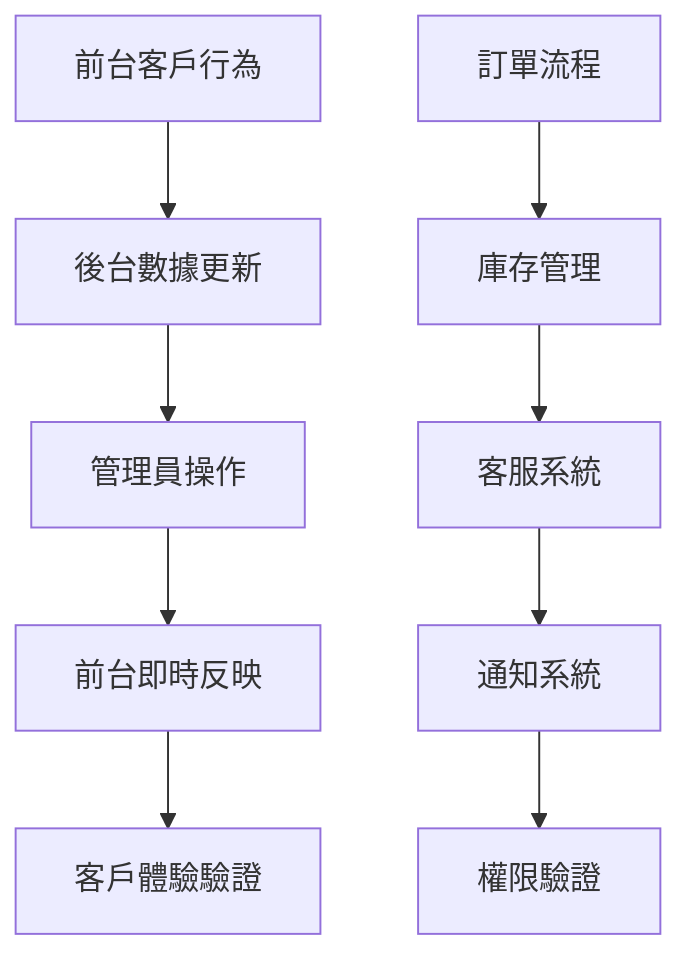

# 整合測試流程文檔

## 概述

本文檔說明如何使用 `front-stage-vue` 前台測試系統與 `admin-platform-vue` 後台管理系統進行端到端的整合測試，確保整個電商平台的功能完整性和數據一致性。

## 測試目標

### 主要測試目標
1. **數據同步驗證**: 確保前後台數據實時同步
2. **業務流程完整性**: 驗證完整的電商業務流程
3. **權限控制測試**: 確保用戶權限正確實施
4. **效能壓力測試**: 驗證系統在負載下的表現
5. **錯誤處理機制**: 測試異常情況的處理能力

### 測試覆蓋範圍


## 測試環境準備

### 1. 雙系統同時啟動
```bash
# 終端視窗 1: 啟動後台管理系統
cd admin-platform-vue
npm run dev
# 運行在 http://localhost:5174

# 終端視窗 2: 啟動前台測試系統  
cd front-stage-vue
npm run dev
# 運行在 http://localhost:5173

# 終端視窗 3: 監控資料庫連接
cd admin-platform-vue
npm run db:monitor
```

### 2. 測試數據初始化
```typescript
// 整合測試數據準備腳本
class IntegrationTestDataSetup {
  static async initializeTestEnvironment() {
    console.log('🚀 初始化整合測試環境...')
    
    try {
      // 1. 清理現有測試數據
      await this.cleanupTestData()
      
      // 2. 創建基礎測試數據
      const testData = await this.createBaseTestData()
      
      // 3. 設置管理員帳號
      await this.setupAdminAccounts()
      
      // 4. 初始化商品庫存
      await this.initializeInventory()
      
      // 5. 創建測試客戶群
      const customers = await this.createTestCustomers(20)
      
      console.log('✅ 整合測試環境初始化完成')
      return { testData, customers }
      
    } catch (error) {
      console.error('❌ 測試環境初始化失敗:', error)
      throw error
    }
  }
  
  private static async createBaseTestData() {
    return {
      products: await ProductTestDataGenerator.generateProducts(50),
      categories: await CategoryTestDataGenerator.generateCategories(8),
      adminUsers: await AdminUserGenerator.generateAdminUsers(3),
      customerServiceAgents: await AgentGenerator.generateAgents(5)
    }
  }
}
```

### 3. 測試配置檔
```typescript
// integration-test.config.ts
export const IntegrationTestConfig = {
  // 系統端點
  endpoints: {
    frontend: 'http://localhost:5173',
    backend: 'http://localhost:5174',
    api: 'https://your-project.supabase.co'
  },
  
  // 測試參數
  testParameters: {
    customerCount: 20,
    productCount: 50,
    orderSimulationCount: 100,
    concurrentUsers: 10,
    testDurationMinutes: 30
  },
  
  // 效能閾值
  performanceThresholds: {
    pageLoadTime: 3000,        // 3秒
    apiResponseTime: 1000,     // 1秒
    databaseQueryTime: 500,    // 0.5秒
    realtimeUpdateDelay: 2000  // 2秒
  },
  
  // 監控設定
  monitoring: {
    enableRealTimeLogging: true,
    logLevel: 'debug',
    metricsInterval: 30000,    // 30秒
    screenshotOnError: true
  }
}
```

## 🧪 核心測試場景

### 場景 1: 客戶註冊到首次購買流程
```typescript
class CustomerJourneyIntegrationTest {
  static async testCompleteCustomerJourney() {
    console.log('🎭 開始客戶完整旅程測試...')
    
    const testContext = {
      customerId: null,
      orderId: null,
      conversationId: null,
      startTime: Date.now()
    }
    
    try {
      // 1. 前台: 客戶註冊
      const customer = await this.simulateCustomerRegistration()
      testContext.customerId = customer.id
      
      // 2. 後台: 驗證客戶數據出現
      await this.verifyCustomerInBackend(customer.id)
      
      // 3. 前台: 客戶瀏覽商品
      const browsedProducts = await this.simulateProductBrowsing(customer.id)
      
      // 4. 前台: 加入購物車
      await this.simulateAddToCart(customer.id, browsedProducts[0])
      
      // 5. 前台: 完成結帳
      const order = await this.simulateCheckout(customer.id)
      testContext.orderId = order.id
      
      // 6. 後台: 驗證訂單出現在管理系統
      await this.verifyOrderInBackend(order.id)
      
      // 7. 後台: 管理員處理訂單
      await this.simulateAdminOrderProcessing(order.id)
      
      // 8. 前台: 驗證客戶看到訂單狀態更新
      await this.verifyOrderStatusUpdate(customer.id, order.id)
      
      // 9. 客服系統: 模擬客戶諮詢
      const conversation = await this.simulateCustomerInquiry(customer.id, order.id)
      testContext.conversationId = conversation.id
      
      // 10. 後台: 客服回覆處理
      await this.simulateAgentResponse(conversation.id)
      
      // 11. 驗證整個流程的數據一致性
      await this.verifyEndToEndDataConsistency(testContext)
      
      const duration = Date.now() - testContext.startTime
      console.log(`✅ 客戶完整旅程測試成功 (耗時: ${duration}ms)`)
      
      return { success: true, duration, testContext }
      
    } catch (error) {
      console.error('❌ 客戶旅程測試失敗:', error)
      await this.cleanupTestData(testContext)
      throw error
    }
  }
  
  private static async verifyCustomerInBackend(customerId: string) {
    // 等待數據同步
    await new Promise(resolve => setTimeout(resolve, 2000))
    
    // 在後台系統查詢客戶
    const response = await fetch(`${IntegrationTestConfig.endpoints.backend}/api/customers/${customerId}`)
    
    if (!response.ok) {
      throw new Error(`後台找不到客戶數據: ${customerId}`)
    }
    
    const customerData = await response.json()
    console.log(`✓ 後台已同步客戶數據: ${customerData.name}`)
    
    return customerData
  }
  
  private static async verifyOrderInBackend(orderId: string) {
    await new Promise(resolve => setTimeout(resolve, 3000))
    
    const response = await fetch(`${IntegrationTestConfig.endpoints.backend}/api/orders/${orderId}`)
    
    if (!response.ok) {
      throw new Error(`後台找不到訂單數據: ${orderId}`)
    }
    
    const orderData = await response.json()
    console.log(`✓ 後台已同步訂單數據: ${orderData.orderNumber}`)
    
    // 驗證訂單詳細資訊
    assert(orderData.items.length > 0, '訂單應包含商品項目')
    assert(orderData.pricing.total > 0, '訂單總額應大於0')
    assert(['pending', 'processing'].includes(orderData.status), '新訂單狀態應為pending或processing')
    
    return orderData
  }
}
```

### 場景 2: 庫存管理整合測試
```typescript
class InventoryManagementIntegrationTest {
  static async testInventorySync() {
    console.log('📦 開始庫存管理整合測試...')
    
    // 1. 選擇測試商品
    const product = await this.selectLowStockProduct()
    const originalStock = product.inventory.quantity
    
    // 2. 前台: 大量購買該商品
    const purchaseQuantity = Math.floor(originalStock * 0.8) // 購買80%庫存
    const customers = await this.generateMultipleCustomers(5)
    
    const purchasePromises = customers.map(async (customer, index) => {
      const quantity = Math.floor(purchaseQuantity / customers.length)
      if (quantity > 0) {
        return await this.simulatePurchase(customer.id, product.id, quantity)
      }
    })
    
    const orders = await Promise.all(purchasePromises)
    
    // 3. 驗證庫存自動扣減
    await this.verifyInventoryDeduction(product.id, purchaseQuantity)
    
    // 4. 觸發低庫存警報
    const updatedProduct = await ProductApiService.getById(product.id)
    if (updatedProduct.inventory.quantity <= updatedProduct.inventory.lowStockThreshold) {
      console.log('⚠️ 觸發低庫存警報')
      
      // 5. 驗證後台收到低庫存通知
      await this.verifyLowStockNotification(product.id)
    }
    
    // 6. 後台: 管理員補充庫存
    const restockQuantity = 100
    await this.simulateAdminRestock(product.id, restockQuantity)
    
    // 7. 驗證前台庫存狀態更新
    await this.verifyFrontendStockUpdate(product.id, restockQuantity)
    
    console.log('✅ 庫存管理整合測試完成')
  }
  
  private static async verifyInventoryDeduction(productId: string, expectedDeduction: number) {
    await new Promise(resolve => setTimeout(resolve, 3000))
    
    const product = await ProductApiService.getById(productId)
    const actualStock = product.inventory.quantity
    
    // 允許少量誤差 (考慮併發處理)
    const tolerance = 2
    const isWithinTolerance = Math.abs(actualStock - (product.inventory.originalQuantity - expectedDeduction)) <= tolerance
    
    if (!isWithinTolerance) {
      throw new Error(`庫存扣減不正確: 期望 ${expectedDeduction}, 實際 ${product.inventory.originalQuantity - actualStock}`)
    }
    
    console.log(`✓ 庫存正確扣減: ${expectedDeduction} 件`)
  }
}
```

### 場景 3: 即時通知系統測試
```typescript
class RealtimeNotificationIntegrationTest {
  static async testNotificationFlow() {
    console.log('🔔 開始即時通知系統測試...')
    
    // 1. 建立前台和後台的 WebSocket 連接
    const frontendWs = await this.establishFrontendWebSocket()
    const backendWs = await this.establishBackendWebSocket()
    
    const notifications = []
    
    // 2. 設置通知監聽器
    frontendWs.on('notification', (data) => {
      notifications.push({ source: 'frontend', ...data })
    })
    
    backendWs.on('notification', (data) => {
      notifications.push({ source: 'backend', ...data })
    })
    
    try {
      // 3. 觸發各種通知事件
      await this.triggerNewOrderNotification()
      await this.triggerCustomerServiceNotification()
      await this.triggerLowStockNotification()
      await this.triggerSystemMaintenanceNotification()
      
      // 4. 等待通知傳播
      await new Promise(resolve => setTimeout(resolve, 5000))
      
      // 5. 驗證通知接收
      await this.verifyNotificationDelivery(notifications)
      
      // 6. 測試通知的即時性
      const latencyTest = await this.measureNotificationLatency()
      
      console.log(`✅ 通知系統測試完成, 平均延遲: ${latencyTest.averageLatency}ms`)
      
    } finally {
      frontendWs.close()
      backendWs.close()
    }
  }
  
  private static async measureNotificationLatency() {
    const testCount = 10
    const latencies = []
    
    for (let i = 0; i < testCount; i++) {
      const startTime = Date.now()
      
      // 觸發測試通知
      await NotificationApiService.create({
        type: 'system_test',
        title: `延遲測試 ${i + 1}`,
        message: '這是一個延遲測試通知',
        userId: 'test-user-id'
      })
      
      // 等待接收通知 (模擬)
      await new Promise(resolve => setTimeout(resolve, 100))
      
      const latency = Date.now() - startTime
      latencies.push(latency)
      
      // 間隔時間避免過載
      await new Promise(resolve => setTimeout(resolve, 200))
    }
    
    return {
      averageLatency: latencies.reduce((a, b) => a + b, 0) / latencies.length,
      maxLatency: Math.max(...latencies),
      minLatency: Math.min(...latencies)
    }
  }
}
```

## 自動化測試套件

### 測試執行器
```typescript
class IntegrationTestSuite {
  private testResults: TestResult[] = []
  private currentTest: string = ''
  
  async runAllTests() {
    console.log('🚀 開始執行完整整合測試套件...')
    
    const tests = [
      { name: 'Customer Journey', test: CustomerJourneyIntegrationTest.testCompleteCustomerJourney },
      { name: 'Inventory Management', test: InventoryManagementIntegrationTest.testInventorySync },
      { name: 'Realtime Notifications', test: RealtimeNotificationIntegrationTest.testNotificationFlow },
      { name: 'Performance Load Test', test: this.runPerformanceLoadTest },
      { name: 'Data Consistency Check', test: this.runDataConsistencyTest }
    ]
    
    for (const testCase of tests) {
      this.currentTest = testCase.name
      console.log(`\n📋 執行測試: ${testCase.name}`)
      
      try {
        const startTime = Date.now()
        await testCase.test()
        const duration = Date.now() - startTime
        
        this.testResults.push({
          name: testCase.name,
          status: 'passed',
          duration,
          error: null
        })
        
        console.log(`✅ ${testCase.name} 測試通過 (${duration}ms)`)
        
      } catch (error) {
        this.testResults.push({
          name: testCase.name,
          status: 'failed',
          duration: 0,
          error: error.message
        })
        
        console.error(`❌ ${testCase.name} 測試失敗:`, error.message)
        
        // 截圖保存錯誤現場 (如果配置啟用)
        if (IntegrationTestConfig.monitoring.screenshotOnError) {
          await this.captureErrorScreenshot(testCase.name)
        }
      }
      
      // 測試間隔，避免系統過載
      await new Promise(resolve => setTimeout(resolve, 2000))
    }
    
    // 生成測試報告
    await this.generateTestReport()
    
    return this.testResults
  }
  
  private async runPerformanceLoadTest() {
    console.log('⚡ 開始效能負載測試...')
    
    const concurrentUsers = IntegrationTestConfig.testParameters.concurrentUsers
    const testDuration = IntegrationTestConfig.testParameters.testDurationMinutes * 60 * 1000
    
    const startTime = Date.now()
    const userSessions = []
    
    // 創建併發用戶會話
    for (let i = 0; i < concurrentUsers; i++) {
      const userSession = this.simulateConcurrentUserSession(i)
      userSessions.push(userSession)
    }
    
    // 等待所有會話完成或測試時間到達
    await Promise.race([
      Promise.all(userSessions),
      new Promise(resolve => setTimeout(resolve, testDuration))
    ])
    
    const actualDuration = Date.now() - startTime
    console.log(`⚡ 負載測試完成, 實際耗時: ${actualDuration}ms`)
    
    // 檢查效能指標
    await this.validatePerformanceMetrics()
  }
  
  private async simulateConcurrentUserSession(userId: number) {
    const customer = await generateCustomer()
    customer.name = `LoadTest_User_${userId}`
    
    try {
      // 模擬真實用戶行為
      await CustomerApiService.register(customer)
      await new Promise(resolve => setTimeout(resolve, 1000))
      
      await ReturningCustomerSimulator.simulateBrowsingBehavior(customer.id)
      await new Promise(resolve => setTimeout(resolve, 2000))
      
      // 30% 機率進行購買
      if (faker.datatype.boolean(0.3)) {
        await PurchaseDecisionSimulator.simulatePurchaseJourney(customer.id)
      }
      
    } catch (error) {
      console.warn(`用戶會話 ${userId} 出現錯誤:`, error.message)
    }
  }
}
```

### 測試報告生成
```typescript
class TestReportGenerator {
  static async generateReport(testResults: TestResult[]) {
    const report = {
      timestamp: new Date().toISOString(),
      summary: {
        total: testResults.length,
        passed: testResults.filter(r => r.status === 'passed').length,
        failed: testResults.filter(r => r.status === 'failed').length,
        totalDuration: testResults.reduce((sum, r) => sum + r.duration, 0)
      },
      details: testResults,
      systemInfo: await this.collectSystemInfo(),
      recommendations: this.generateRecommendations(testResults)
    }
    
    // 儲存 JSON 報告
    await fs.writeFile(
      `integration-test-report-${Date.now()}.json`,
      JSON.stringify(report, null, 2)
    )
    
    // 生成 HTML 報告
    await this.generateHtmlReport(report)
    
    console.log('📊 測試報告已生成')
    return report
  }
  
  private static generateRecommendations(results: TestResult[]): string[] {
    const recommendations = []
    
    const failedTests = results.filter(r => r.status === 'failed')
    if (failedTests.length > 0) {
      recommendations.push(`修復 ${failedTests.length} 個失敗的測試案例`)
    }
    
    const avgDuration = results.reduce((sum, r) => sum + r.duration, 0) / results.length
    if (avgDuration > 10000) {
      recommendations.push('考慮優化測試執行效能，平均執行時間過長')
    }
    
    return recommendations
  }
}
```

## 📈 持續整合測試

### CI/CD 整合
```yaml
# .github/workflows/integration-test.yml
name: Integration Tests

on:
  push:
    branches: [ main, develop ]
  pull_request:
    branches: [ main ]
  schedule:
    - cron: '0 2 * * *' # 每日凌晨2點執行

jobs:
  integration-test:
    runs-on: ubuntu-latest
    
    services:
      postgres:
        image: postgres:13
        env:
          POSTGRES_PASSWORD: postgres
        options: >-
          --health-cmd pg_isready
          --health-interval 10s
          --health-timeout 5s
          --health-retries 5
          
    steps:
    - uses: actions/checkout@v3
    
    - name: Setup Node.js
      uses: actions/setup-node@v3
      with:
        node-version: '18'
        
    - name: Install dependencies
      run: |
        cd admin-platform-vue && npm ci
        cd ../front-stage-vue && npm ci
        
    - name: Setup test database
      run: |
        npm run db:setup:test
        
    - name: Start applications
      run: |
        cd admin-platform-vue && npm run dev &
        cd ../front-stage-vue && npm run dev &
        sleep 30 # 等待應用啟動
        
    - name: Run integration tests
      run: |
        npm run test:integration
        
    - name: Upload test results
      uses: actions/upload-artifact@v3
      if: always()
      with:
        name: test-results
        path: test-results/
        
    - name: Notify on failure
      if: failure()
      run: |
        # 發送測試失敗通知
        npm run notify:test-failure
```

### 監控指標收集
```typescript
class IntegrationTestMetrics {
  private static metrics = {
    apiResponseTimes: [],
    databaseQueryTimes: [],
    pageLoadTimes: [],
    errorCounts: {},
    memoryUsage: [],
    cpuUsage: []
  }
  
  static startMetricsCollection() {
    // 每30秒收集一次系統指標
    setInterval(async () => {
      const systemMetrics = await this.collectSystemMetrics()
      this.metrics.memoryUsage.push(systemMetrics.memory)
      this.metrics.cpuUsage.push(systemMetrics.cpu)
    }, 30000)
    
    // 監聽 API 響應時間
    this.monitorApiResponseTimes()
    
    console.log('📊 開始收集整合測試指標')
  }
  
  private static async collectSystemMetrics() {
    const usage = process.memoryUsage()
    const cpuUsage = process.cpuUsage()
    
    return {
      memory: {
        rss: usage.rss,
        heapTotal: usage.heapTotal,
        heapUsed: usage.heapUsed,
        external: usage.external
      },
      cpu: {
        user: cpuUsage.user,
        system: cpuUsage.system
      },
      timestamp: Date.now()
    }
  }
  
  static generateMetricsReport() {
    return {
      averageApiResponseTime: this.calculateAverage(this.metrics.apiResponseTimes),
      averagePageLoadTime: this.calculateAverage(this.metrics.pageLoadTimes),
      peakMemoryUsage: Math.max(...this.metrics.memoryUsage.map(m => m.heapUsed)),
      errorRate: Object.values(this.metrics.errorCounts).reduce((a, b) => a + b, 0) / this.metrics.apiResponseTimes.length,
      totalRequests: this.metrics.apiResponseTimes.length
    }
  }
}
```

## 故障排除

### 常見問題與解決方案

#### 1. 數據同步延遲
```typescript
class SyncIssueDetector {
  static async detectSyncLag() {
    const testData = {
      customerId: faker.string.uuid(),
      timestamp: Date.now()
    }
    
    // 前台寫入數據
    await FrontendApiService.createCustomer(testData)
    
    // 檢查後台數據出現時間
    const startCheck = Date.now()
    let found = false
    let attempts = 0
    
    while (!found && attempts < 10) {
      try {
        await BackendApiService.getCustomer(testData.customerId)
        found = true
        const syncDelay = Date.now() - startCheck
        console.log(`✅ 數據同步延遲: ${syncDelay}ms`)
        return syncDelay
      } catch (error) {
        attempts++
        await new Promise(resolve => setTimeout(resolve, 1000))
      }
    }
    
    if (!found) {
      throw new Error('數據同步失敗，超過10秒未同步')
    }
  }
}
```

#### 2. 測試環境清理
```typescript
class TestEnvironmentCleaner {
  static async cleanupAfterTest() {
    console.log('🧹 開始清理測試環境...')
    
    try {
      // 清理測試客戶
      await supabase.from('customers').delete().ilike('email', '%test%')
      
      // 清理測試訂單
      await supabase.from('orders').delete().ilike('order_number', '%TEST%')
      
      // 清理測試對話
      await supabase.from('conversations').delete().eq('subject', 'TEST_CONVERSATION')
      
      console.log('✅ 測試環境清理完成')
    } catch (error) {
      console.error('❌ 清理測試環境失敗:', error)
    }
  }
}
```

## 相關文檔

- [前台測試環境設置](./front-stage-setup.md)
- [測試數據生成指南](./test-data-generation.md)
- [客戶行為模擬文檔](./customer-simulation.md)
- [後台系統架構](../../02-development/architecture/architecture.md)
- [錯誤處理指南](../../05-reference/standards/error-handling-guide.md)

---

*最後更新: $(date "+%Y-%m-%d")*
*適用版本: front-stage-vue v1.0.0, admin-platform-vue v1.0.0*