# 效能監控指南

## 概述

本指南詳細說明如何建立全面的效能監控系統，包括即時監控、自動化警報、效能基準設定和持續監控策略。適用於 Vue 3 電商平台的生產環境和開發環境。

## 監控目標

### 關鍵效能指標 (KPI)
- **前端效能**: 首屏載入時間、互動響應時間、記憶體使用量
- **API 效能**: 響應時間、吞吐量、錯誤率
- **資料庫效能**: 查詢時間、連接池使用率、JSONB 操作效能
- **系統資源**: CPU、記憶體、磁碟 I/O、網路頻寬
- **業務指標**: 訂單轉換率、客服響應時間、用戶滿意度

### 監控層級

```mermaid
graph TD
    A[應用層監控] --> A1[Vue 3 前端效能]
    A --> A2[Node.js API 效能]
    A --> A3[Supabase 資料庫效能]
    
    B[基礎設施監控] --> B1[伺服器資源]
    B --> B2[網路效能]
    B --> B3[容器健康度]
    
    C[業務監控] --> C1[訂單處理效能]
    C --> C2[客服系統效能]
    C --> C3[用戶體驗指標]
```


## ⚡ Vue 3 前端效能監控

### Web Vitals 整合監控

#### 安裝與設置
```bash
npm install web-vitals @web-vitals/attribution
npm install --save-dev @types/web-vitals
```

#### 效能監控組合式函數
```typescript
// src/composables/usePerformanceMonitoring.ts
import { ref, onMounted, onUnmounted } from 'vue'
import { getCLS, getFID, getFCP, getLCP, getTTFB, Metric } from 'web-vitals'
import { AttributionEntry } from '@web-vitals/attribution'

interface PerformanceData {
  cls: number | null
  fid: number | null 
  fcp: number | null
  lcp: number | null
  ttfb: number | null
  customMetrics: CustomMetric[]
}

interface CustomMetric {
  name: string
  value: number
  timestamp: number
  attribution?: string
}

export function usePerformanceMonitoring() {
  const performanceData = ref<PerformanceData>({
    cls: null,
    fid: null,
    fcp: null,
    lcp: null,
    ttfb: null,
    customMetrics: []
  })

  const isMonitoring = ref(false)
  const observers: PerformanceObserver[] = []

  // Web Vitals 收集
  const collectWebVitals = () => {
    getCLS((metric: Metric) => {
      performanceData.value.cls = metric.value
      reportMetric('CLS', metric)
    })

    getFID((metric: Metric) => {
      performanceData.value.fid = metric.value
      reportMetric('FID', metric)
    })

    getFCP((metric: Metric) => {
      performanceData.value.fcp = metric.value
      reportMetric('FCP', metric)
    })

    getLCP((metric: Metric) => {
      performanceData.value.lcp = metric.value
      reportMetric('LCP', metric)
    })

    getTTFB((metric: Metric) => {
      performanceData.value.ttfb = metric.value
      reportMetric('TTFB', metric)
    })
  }

  // 自定義效能指標收集
  const collectCustomMetrics = () => {
    // Vue 元件渲染時間
    if ('PerformanceObserver' in window) {
      const observer = new PerformanceObserver((list) => {
        list.getEntries().forEach((entry) => {
          if (entry.entryType === 'measure' && entry.name.startsWith('vue-')) {
            addCustomMetric(entry.name, entry.duration, 'Vue Component')
          }
        })
      })
      
      observer.observe({ entryTypes: ['measure'] })
      observers.push(observer)
    }

    // API 請求監控
    const originalFetch = window.fetch
    window.fetch = async (...args) => {
      const startTime = performance.now()
      try {
        const response = await originalFetch(...args)
        const duration = performance.now() - startTime
        
        const url = args[0] as string
        addCustomMetric(`API-${extractEndpoint(url)}`, duration, 'API Request')
        
        return response
      } catch (error) {
        const duration = performance.now() - startTime
        addCustomMetric(`API-Error-${extractEndpoint(args[0] as string)}`, duration, 'API Error')
        throw error
      }
    }
  }

  // 記憶體監控
  const monitorMemoryUsage = () => {
    if ('memory' in performance) {
      const memoryInfo = (performance as any).memory
      addCustomMetric('Memory-Used', memoryInfo.usedJSHeapSize / 1024 / 1024, 'Memory (MB)')
      addCustomMetric('Memory-Total', memoryInfo.totalJSHeapSize / 1024 / 1024, 'Memory (MB)')
    }
  }

  // 長任務監控
  const monitorLongTasks = () => {
    if ('PerformanceObserver' in window) {
      const observer = new PerformanceObserver((list) => {
        list.getEntries().forEach((entry) => {
          if (entry.duration > 50) { // 超過50ms的任務
            addCustomMetric('Long-Task', entry.duration, 'Performance')
          }
        })
      })
      
      try {
        observer.observe({ entryTypes: ['longtask'] })
        observers.push(observer)
      } catch (e) {
        console.warn('Long task monitoring not supported')
      }
    }
  }

  const addCustomMetric = (name: string, value: number, attribution: string) => {
    performanceData.value.customMetrics.push({
      name,
      value,
      timestamp: Date.now(),
      attribution
    })
  }

  const reportMetric = (name: string, metric: Metric) => {
    // 發送到監控服務
    if (import.meta.env.PROD) {
      sendToAnalytics(name, metric)
    }
    
    console.log(`[Performance] ${name}: ${metric.value}`)
  }

  const sendToAnalytics = async (name: string, metric: Metric) => {
    try {
      await fetch('/api/analytics/performance', {
        method: 'POST',
        headers: {
          'Content-Type': 'application/json',
        },
        body: JSON.stringify({
          metric: name,
          value: metric.value,
          id: metric.id,
          delta: metric.delta,
          timestamp: Date.now(),
          url: window.location.href,
          userAgent: navigator.userAgent
        })
      })
    } catch (error) {
      console.error('Failed to send performance data:', error)
    }
  }

  const extractEndpoint = (url: string): string => {
    try {
      return new URL(url, window.location.origin).pathname.split('/').slice(0, 3).join('/')
    } catch {
      return 'unknown'
    }
  }

  const startMonitoring = () => {
    if (isMonitoring.value) return

    isMonitoring.value = true
    collectWebVitals()
    collectCustomMetrics()
    
    // 定期收集記憶體資訊
    const memoryInterval = setInterval(monitorMemoryUsage, 30000) // 每30秒
    
    monitorLongTasks()

    onUnmounted(() => {
      clearInterval(memoryInterval)
      observers.forEach(observer => observer.disconnect())
      isMonitoring.value = false
    })
  }

  const stopMonitoring = () => {
    observers.forEach(observer => observer.disconnect())
    observers.length = 0
    isMonitoring.value = false
  }

  const getPerformanceReport = () => {
    return {
      ...performanceData.value,
      timestamp: Date.now(),
      url: window.location.href,
      viewport: {
        width: window.innerWidth,
        height: window.innerHeight
      },
      connection: (navigator as any).connection ? {
        effectiveType: (navigator as any).connection.effectiveType,
        downlink: (navigator as any).connection.downlink
      } : null
    }
  }

  onMounted(() => {
    if (import.meta.env.PROD || import.meta.env.VITE_ENABLE_MONITORING === 'true') {
      startMonitoring()
    }
  })

  return {
    performanceData: readonly(performanceData),
    isMonitoring: readonly(isMonitoring),
    startMonitoring,
    stopMonitoring,
    getPerformanceReport,
    addCustomMetric
  }
}
```

### 效能監控元件
```vue
<!-- src/components/PerformanceMonitor.vue -->
<template>
  <div v-if="showMonitor && isDev" class="performance-monitor">
    <div class="monitor-header">
      <h3>效能監控</h3>
      <button @click="toggleExpanded">{{ expanded ? '收起' : '展開' }}</button>
    </div>
    
    <div v-if="expanded" class="monitor-content">
      <div class="vitals-grid">
        <div class="vital-item" :class="getVitalStatus('lcp')">
          <label>LCP</label>
          <value>{{ performanceData.lcp?.toFixed(0) }}ms</value>
        </div>
        
        <div class="vital-item" :class="getVitalStatus('fid')">
          <label>FID</label>
          <value>{{ performanceData.fid?.toFixed(0) }}ms</value>
        </div>
        
        <div class="vital-item" :class="getVitalStatus('cls')">
          <label>CLS</label>
          <value>{{ performanceData.cls?.toFixed(3) }}</value>
        </div>
        
        <div class="vital-item" :class="getVitalStatus('fcp')">
          <label>FCP</label>
          <value>{{ performanceData.fcp?.toFixed(0) }}ms</value>
        </div>
      </div>
      
      <div class="custom-metrics">
        <h4>自定義指標</h4>
        <div v-for="metric in recentCustomMetrics" :key="metric.name + metric.timestamp" 
             class="metric-item">
          <span class="metric-name">{{ metric.name }}</span>
          <span class="metric-value">{{ metric.value.toFixed(1) }}{{ getUnit(metric.name) }}</span>
        </div>
      </div>
      
      <div class="monitor-actions">
        <button @click="exportReport">匯出報告</button>
        <button @click="clearData">清除資料</button>
      </div>
    </div>
  </div>
</template>

<script setup lang="ts">
import { ref, computed } from 'vue'
import { usePerformanceMonitoring } from '@/composables/usePerformanceMonitoring'

const { performanceData, getPerformanceReport } = usePerformanceMonitoring()

const showMonitor = ref(true)
const expanded = ref(false)
const isDev = import.meta.env.DEV

const recentCustomMetrics = computed(() => {
  return performanceData.value.customMetrics
    .slice(-10) // 只顯示最近10個指標
    .reverse()
})

const getVitalStatus = (vital: string) => {
  const value = performanceData.value[vital as keyof typeof performanceData.value]
  if (value === null) return 'loading'
  
  const thresholds = {
    lcp: { good: 2500, needsImprovement: 4000 },
    fid: { good: 100, needsImprovement: 300 },
    cls: { good: 0.1, needsImprovement: 0.25 },
    fcp: { good: 1800, needsImprovement: 3000 },
  }
  
  const threshold = thresholds[vital as keyof typeof thresholds]
  if (!threshold) return ''
  
  if (value <= threshold.good) return 'good'
  if (value <= threshold.needsImprovement) return 'needs-improvement'
  return 'poor'
}

const getUnit = (metricName: string): string => {
  if (metricName.includes('Memory')) return 'MB'
  if (metricName.includes('API') || metricName.includes('Task')) return 'ms'
  return ''
}

const toggleExpanded = () => {
  expanded.value = !expanded.value
}

const exportReport = () => {
  const report = getPerformanceReport()
  const dataStr = JSON.stringify(report, null, 2)
  const dataBlob = new Blob([dataStr], { type: 'application/json' })
  
  const link = document.createElement('a')
  link.href = URL.createObjectURL(dataBlob)
  link.download = `performance-report-${Date.now()}.json`
  link.click()
}

const clearData = () => {
  performanceData.value.customMetrics.length = 0
}
</script>

<style scoped>
.performance-monitor {
  position: fixed;
  top: 20px;
  right: 20px;
  background: rgba(0, 0, 0, 0.9);
  color: white;
  border-radius: 8px;
  padding: 16px;
  max-width: 400px;
  font-family: monospace;
  font-size: 12px;
  z-index: 9999;
}

.monitor-header {
  display: flex;
  justify-content: space-between;
  align-items: center;
  margin-bottom: 12px;
}

.monitor-header h3 {
  margin: 0;
  font-size: 14px;
}

.vitals-grid {
  display: grid;
  grid-template-columns: repeat(2, 1fr);
  gap: 8px;
  margin-bottom: 16px;
}

.vital-item {
  padding: 8px;
  border-radius: 4px;
  text-align: center;
}

.vital-item.good { background: #10b981; }
.vital-item.needs-improvement { background: #f59e0b; }
.vital-item.poor { background: #ef4444; }
.vital-item.loading { background: #6b7280; }

.vital-item label {
  display: block;
  font-size: 10px;
  opacity: 0.8;
}

.vital-item value {
  display: block;
  font-size: 14px;
  font-weight: bold;
}

.custom-metrics {
  margin-bottom: 16px;
}

.custom-metrics h4 {
  margin: 0 0 8px 0;
  font-size: 12px;
}

.metric-item {
  display: flex;
  justify-content: space-between;
  margin-bottom: 4px;
  padding: 2px 0;
}

.metric-name {
  opacity: 0.8;
}

.metric-value {
  font-weight: bold;
}

.monitor-actions {
  display: flex;
  gap: 8px;
}

.monitor-actions button {
  flex: 1;
  padding: 6px;
  border: none;
  border-radius: 4px;
  background: #374151;
  color: white;
  font-size: 10px;
  cursor: pointer;
}

.monitor-actions button:hover {
  background: #4b5563;
}
</style>
```

## API 效能監控

### Express.js 中間件監控
```typescript
// src/middleware/performanceMiddleware.ts
import { Request, Response, NextFunction } from 'express'

interface RequestMetrics {
  method: string
  url: string
  statusCode: number
  responseTime: number
  timestamp: number
  memoryUsage: NodeJS.MemoryUsage
  userAgent?: string
  ip?: string
}

class APIPerformanceMonitor {
  private metrics: RequestMetrics[] = []
  private readonly maxMetrics = 10000
  
  middleware() {
    return (req: Request, res: Response, next: NextFunction) => {
      const startTime = process.hrtime.bigint()
      const startMemory = process.memoryUsage()
      
      // 監聽回應結束
      res.on('finish', () => {
        const endTime = process.hrtime.bigint()
        const responseTime = Number(endTime - startTime) / 1000000 // 轉換為毫秒
        
        const metrics: RequestMetrics = {
          method: req.method,
          url: req.originalUrl || req.url,
          statusCode: res.statusCode,
          responseTime,
          timestamp: Date.now(),
          memoryUsage: process.memoryUsage(),
          userAgent: req.get('User-Agent'),
          ip: req.ip || req.connection.remoteAddress
        }
        
        this.addMetrics(metrics)
        
        // 記錄慢查詢
        if (responseTime > 1000) {
          console.warn(`Slow API request: ${req.method} ${req.url} - ${responseTime.toFixed(2)}ms`)
        }
        
        // 記錄錯誤
        if (res.statusCode >= 400) {
          console.error(`API error: ${req.method} ${req.url} - ${res.statusCode}`)
        }
      })
      
      next()
    }
  }
  
  private addMetrics(metrics: RequestMetrics) {
    this.metrics.push(metrics)
    
    // 保持陣列大小限制
    if (this.metrics.length > this.maxMetrics) {
      this.metrics.splice(0, this.metrics.length - this.maxMetrics)
    }
  }
  
  getMetrics(timeWindow: number = 300000): RequestMetrics[] {
    const cutoff = Date.now() - timeWindow
    return this.metrics.filter(m => m.timestamp > cutoff)
  }
  
  getAverageResponseTime(endpoint?: string): number {
    const filteredMetrics = endpoint 
      ? this.metrics.filter(m => m.url.includes(endpoint))
      : this.metrics
      
    if (filteredMetrics.length === 0) return 0
    
    const total = filteredMetrics.reduce((sum, m) => sum + m.responseTime, 0)
    return total / filteredMetrics.length
  }
  
  getErrorRate(timeWindow: number = 300000): number {
    const recentMetrics = this.getMetrics(timeWindow)
    if (recentMetrics.length === 0) return 0
    
    const errorCount = recentMetrics.filter(m => m.statusCode >= 400).length
    return (errorCount / recentMetrics.length) * 100
  }
  
  getThroughput(timeWindow: number = 60000): number {
    const recentMetrics = this.getMetrics(timeWindow)
    return (recentMetrics.length / timeWindow) * 1000 // 每秒請求數
  }
  
  generateReport() {
    const now = Date.now()
    const last5min = this.getMetrics(300000)
    const last1min = this.getMetrics(60000)
    
    return {
      timestamp: now,
      totalRequests: this.metrics.length,
      metrics: {
        last5min: {
          requestCount: last5min.length,
          averageResponseTime: this.getAverageResponseTime(),
          errorRate: this.getErrorRate(300000),
          throughput: this.getThroughput(300000)
        },
        last1min: {
          requestCount: last1min.length,
          throughput: this.getThroughput(60000),
          errorRate: this.getErrorRate(60000)
        }
      },
      topEndpoints: this.getTopEndpoints(last5min),
      slowestEndpoints: this.getSlowestEndpoints(last5min),
      memoryUsage: process.memoryUsage()
    }
  }
  
  private getTopEndpoints(metrics: RequestMetrics[]) {
    const endpointCounts = new Map<string, number>()
    
    metrics.forEach(m => {
      const endpoint = this.normalizeEndpoint(m.url)
      endpointCounts.set(endpoint, (endpointCounts.get(endpoint) || 0) + 1)
    })
    
    return Array.from(endpointCounts.entries())
      .sort((a, b) => b[1] - a[1])
      .slice(0, 10)
      .map(([endpoint, count]) => ({ endpoint, count }))
  }
  
  private getSlowestEndpoints(metrics: RequestMetrics[]) {
    const endpointTimes = new Map<string, number[]>()
    
    metrics.forEach(m => {
      const endpoint = this.normalizeEndpoint(m.url)
      if (!endpointTimes.has(endpoint)) {
        endpointTimes.set(endpoint, [])
      }
      endpointTimes.get(endpoint)!.push(m.responseTime)
    })
    
    return Array.from(endpointTimes.entries())
      .map(([endpoint, times]) => ({
        endpoint,
        averageTime: times.reduce((a, b) => a + b, 0) / times.length,
        maxTime: Math.max(...times),
        callCount: times.length
      }))
      .sort((a, b) => b.averageTime - a.averageTime)
      .slice(0, 10)
  }
  
  private normalizeEndpoint(url: string): string {
    // 將 ID 參數標準化為 :id
    return url.replace(/\/\d+/g, '/:id')
              .replace(/\?.*$/, '') // 移除查詢參數
  }
}

export const performanceMonitor = new APIPerformanceMonitor()
```

## 資料庫效能監控

### Supabase 查詢效能監控
```sql
-- 建立效能監控視圖
CREATE OR REPLACE VIEW performance_monitoring AS
SELECT 
  schemaname,
  tablename,
  attname,
  n_distinct,
  correlation,
  most_common_vals,
  most_common_freqs
FROM pg_stats 
WHERE schemaname = 'public';

-- JSONB 查詢效能分析
CREATE OR REPLACE FUNCTION analyze_jsonb_performance(
  table_name TEXT,
  jsonb_column TEXT,
  sample_size INTEGER DEFAULT 1000
) RETURNS TABLE(
  query_type TEXT,
  avg_execution_time NUMERIC,
  max_execution_time NUMERIC,
  min_execution_time NUMERIC,
  sample_count INTEGER
) AS $$
DECLARE
  start_time TIMESTAMP;
  end_time TIMESTAMP;
  execution_time NUMERIC;
  query_sql TEXT;
BEGIN
  -- 測試簡單 JSONB 查詢
  query_sql := format('SELECT %s FROM %s LIMIT %s', jsonb_column, table_name, sample_size);
  
  start_time := clock_timestamp();
  EXECUTE query_sql;
  end_time := clock_timestamp();
  execution_time := EXTRACT(EPOCH FROM (end_time - start_time)) * 1000;
  
  RETURN QUERY SELECT 
    'simple_select'::TEXT,
    execution_time,
    execution_time,
    execution_time,
    sample_size;
    
  -- 測試 JSONB 屬性查詢
  query_sql := format('SELECT %s->>''product_name'' FROM %s WHERE %s IS NOT NULL LIMIT %s', 
                     jsonb_column, table_name, jsonb_column, sample_size);
  
  start_time := clock_timestamp();
  EXECUTE query_sql;
  end_time := clock_timestamp();
  execution_time := EXTRACT(EPOCH FROM (end_time - start_time)) * 1000;
  
  RETURN QUERY SELECT 
    'jsonb_attribute'::TEXT,
    execution_time,
    execution_time,
    execution_time,
    sample_size;
    
  -- 測試 JSONB 包含查詢
  query_sql := format('SELECT * FROM %s WHERE %s @> ''{"status": "active"}''::jsonb LIMIT %s',
                     table_name, jsonb_column, sample_size);
  
  start_time := clock_timestamp();
  EXECUTE query_sql;
  end_time := clock_timestamp();
  execution_time := EXTRACT(EPOCH FROM (end_time - start_time)) * 1000;
  
  RETURN QUERY SELECT 
    'jsonb_contains'::TEXT,
    execution_time,
    execution_time,
    execution_time,
    sample_size;
    
END;
$$ LANGUAGE plpgsql;

-- 慢查詢監控
CREATE OR REPLACE FUNCTION get_slow_queries(
  time_threshold INTERVAL DEFAULT '1 second',
  limit_count INTEGER DEFAULT 20
) RETURNS TABLE(
  query TEXT,
  calls BIGINT,
  total_time NUMERIC,
  mean_time NUMERIC,
  max_time NUMERIC,
  stddev_time NUMERIC
) AS $$
BEGIN
  RETURN QUERY
  SELECT 
    pg_stat_statements.query,
    pg_stat_statements.calls,
    pg_stat_statements.total_exec_time as total_time,
    pg_stat_statements.mean_exec_time as mean_time,
    pg_stat_statements.max_exec_time as max_time,
    pg_stat_statements.stddev_exec_time as stddev_time
  FROM pg_stat_statements
  WHERE pg_stat_statements.mean_exec_time > EXTRACT(EPOCH FROM time_threshold) * 1000
  ORDER BY pg_stat_statements.mean_exec_time DESC
  LIMIT limit_count;
END;
$$ LANGUAGE plpgsql;
```

### Node.js 資料庫連接池監控
```typescript
// src/utils/database-monitor.ts
import { createClient } from '@supabase/supabase-js'

class DatabasePerformanceMonitor {
  private queryTimes: Array<{ query: string; duration: number; timestamp: number }> = []
  private connectionPoolStats = {
    activeConnections: 0,
    idleConnections: 0,
    totalConnections: 0,
    waitingRequests: 0
  }

  monitorSupabaseClient(supabase: any) {
    const originalFrom = supabase.from.bind(supabase)
    
    supabase.from = (table: string) => {
      const queryBuilder = originalFrom(table)
      
      // 包裝查詢方法
      const wrapMethod = (method: string) => {
        const originalMethod = queryBuilder[method].bind(queryBuilder)
        
        queryBuilder[method] = async (...args: any[]) => {
          const startTime = performance.now()
          const queryInfo = `${method.toUpperCase()} ${table}`
          
          try {
            const result = await originalMethod(...args)
            const duration = performance.now() - startTime
            
            this.recordQuery(queryInfo, duration)
            
            // 記錄慢查詢
            if (duration > 1000) {
              console.warn(`Slow database query: ${queryInfo} - ${duration.toFixed(2)}ms`)
            }
            
            return result
          } catch (error) {
            const duration = performance.now() - startTime
            this.recordQuery(`${queryInfo} [ERROR]`, duration)
            throw error
          }
        }
      }
      
      // 包裝主要查詢方法
      ['select', 'insert', 'update', 'delete', 'upsert'].forEach(wrapMethod)
      
      return queryBuilder
    }
    
    return supabase
  }
  
  private recordQuery(query: string, duration: number) {
    this.queryTimes.push({
      query,
      duration,
      timestamp: Date.now()
    })
    
    // 保持最近1000個查詢記錄
    if (this.queryTimes.length > 1000) {
      this.queryTimes.splice(0, this.queryTimes.length - 1000)
    }
  }
  
  getQueryStatistics(timeWindow: number = 300000) {
    const cutoff = Date.now() - timeWindow
    const recentQueries = this.queryTimes.filter(q => q.timestamp > cutoff)
    
    if (recentQueries.length === 0) {
      return {
        totalQueries: 0,
        averageTime: 0,
        slowQueries: 0,
        queryTypes: {}
      }
    }
    
    const totalTime = recentQueries.reduce((sum, q) => sum + q.duration, 0)
    const slowQueries = recentQueries.filter(q => q.duration > 1000)
    
    // 按查詢類型分組
    const queryTypes: { [key: string]: { count: number; avgTime: number } } = {}
    
    recentQueries.forEach(q => {
      const type = q.query.split(' ')[0]
      if (!queryTypes[type]) {
        queryTypes[type] = { count: 0, avgTime: 0 }
      }
      queryTypes[type].count++
      queryTypes[type].avgTime = 
        (queryTypes[type].avgTime * (queryTypes[type].count - 1) + q.duration) / queryTypes[type].count
    })
    
    return {
      totalQueries: recentQueries.length,
      averageTime: totalTime / recentQueries.length,
      slowQueries: slowQueries.length,
      queryTypes,
      slowestQueries: recentQueries
        .sort((a, b) => b.duration - a.duration)
        .slice(0, 10)
        .map(q => ({
          query: q.query,
          duration: q.duration,
          timestamp: q.timestamp
        }))
    }
  }
}

export const dbMonitor = new DatabasePerformanceMonitor()
```

## 🚨 自動化警報系統

### 警報配置
```typescript
// src/utils/alerting.ts
interface AlertRule {
  name: string
  metric: string
  condition: 'gt' | 'lt' | 'eq'
  threshold: number
  duration: number // 持續時間 (毫秒)
  severity: 'low' | 'medium' | 'high' | 'critical'
  actions: AlertAction[]
}

interface AlertAction {
  type: 'email' | 'slack' | 'webhook' | 'log'
  config: any
}

class AlertingSystem {
  private rules: AlertRule[] = []
  private activeAlerts = new Map<string, { startTime: number; lastSent: number }>()
  
  constructor() {
    this.setupDefaultRules()
    this.startMonitoring()
  }
  
  private setupDefaultRules() {
    this.rules = [
      {
        name: 'High API Response Time',
        metric: 'api.average_response_time',
        condition: 'gt',
        threshold: 2000, // 2秒
        duration: 300000, // 5分鐘
        severity: 'high',
        actions: [
          { type: 'log', config: {} },
          { type: 'webhook', config: { url: '/api/alerts/webhook' } }
        ]
      },
      {
        name: 'High Error Rate',
        metric: 'api.error_rate',
        condition: 'gt',
        threshold: 5, // 5%
        duration: 180000, // 3分鐘
        severity: 'critical',
        actions: [
          { type: 'log', config: {} },
          { type: 'email', config: { to: 'devops@company.com' } }
        ]
      },
      {
        name: 'Memory Usage High',
        metric: 'system.memory_usage_mb',
        condition: 'gt',
        threshold: 512, // 512MB
        duration: 600000, // 10分鐘
        severity: 'medium',
        actions: [
          { type: 'log', config: {} }
        ]
      },
      {
        name: 'Database Slow Queries',
        metric: 'database.slow_query_count',
        condition: 'gt',
        threshold: 10, // 10個慢查詢
        duration: 300000, // 5分鐘
        severity: 'high',
        actions: [
          { type: 'log', config: {} },
          { type: 'slack', config: { channel: '#dev-alerts' } }
        ]
      }
    ]
  }
  
  addRule(rule: AlertRule) {
    this.rules.push(rule)
  }
  
  checkAlerts() {
    const metrics = this.collectCurrentMetrics()
    
    this.rules.forEach(rule => {
      const currentValue = this.getMetricValue(metrics, rule.metric)
      const shouldTrigger = this.evaluateCondition(currentValue, rule.condition, rule.threshold)
      
      if (shouldTrigger) {
        this.handleAlert(rule, currentValue)
      } else {
        this.clearAlert(rule.name)
      }
    })
  }
  
  private handleAlert(rule: AlertRule, currentValue: number) {
    const now = Date.now()
    const activeAlert = this.activeAlerts.get(rule.name)
    
    if (!activeAlert) {
      // 新警報
      this.activeAlerts.set(rule.name, { startTime: now, lastSent: 0 })
      return
    }
    
    // 檢查是否達到持續時間閾值
    if (now - activeAlert.startTime >= rule.duration) {
      // 檢查是否需要再次發送警報 (避免垃圾訊息)
      const timeSinceLastSent = now - activeAlert.lastSent
      if (timeSinceLastSent >= 600000 || activeAlert.lastSent === 0) { // 10分鐘間隔
        this.triggerAlert(rule, currentValue)
        activeAlert.lastSent = now
      }
    }
  }
  
  private clearAlert(ruleName: string) {
    if (this.activeAlerts.has(ruleName)) {
      this.activeAlerts.delete(ruleName)
      console.log(`Alert cleared: ${ruleName}`)
    }
  }
  
  private triggerAlert(rule: AlertRule, currentValue: number) {
    const alertData = {
      rule: rule.name,
      metric: rule.metric,
      currentValue,
      threshold: rule.threshold,
      severity: rule.severity,
      timestamp: new Date().toISOString()
    }
    
    console.error(`ALERT TRIGGERED: ${rule.name}`, alertData)
    
    rule.actions.forEach(action => {
      this.executeAction(action, alertData)
    })
  }
  
  private executeAction(action: AlertAction, alertData: any) {
    switch (action.type) {
      case 'log':
        console.error(`[ALERT] ${alertData.rule}: ${alertData.metric} = ${alertData.currentValue} (threshold: ${alertData.threshold})`)
        break
        
      case 'webhook':
        fetch(action.config.url, {
          method: 'POST',
          headers: { 'Content-Type': 'application/json' },
          body: JSON.stringify(alertData)
        }).catch(console.error)
        break
        
      case 'email':
        // 整合 email 服務
        this.sendEmail(action.config.to, alertData)
        break
        
      case 'slack':
        // 整合 Slack webhook
        this.sendSlackMessage(action.config.channel, alertData)
        break
    }
  }
  
  private collectCurrentMetrics(): any {
    // 整合各個監控系統的指標
    return {
      'api.average_response_time': performanceMonitor.getAverageResponseTime(),
      'api.error_rate': performanceMonitor.getErrorRate(),
      'system.memory_usage_mb': process.memoryUsage().heapUsed / 1024 / 1024,
      'database.slow_query_count': dbMonitor.getQueryStatistics().slowQueries
    }
  }
  
  private getMetricValue(metrics: any, metricPath: string): number {
    return metricPath.split('.').reduce((obj, key) => obj?.[key], metrics) || 0
  }
  
  private evaluateCondition(value: number, condition: string, threshold: number): boolean {
    switch (condition) {
      case 'gt': return value > threshold
      case 'lt': return value < threshold
      case 'eq': return value === threshold
      default: return false
    }
  }
  
  private startMonitoring() {
    // 每分鐘檢查一次警報
    setInterval(() => {
      this.checkAlerts()
    }, 60000)
  }
  
  private async sendEmail(to: string, alertData: any) {
    // Email 發送邏輯
    console.log(`Sending email to ${to}:`, alertData)
  }
  
  private async sendSlackMessage(channel: string, alertData: any) {
    // Slack 訊息發送邏輯
    console.log(`Sending Slack message to ${channel}:`, alertData)
  }
}

export const alertingSystem = new AlertingSystem()
```

## 儀表板和報告

### 效能儀表板 API
```typescript
// src/routes/performance.ts
import { Router } from 'express'
import { performanceMonitor, dbMonitor, alertingSystem } from '../utils/monitoring'

const router = Router()

router.get('/dashboard', async (req, res) => {
  const timeWindow = parseInt(req.query.timeWindow as string) || 300000 // 5分鐘預設
  
  const performanceData = {
    timestamp: Date.now(),
    timeWindow,
    api: performanceMonitor.generateReport(),
    database: dbMonitor.getQueryStatistics(timeWindow),
    system: {
      memory: process.memoryUsage(),
      uptime: process.uptime(),
      cpuUsage: process.cpuUsage(),
      loadAverage: os.loadavg()
    },
    alerts: {
      active: Array.from(alertingSystem.activeAlerts.keys()),
      total: alertingSystem.activeAlerts.size
    }
  }
  
  res.json(performanceData)
})

router.get('/metrics/export', async (req, res) => {
  const format = req.query.format || 'json'
  const timeWindow = parseInt(req.query.timeWindow as string) || 3600000 // 1小時預設
  
  const metrics = performanceMonitor.getMetrics(timeWindow)
  
  if (format === 'csv') {
    const csv = convertToCsv(metrics)
    res.setHeader('Content-Type', 'text/csv')
    res.setHeader('Content-Disposition', 'attachment; filename="performance-metrics.csv"')
    res.send(csv)
  } else {
    res.json(metrics)
  }
})

function convertToCsv(metrics: any[]): string {
  if (metrics.length === 0) return ''
  
  const headers = Object.keys(metrics[0]).join(',')
  const rows = metrics.map(metric => 
    Object.values(metric).map(value => 
      typeof value === 'string' ? `"${value}"` : value
    ).join(',')
  )
  
  return [headers, ...rows].join('\n')
}

export default router
```

## CI/CD 整合

### GitHub Actions 效能監控
```yaml
# .github/workflows/performance-monitoring.yml
name: Performance Monitoring

on:
  push:
    branches: [ main, develop ]
  schedule:
    - cron: '0 */6 * * *'  # 每6小時執行一次
  workflow_dispatch:

jobs:
  performance-monitoring:
    runs-on: ubuntu-latest
    
    services:
      postgres:
        image: postgres:13
        env:
          POSTGRES_PASSWORD: postgres
        options: >-
          --health-cmd pg_isready
          --health-interval 10s
          --health-timeout 5s
          --health-retries 5
    
    steps:
    - uses: actions/checkout@v3
    
    - name: Setup Node.js
      uses: actions/setup-node@v3
      with:
        node-version: '18'
        cache: 'npm'
    
    - name: Install dependencies
      run: |
        npm ci
        cd admin-platform-vue && npm ci
        cd ../front-stage-vue && npm ci
        
    - name: Start applications
      run: |
        cd admin-platform-vue && npm run dev &
        cd ../front-stage-vue && npm run dev &
        sleep 30  # 等待應用啟動
        
    - name: Run Lighthouse CI
      run: |
        npm install -g @lhci/cli
        lhci autorun
        
    - name: Run performance tests
      run: |
        npm run perf:ci
        
    - name: Generate performance report
      run: |
        node scripts/generate-perf-report.js
        
    - name: Upload performance results
      uses: actions/upload-artifact@v3
      if: always()
      with:
        name: performance-results
        path: |
          performance-report.json
          lighthouse-results/
          
    - name: Performance regression check
      run: |
        node scripts/check-performance-regression.js
        
    - name: Comment PR with results
      if: github.event_name == 'pull_request'
      uses: actions/github-script@v6
      with:
        script: |
          const fs = require('fs');
          const report = JSON.parse(fs.readFileSync('performance-report.json', 'utf8'));
          
          const comment = `
          ## 🚀 Performance Report
          
          **API Performance:**
          - Average Response Time: ${report.api.averageResponseTime.toFixed(2)}ms
          - Error Rate: ${report.api.errorRate.toFixed(2)}%
          
          **Frontend Performance:**
          - Lighthouse Score: ${report.lighthouse.performance}/100
          - First Contentful Paint: ${report.lighthouse.fcp}ms
          
          **Database Performance:**
          - Average Query Time: ${report.database.averageQueryTime.toFixed(2)}ms
          - Slow Queries: ${report.database.slowQueriesCount}
          
          [View full report](${report.reportUrl})
          `;
          
          github.rest.issues.createComment({
            issue_number: context.issue.number,
            owner: context.repo.owner,
            repo: context.repo.repo,
            body: comment
          });
```

## 相關文檔

- [效能測試指南](./performance-testing.md)
- [負載測試場景](./load-testing-scenarios.md)
- [整合測試流程](./integration-testing.md)
- [資料庫運維](../../03-operations/database/README.md)

---

*最後更新: $(date "+%Y-%m-%d")*
*監控工具版本: Web Vitals 3.x, Node.js 18+, PostgreSQL 15*