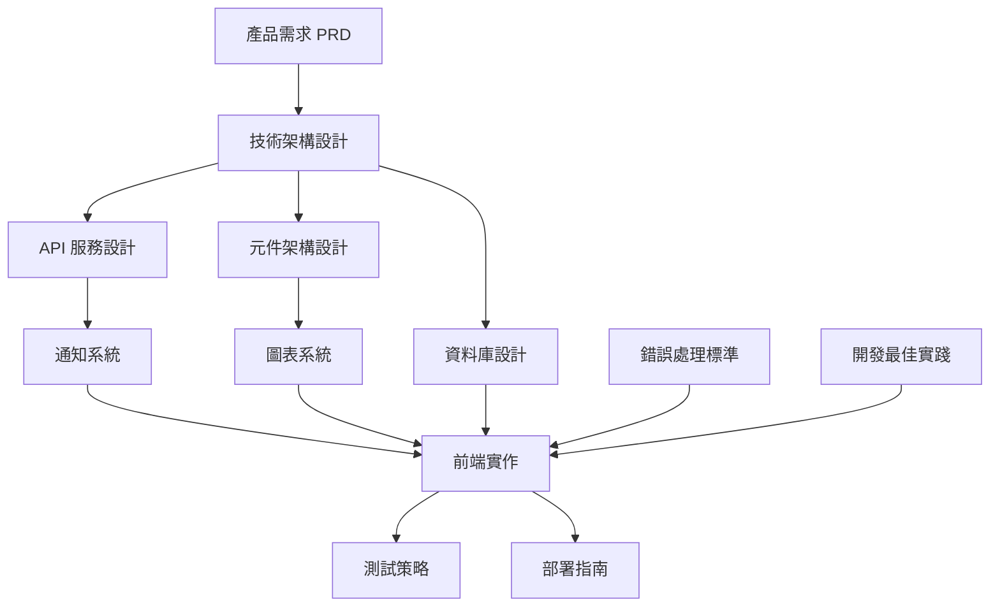

# 文檔索引與導航

## 📖 文檔概覽

本索引提供完整的文檔導航，按角色和開發階段分類，幫助不同背景的用戶快速定位所需資訊。

> 📋 **文檔維護**: 查看 [文檔健檢報告](./04-guides/dev-notes/documentation/health-check-report.md) 了解文檔分類、過時檢查與定期維護流程

## 👥 按角色導航

### 產品經理 / 業務分析師
- [產品需求文檔](./01-planning/prd/) - 功能規格、用戶故事、成功指標
- [用戶流程設計](./01-planning/prd/user-flow.md) - 完整的用戶操作流程
- [專案里程碑](./01-planning/project-plan/feature-milestones.md) - 開發進度與計劃

### 👨‍💻 前端開發者
- [Vue 專案結構優化建議](./05-reference/project-optimization-roadmap.md) - 元件架構改進
- [圖表元件架構](./02-development/architecture/CHART_ARCHITECTURE.md) - 圖表系統設計
- [通知系統完整指南](./02-development/modules/notification/) - 前後端整合
- [錯誤處理與監控指南](./05-reference/standards/error-handling-guide.md) - 統一錯誤處理
- [React 技術差異對比](./05-reference/historical/react-appendix.md) - 🔖 歷史參考：Vue vs React 學習指南

### 後端開發者
- [API 設計文檔](./02-development/architecture/api-design.md) - RESTful API 規範
- [資料庫架構](./02-development/database/) - Schema 設計與遷移
- [🆕 種子資料管理指南](./02-development/database/seed-data-management.md) - **核心與測試資料分離架構**
- [Supabase Storage 設定](./02-development/database/supabase-storage-setup.md) - 檔案儲存初始化
- [Supabase 集成說明](./02-development/database/supabase-integration.md) - Supabase 在專案中的角色與工具
- [Supabase API 端點](./02-development/architecture/supabase-api-endpoints.md) - 後端服務整合

### DevOps / 運維工程師
- [部署完整指南](./03-operations/deployment/DEPLOYMENT.md) - 生產環境部署
- [CI/CD 流程](./03-operations/deployment/ci-cd.md) - 自動化部署
- [Docker 使用指南](./03-operations/deployment/docker-guide.md) - 容器化部署
- [資料庫運維指南](./03-operations/database/) - 資料庫日常維護與監控
- [監控與日誌策略](./03-operations/monitoring/) - 系統監控設置

### 🧪 測試工程師
- [前台測試環境](./04-guides/testing-tools/front-stage-setup.md) - 客戶端測試環境設置
- [測試數據生成](./04-guides/testing-tools/test-data-generation.md) - 自動化測試數據生成
- [整合測試流程](./04-guides/testing-tools/integration-testing.md) - 端到端測試策略
- [客戶行為模擬](./04-guides/testing-tools/customer-simulation.md) - 真實用戶行為模擬
- [壓力測試指南](./04-guides/testing-tools/performance-testing.md) - Vue 3 應用壓力測試
- [負載測試場景](./04-guides/testing-tools/load-testing-scenarios.md) - 關鍵業務場景測試
- [效能監控設置](./04-guides/testing-tools/performance-monitoring.md) - 即時監控與警報系統
- [元件整合測試計劃](./04-guides/dev-notes/COMPONENT_INTEGRATION_TESTS_PLAN.md) - 元件測試實施指南

### UI/UX 設計師
- [圖表視覺指南](./02-development/design/chart-visual-guidelines.md) - 視覺設計標準
- [使用者介面元件](./04-guides/onboarding/ui-components.md) - UI 元件庫

## 按開發階段導航

### 規劃階段
```
01-planning/
├── prd/                     # 產品需求
│   ├── features.md          # 功能規格
│   ├── overview.md          # 專案概覽
│   ├── personas.md          # 用戶畫像
│   ├── success-metrics.md   # 成功指標
│   └── user-flow.md         # 用戶流程
├── project-plan/            # 專案計劃
│   ├── feature-milestones.md # 開發里程碑
│   └── gantt-chart.md       # 時程規劃
└── react-appendix.md        # React 技術差異
```

### 開發階段
```
02-development/
├── architecture/            # 系統架構
│   ├── api-design.md        # API 設計
│   ├── architecture.md      # 整體架構
│   ├── component-map.md     # 元件結構
│   ├── data-flow.md         # 資料流
│   ├── CHART_ARCHITECTURE.md # 圖表架構
│   └── REALTIME_MIGRATION.md # 即時功能遷移
├── api/                     # API 文檔
│   └── notification-system.md # 通知系統
├── components/              # 元件文檔
├── database/                # 資料庫設計
│   ├── notification-system/ # 通知系統完整文件
│   │   ├── README.md        # 系統概述與導航
│   │   ├── sql-migrations/  # SQL 遷移檔案
│   │   └── architecture/    # 架構與開發文件
│   ├── supabase-integration.md # Supabase 集成說明
│   ├── dashboard-analysis.md # 分析報告
│   ├── erd.puml             # 關係圖
│   ├── rls-policy.md        # 安全政策
│   └── schema.sql           # 資料庫結構
└── design/                  # 設計規範
    ├── chart-visual-guidelines.md
    └── onboarding-flow.md
```

### 運維階段
```
03-operations/
├── deployment/              # 部署文檔
│   ├── DEPLOYMENT.md        # 部署指南
│   ├── ci-cd.md            # CI/CD
│   ├── cloud-deploy.md     # 雲端部署
│   └── docker-guide.md     # Docker
├── database/                # 資料庫運維
│   └── README.md           # 運維指南
├── testing/                 # 測試策略
└── monitoring/              # 監控設定
```

### 📖 使用指南
```
04-guides/
├── user-guide/              # 使用者指南
├── dev-guide/              # 開發者指南
├── demo-tools/             # 演示工具
│   ├── faker-seed.md       # 測試資料
│   ├── usage-guide.md      # 使用說明
│   └── mock-data-guide/    # 模擬資料
├── testing-tools/          # 測試工具
│   ├── front-stage-setup.md     # 前台測試環境
│   ├── test-data-generation.md  # 測試數據生成
│   ├── customer-simulation.md   # 客戶行為模擬
│   ├── integration-testing.md   # 整合測試流程
│   ├── performance-testing.md   # Vue 3 壓力測試指南
│   ├── load-testing-scenarios.md # 負載測試場景設計
│   └── performance-monitoring.md # 效能監控與警報系統
├── onboarding/             # 新手指南
│   ├── ui-components.md    # UI 元件
│   └── walkthrough.md      # 快速上手
├── dev-notes/              # 開發筆記
│   ├── CHART_COMPOSABLE.md
│   ├── NOTIFICATION_LIB_USAGE_GUIDE.md
│   └── ... (其他開發筆記)
└── project-info/           # 專案資訊
    ├── README.md
    ├── tech-stack.md
    └── vue-tech-stack.md
```

### 參考資料
```
05-reference/
├── standards/               # 開發標準
│   ├── error-handling-guide.md # 錯誤處理
│   ├── ARCHITECTURE.md      # 架構參考
│   ├── NOTIFICATION_TYPE_ARCHITECTURE.md
│   └── ... (其他標準文檔)
└── ai-collaboration/        # AI 協作指南
    └── README.md
```

## 🔍 快速查找

### 按功能分類

#### 通知系統
- [通知系統文件總覽](./02-development/database/notification-system/README.md) - 系統概述與文件導航
- [通知系統完整指南](./04-guides/dev-notes/NOTIFICATION_SYSTEM_COMPLETE_GUIDE.md) - Vue 組件使用、API 介面、最佳實踐
- [API 服務文件](./02-development/api/notification-system.md) - RESTful API 介面說明
- [系統架構設計](./02-development/database/notification-system/architecture/NOTIFICATION_SYSTEM_ARCHITECTURE.md) - 整體架構與元件關係
- [SQL Migrations](./02-development/database/notification-system/sql-migrations/) - 完整的資料庫遷移檔案
- [通知類型架構](./05-reference/standards/NOTIFICATION_TYPE_ARCHITECTURE.md) - 類型系統設計
- [通知函數庫使用指南](./04-guides/dev-notes/NOTIFICATION_LIB_USAGE_GUIDE.md) - 開發使用手冊

#### 圖表系統
- [圖表元件架構](./02-development/architecture/CHART_ARCHITECTURE.md) - 架構設計與使用
- [圖表視覺指南](./02-development/design/chart-visual-guidelines.md) - 視覺規範
- [圖表 Composable 指南](./04-guides/dev-notes/CHART_COMPOSABLE.md) - 開發實作

#### 📈 分析系統
- [Analytics 系統架構](./02-development/architecture/analytics-system.md) - 四大分析模組完整文檔
- [Campaign 管理系統](./02-development/architecture/campaign-system.md) - 行銷活動管理系統文檔
- [Analytics 開發指南](./02-development/modules/analytics/guides/) - 詳細開發指南（Campaign、Customer、Order、Support）

#### 開發工具
- [Vue 專案結構優化](./05-reference/project-optimization-roadmap.md) - 架構改進建議
- [錯誤處理指南](./05-reference/standards/error-handling-guide.md) - 統一錯誤處理
- [測試整合計劃](./04-guides/dev-notes/COMPONENT_INTEGRATION_TESTS_PLAN.md) - 測試策略

#### ⚡ 效能測試工具
- [Vue 3 壓力測試指南](./04-guides/testing-tools/performance-testing.md) - Artillery, k6, Lighthouse 工具整合
- [負載測試場景設計](./04-guides/testing-tools/load-testing-scenarios.md) - 客戶旅程、API 負載、JSONB 效能測試
- [效能監控與警報](./04-guides/testing-tools/performance-monitoring.md) - Web Vitals, 自動化監控, CI/CD 整合

#### 🔐 權限與認證
- [角色用戶功能](./04-guides/dev-notes/ROLE_USERS_VIEW_FUNCTIONALITY.md) - 權限管理
- [RLS 安全政策](./02-development/database/rls-policy.md) - 資料庫安全

#### Supabase 專屬文檔
> 詳細的 Supabase 操作指南位於 `supabase/docs/` 目錄，以下為快速導航：

- **📖 完整索引**: [Supabase 文檔總覽](../supabase/docs/README.md)
- **🔄 資料庫管理**: [重置指南](../supabase/docs/guides/database-reset.md) | [驗證腳本](../supabase/verify_seed_data.sql)
- **🔐 權限系統**: [Super Admin 指南](../supabase/docs/guides/super-admin-guide.md) | [部署狀態](../supabase/docs/reference/super-admin-deployment.md)
- **📊 JSONB 系統**: [系統指南](../supabase/docs/guides/jsonb-system.md) | [測試指南](../supabase/docs/guides/jsonb-testing.md)
- **🛠️ 工具腳本**: [種子資料](../supabase/seed.sql) | [資料匯出](../supabase/export_initial_data.sql)

#### 📈 效能優化
- [效能優化方法論](./04-guides/dev-notes/performance-optimization/) - 系統效能優化策略與實踐
- [即時功能遷移](./02-development/architecture/REALTIME_MIGRATION.md) - Realtime 效能提升

#### 🔮 未來功能規劃
- [Enhancement Plans](./future-features/enhancement-plans/) - 系統增強計劃（運維卓越、產品功能、Campaign 擴展）
- [Future Features](./future-features/) - 未來功能備份與恢復指南

## 文檔關係圖



## 文檔維護

### 文檔更新流程
1. **新功能開發**: 同步更新相關技術文檔
2. **架構變更**: 更新架構設計文檔和相關引用
3. **Bug 修復**: 更新錯誤處理和故障排除文檔
4. **版本發布**: 更新部署指南和變更日誌

### 文檔審查週期
- **每月審查**: 檢查文檔準確性和連結有效性
- **每季更新**: 整合新功能文檔和最佳實踐
- **版本同步**: 確保文檔版本與程式碼版本一致

### 文檔品質標準
- ✅ 清晰的結構和導航
- ✅ 實用的程式碼範例
- ✅ 完整的交叉引用
- ✅ 定期的內容更新
- ✅ 多角色的使用指導

## 🆘 快速求助

### 常見問題解答
- **元件找不到**: 查看 [Vue 專案結構優化建議](./05-reference/project-optimization-roadmap.md)
- **API 錯誤**: 參考 [錯誤處理指南](./05-reference/standards/error-handling-guide.md)
- **部署問題**: 查看 [部署完整指南](./03-operations/deployment/DEPLOYMENT.md)
- **測試失敗**: 參考 [測試策略文檔](./03-operations/testing/)

### 聯絡資訊
- **技術問題**: 查看相關技術文檔或開發筆記
- **業務問題**: 參考產品需求文檔
- **部署問題**: 查看運維文檔

---

*建立日期: $(date "+%Y-%m-%d")*
*維護週期: 每月更新*